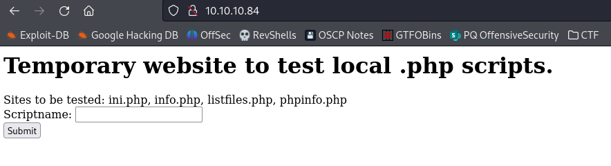

# Poison

| | |
|---|---|
| **OS** | Linux |
| **Difficulty** | Medium |
| **Topics** | LFI, Password reuse, VNCviewer, VNC Pass file, VNC Authentication over passwd file |

---

## 📁 Folder Structure

- [`content/`](content/) — screenshots and inline references used in the write-up
- [`nmap/`](nmap/) — raw nmap output files
- [`exploit/`](exploit/) — exploit scripts, binaries, payloads, and other tools used

---

# Enumeration

## Nmap

SYN Stealth Scan

```bash
sudo nmap -p- --open -sS --min-rate 5000 -Pn -n -v -oN AllPorts.txt 10.10.10.84

```

Result:

```markdown
PORT   STATE SERVICE
22/tcp open  ssh
80/tcp open  http
```

TCP Full Scan: 

```bash
nmap -p22,80 -sCV -Pn -n 10.10.10.84 -oN FullScan.txt
```

Result: 

```markdown
PORT   STATE SERVICE VERSION
22/tcp open  ssh     OpenSSH 7.2 (FreeBSD 20161230; protocol 2.0)
| ssh-hostkey: 
|   2048 e3:3b:7d:3c:8f:4b:8c:f9:cd:7f:d2:3a:ce:2d:ff:bb (RSA)
|   256 4c:e8:c6:02:bd:fc:83:ff:c9:80:01:54:7d:22:81:72 (ECDSA)
|_  256 0b:8f:d5:71:85:90:13:85:61:8b:eb:34:13:5f:94:3b (ED25519)
80/tcp open  http    Apache httpd 2.4.29 ((FreeBSD) PHP/5.6.32)
|_http-title: Site doesn't have a title (text/html; charset=UTF-8).
|_http-server-header: Apache/2.4.29 (FreeBSD) PHP/5.6.32
Service Info: OS: FreeBSD; CPE: cpe:/o:freebsd:freebsd

```

HTTP Enum: 

```jsx
nmap -p80 --script http-enum* -Pn -n 10.10.10.84 -oN HTTPEnum 
```

Result: 

```jsx
PORT   STATE SERVICE
80/tcp open  http
| http-enum: 
|   /info.php: Possible information file
|_  /phpinfo.php: Possible information file

```

# Initial Access

Checking the Webpage hosted on port 80 we can see the following: 



This seems to be a testing website for PHP files. 

If we test the `info.php` 


We will see the output of that php file executed: 


If we test `phpinfo.php`, we will the output of the PHPInfo file executed: 


Testing the `listfiles.php` we will see what seems to be the files hosted in the server in the current directory: 


One of them seems to be interesting, called `pwdbackup.txt`: 


Let’s try to read the file using the function from the website: 


We will see the content of the file, which seems to be a Base64 encoded code: 


The file also gives a hint that the text has been encoded 13 times, hence, we can use https://gchq.github.io/CyberChef/ to decode the text, we just need to drag and drop the “From Base64” 13 times to the recipe xD

Final text decoded: 


This seems to be a password: 

```jsx
Charix!2#4%6&8(0
```

However we don’t have a valid username, hence, let’s further enumerate. 

Going back to the website, we can see that the URL has a parameter that might be vulnerable to LFI: 


The function “file=” receives a filename to later present it in the website, let’s try to inject a local path like `/etc/passwd` to see if is vulnerable: 

Request: 


Result: We can see that parameter was vulnerable to LFI as it showed the contents of /etc/passwd


Let’s use `curl` to better see the content of the passwd file:


From the output we can see a username identified as `charix`, this user may be the one with password `Charix!2#4%6&8(0` that we previously found. 

Since SSH is opened, we can try to authenticate using these credentials: 

```jsx
charix:Charix!2#4%6&8(0
```

As a result we were able to authenticate as `charix`


# Privilege Escalation

Once we gained access as Charix, we can see an interesting file in the home directory identified as `secret.zip`

Let’s transfer the file to our kali machine using either netcat or SCP. 

Trying to unzip the file we will noticed that is password protected: 


We can try to crack the password using John the Ripper (using zip2john) however after trying this way, there was no success. 

Hence, as an alternative option we can reuse the password we previously collected: 


We will see that this was the password used to protect the file. 

Now, let’s check the content of the file: 


We will that file is not in a readable format. 

Going back to the machine, we will notice a port that is not publicly exposed: 

```jsx
sockstat -4 -l
```

Result: 


We can see the port 5801 and 5901. 

Checking on internet these ports we will that they are used on VNC:


Checking this article we can see that a file can be used to authenticate to the machine, in this case, the `secret` file might be the passwd file for VNC: 

Reference: 

[linux - How to open vnc viewer and login vnc with one command line - Super User](https://superuser.com/questions/853160/how-to-open-vnc-viewer-and-login-vnc-with-one-command-line)

Command: 

```jsx
vncviewer -passwd ~/.vnc/vncfile localhost:5901
```

However, since the port 5901 it’s not exposed to us, we need to create a port forwarding using SSH. 

Check: `Port Forwarding ` 

Command for Port forwarding: 

```jsx
sudo ssh -N -L 0.0.0.0:5901:127.0.0.1:5901 charix@10.10.10.84 -p 22
```

Explanation: 

```jsx

0.0.0.0:5901    --> This the IP of kali, that means, all the request made to 0.0.0.0
              which is any IP, it will be forwarded

127.0.0.1:80 -> This is the loopback IP for the target machine, meaning that our requests
                from 0.0.0.0 will be forwards to the 127.0.0.1 on port 5901. 
               
```

Executing the command: 


Now, let’s use `vncviewer` along with the `secret` file: 

```jsx
vncviewer -passwd secret localhost:5901
```

After executing we will see that file was accepted as valid password: 


And a new window from VNC will be created giving us a live shell with root as user: 


What we can do now to have a better shell over the ssh is to add the SUID bit to the shell


Now, from the SSH session just spawn a need privilege shell: 

